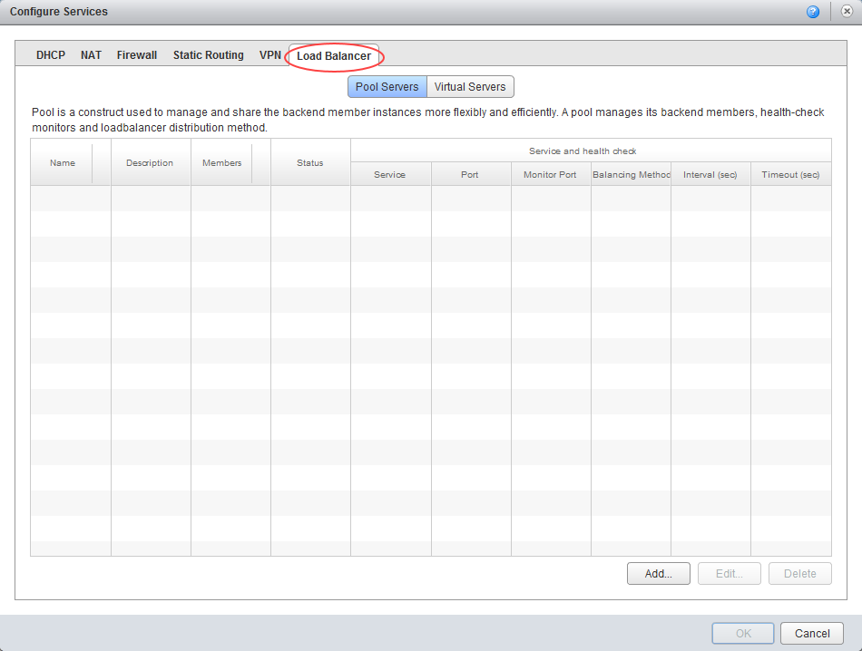
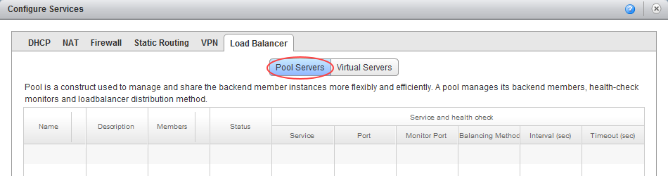
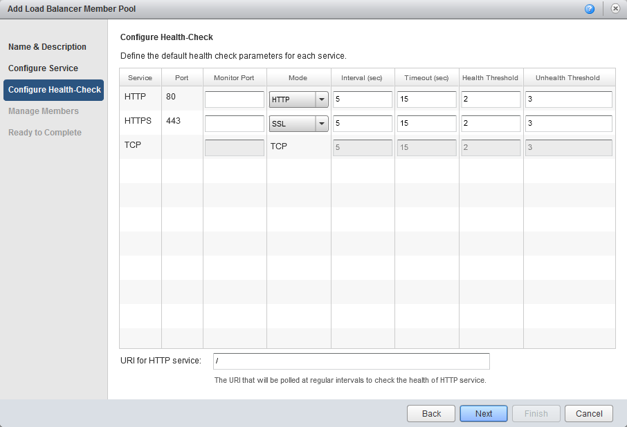
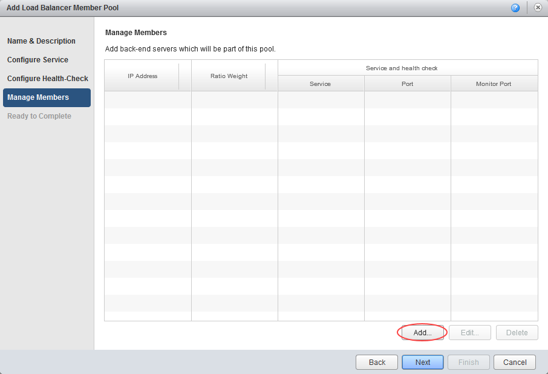
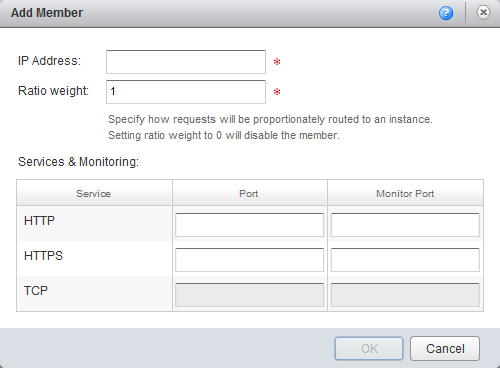
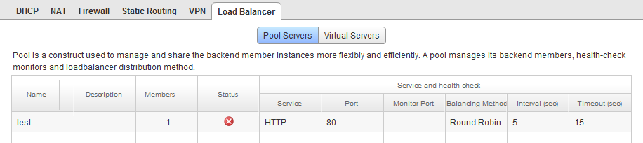
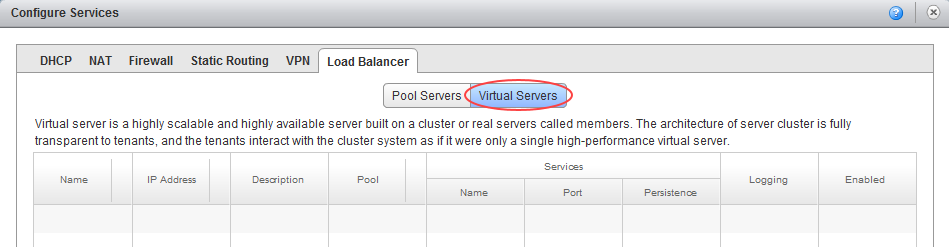
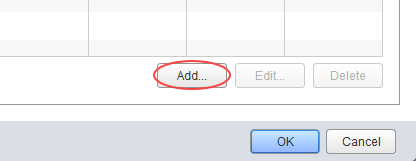
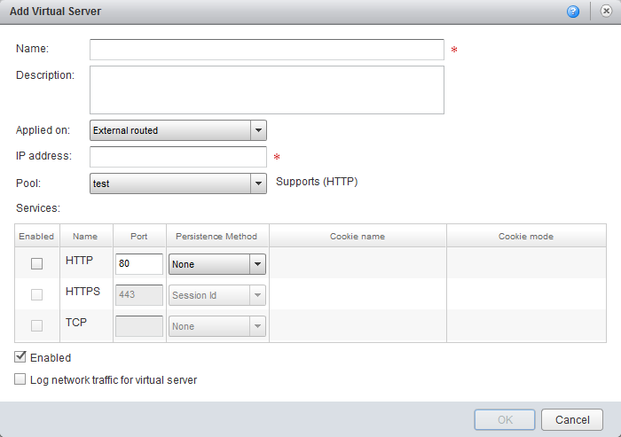

# How to configure a load balancer

# Overview

One of the functions of the edge gateway is to act as a basic layer 3 load balancer, distributing IP traffic to a pool of servers while appearing as a single virtual server. The load balancing methods offered are round-robin, IP hash, URI, HTTP header or least connected.

Bear in mind, however, that the edge gateway load balancer is quite basic. If you need to meet more complex requirements, you'll need provide your own third-party virtual load balancer.

The steps for configuring a load balancer vary depending on what type of edge gateway you're working with:

- [Configuring a load balancer for an advanced gateway](#configuring-a-load-balancer-for-an-advanced-gateway)
- [Configuring a load balancer for a standard edge](#configuring-a-load-balancer-for-a-standard-edge)

> [!NOTE]
> We recommend that you convert your edge to an advanced gateway to access the latest vCloud Director functionality. For more information, see [*How to convert your edge to an advanced gateway*](vmw-how-convert-edge.md).

## Configuring a load balancer for an advanced gateway

To configure a load balancer for an advanced gateway:

1. In vCloud Director, access the edge gateway settings.

    For more detailed instructions, see [*How to access edge gateway settings*](vmw-how-access-edge.md)

2. Select the **Load Balancer** tab.

    

3. On the **Global Configuration** tab, select the **Enabled** toggle.

4. If you have a syslog server configured, select the **Enable Logging** toggle.

    For more information about syslog servers, see [*How to access syslog data for your advanced gateway*](vmw-how-access-syslog-data-adv.md)

5. Click **Save changes**.

6. You need to configure two components of the load balancing service for it to function correctly: [pool servers](#configuring-a-pool-server-for-an-advanced-gateway) and [virtual servers](#configuring-a-virtual-server-for-an-advanced-gateway).

### Configuring a pool server for an advanced gateway

Pool servers are the real servers that will be masked by the load balancer.

> [!NOTE]
> Before you configure the pool of servers, make a list of their IP addresses so that you can populate the pool later in the procedure.

1. Select the **Pools** tab.

    

2. Click the **+** button.

    

3. In the *Add Pool* dialog box, enter a **Name** and **Description**.

    > [!NOTE]
    > The pool name should not include any spaces.

4. From the **Algorithm** list, select the load balancing algorithm to use.

5. From the **Monitors** list, select the monitors policy.

6. Select the **Transparent** toggle if you want IP addresses to be transparent.

    

7. In the *Members* section, click **+**.

    

8. In the *Add Member* dialog box, in the **Name** field, enter the server **Name**, **IP Address**, **Port** and **Weight**. When you're done, click **Keep**.

    

9. Add more pool members as required and when you're done, click **Keep**.

10. To view the status of pool members, click **Show Pool Statistics**.

    

### Configuring a virtual server for an advanced gateway

A virtual server masks the pool of real servers and presents a single IP address.

1. Select the **Virtual Servers** tab.

    

2. Click the **+** button.

    

3. In the **Add Virtual Server** dialog box, select the **Enable Virtual Server** toggle.

4. Enter a **Name** for the virtual server, assign it a virtual **IP Address**, and assign it to the server pool you want to mask. You can also choose which services you want to apply to the virtual server. When you're done, click **Keep**.

    

## Configuring a load balancer for a standard edge

To configure a load balancer for a standard edge:

1. In vCloud Director, click the **Administration** tab.

    

    For more detailed instructions, see the [*Getting Started Guide for UKCloud for VMware*](vmw-gs.md)

2. Double-click the virtual data centre (VDC) that you want to work with, or right-click the VDC and select **Open**.

3. Select the **Edge Gateways** tab.

    

4. Right-click the edge gateway and select **Edge Gateway Services**.

5. Select the **Load Balancer** tab.

    

6. You need to configure two components of the load balancing service for it to function correctly: [pool servers](#configuring-a-pool-server-for-a-standard-edge) and [virtual servers](#configuring-a-virtual-server-for-a-standard-edge).

### Configuring a pool server for a standard edge

Pool servers are the real servers that will be masked by the load balancer.

> [!NOTE]
> Before you configure the pool of servers, make a list of their IP addresses so that you can populate the pool later in the procedure.

1. On the **Load Balancer** tab, select the **Pool Servers** tab.

    

2. Click **Add**.

    

3. In the *Add Load Balancer Member Pool* wizard, give the pool a **Name** and **Description** then click **Next**.

4. Select the service type for the pool then click **Next**.

    A service type consists of the protocol, port number and balancing method. You can enable multiple services for a pool.

    

5. Configure health check parameters for the services you're provisioning (or leave as the default), then click **Next**.

    

6. Click **Add** to add members to the pool.

    

7. In the *Add Member* dialog box, enter the IP addresses of one of the servers that you want to include in the pool. You can also give the servers different weightings to modify the flow of traffic to each one. You can then add service and monitoring port numbers.

    

8. When you're happy with the settings, click **OK**.

9. Click **Add** to add another server to the pool and when you've added all the servers, click **Next**.

10. On the last page of the wizard, review your settings and click **Finish**.

    The pool you created will now be visible in the Pool Servers window.

    

### Configuring a virtual server for a standard edge

A virtual server masks the pool of real servers and presents a single IP address.

1. On the **Load Balancer** tab, select the **Virtual Servers** tab.

    

2. Click **Add**.

    

3. In the *Add Virtual Server* dialog box, name the virtual server, assign a virtual IP address to it and assign it to the server pool you want to mask. You can also choose which services you want to apply to the virtual server.

    

4. When you're finished, click **OK**.

## Next steps

In this article you've learned how to create firewall rules. For other edge gateway configuration tasks, see:

- [*How to create firewall rules*](vmw-how-create-firewall-rules.md)
- [*How to create NAT rules*](vmw-how-create-nat-rules.md)
- [*How to create a DHCP pool*](vmw-how-create-dhcp-pool.md)
- [*How to configure IPsec VPN*](vmw-how-configure-ipsec-vpn.md)
- [*How to create a static route*](vmw-how-create-static-route.md)

## Feedback

If you have any comments on this document or any other aspect of your UKCloud experience, send them to <products@ukcloud.com>.