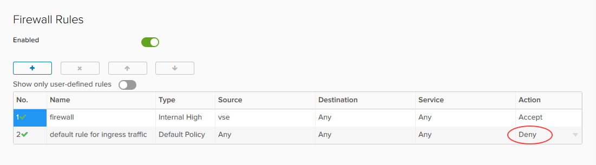

# How to convert your edge to an advanced gateway

## Overview

UKCloud for VMware offers advanced gateways to provide access to new vCloud Director functionality. Some of this functionality is available now, with other features being added following integration testing to assess suitability on our platform (some features may incur additional charges).

Advanced gateways in UKCloud for VMware provide:

- **NSX Tenant Portal** - The new Tenant Portal is a pure HTML5 user interface that you can use in conjunction with the legacy vCloud Director Web Console. This portal provides an initial set of controls to configure Advanced Gateway NSX Edges.

- **New API NSX management** - vCloud Director 8.20 introduces a new proxy API that enables vCloud API clients to make requests to the NSX API. Unlike the NSX API, which is designed to address NSX objects in a global scope, such as a vCenter database, the vCloud Director API for NSX is designed to address NSX objects within the scope of a vCloud Director tenant organisation.

- **SSH edge access** - If you enable SSH, you can perform your own packet captures and troubleshoot your edge gateway yourself, without having to contact UKCloud Support.

- **Advanced networking options** - Distributed networking features, namely Distributed Firewall, Distributed Logical Router and L2 VPN, to improve the performance of traffic within your VDC.

> [!IMPORTANT]
> After converting your edge gateway to an advanced gateway, the API endpoint for configuring edge services will change. Any tooling that you use to amend the edge service configuration, such as adding firewall rules, will no longer work in its current state. For more information about using the advanced gateway API, see the [*vCloud Director API for NSX Programming Guide*](https://pubs.vmware.com/vcd-820/topic/com.vmware.ICbase/PDF/vcloud_nsx_api_guide_27_0.pdf).

> [!IMPORTANT]
> After converting your edge to an advanced gateway, you will not be able to enable or disable logging on firewall rules via the advanced gateway GUI. To enable or disable logging, you must either use the API or raise a service request detailing the firewall rules for which you want to enable or disable logging so that we can action it on your behalf. When you convert an edge, the advanced gateway inherits the firewall logging configuration from the original edge. Enabling or disabling logging for NAT or load balancer services is not affected and you can edit those settings from the advanced gateway GUI as normal. For more information about using the API to amend firewall rules, see the [*vCloud Director API for NSX Programming Guide*](https://pubs.vmware.com/vcd-820/topic/com.vmware.ICbase/PDF/vcloud_nsx_api_guide_27_0.pdf).

### Intended audience

To complete the steps in this guide you must have access to the UKCloud Portal and vCloud Director.

## Prerequisites and known issues

Before converting your edge gateway, review the prerequisites and known issues below:

- **Edge gateway version** --- When converting to an advanced gateway, your edge will be redeployed to the latest version.

    > [!IMPORTANT]
    > As the conversion process causes the gateway to redeploy, you should always schedule an edge conversion during an outage window.

- **Disabled firewalls** - On an advanced gateway, if you disable the firewall, this also stops the NAT service, as it is dependent on the firewall. As a result, traffic flow that relies on NAT, such as NAT rules and the load balancer is stopped. If you attempt to disable the firewall service, the vCloud Director Web Console will display a warning. This is due to the firewall service being used to track stateful connections. See the following VMware Knowledge Base article for more information: <https://kb.vmware.com/s/article/2093153>.

    If you convert an edge that already has the firewall disabled to an advanced gateway, the converted advanced gateway will have the firewall enabled, but with an Any, Any, Allow rule so that all traffic is allowed inbound or outbound.

## Converting your edge to an advanced gateway

To access the latest vCloud Director networking features, you need to convert your edge to an advanced gateway.

To convert your edge to an advanced gateway:

1. In vCloud Director *Virtual Datacenters* dashboard, select the VDC that contains the edge gateway you want to convert.

2. In the left navigation panel, click **Edges**.

    

3. Select the edge that you want to convert and click the **Convert to Advanced** button.

4. Click **Yes** to start the conversion.

    > [!IMPORTANT]
    > After converting your edge gateway, click **Configure Services** and check the firewall rules to make sure that the **default rule for ingress traffic** is set to **Deny**.

    

## Next steps

To find out more about the advanced networking features provided by advanced gateways, see the following article:

- [*Advanced networking options for UKCloud for VMware*](vmw-ref-advanced-networking.md)

## Feedback

If you find an issue with this article, click **Improve this Doc** to suggest a change. If you have an idea for how we could improve any of our services, visit [UKCloud Ideas](https://ideas.ukcloud.com). Alternatively, you can contact us at <products@ukcloud.com>.
