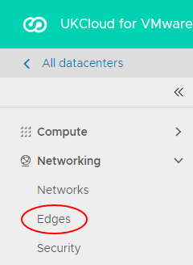

# How to convert your edge to an advanced gateway

## Overview

With the upgrade to vCloud Director 8.20 and 9.1, UKCloud for VMware now offers advanced gateways to provide access to new vCloud Director functionality. Some of this functionality is available now, with other features being added following integration testing to assess suitability on our platform (some features may incur additional charges).

Advanced gateways in UKCloud for VMware provide:

- **NSX Tenant Portal** - The new Tenant Portal is a pure HTML5 user interface that you can use in conjunction with the legacy vCloud Director Web Console. This portal provides an initial set of controls to configure Advanced Gateway NSX Edges.
- **New API NSX management** - vCloud Director 8.20 introduces a new proxy API that enables vCloud API clients to make requests to the NSX API. Unlike the NSX API, which is designed to address NSX objects in a global scope, such as a vCenter database, the vCloud Director API for NSX is designed to address NSX objects within the scope of a vCloud Director tenant organisation.
- **SSH edge access** - If you enable SSH, you can perform your own packet captures and troubleshoot your edge gateway yourself, without having to contact UKCloud Support.

> [!IMPORTANT]
> After converting your edge gateway to an advanced gateway, the API endpoint for configuring edge services will change. Any tooling that you use to amend the edge service configuration, such as adding firewall rules, will no longer work in its current state. For more information about using the advanced gateway API, see the [*vCloud Director API for NSX Programming Guide*](https://pubs.vmware.com/vcd-820/topic/com.vmware.ICbase/PDF/vcloud_nsx_api_guide_27_0.pdf).

> [!IMPORTANT]
> After converting your edge to an advanced gateway, you will not be able to enable or disable logging on firewall rules via the advanced gateway GUI. To enable or disable logging, you must either use the API or raise a service request detailing the firewall rules for which you want to enable or disable logging so that we can action it on your behalf. When you convert an edge, the advanced gateway inherits the firewall logging configuration from the original edge. Enabling or disabling logging for NAT or load balancer services is not affected and you can edit those settings from the advanced gateway GUI as normal. For more information about using the API to amend firewall rules, see the [*vCloud Director API for NSX Programming Guide*](https://pubs.vmware.com/vcd-820/topic/com.vmware.ICbase/PDF/vcloud_nsx_api_guide_27_0.pdf).

### Intended audience

To complete the steps in this guide you must have access to the UKCloud Portal and vCloud Director.

## Prerequisites and known issues

Before converting your edge gateway, review the prerequisites and known issues below:

- **Edge gateway version** --- To convert to an advanced gateway, your edge gateway must be at version 6.2.*x*. If necessary, redeploy your edge gateway to upgrade to the latest version; for more information,
    see [*How to upgrade your edge gateway*](vmw-how-upgrade-edge.md).

- **Disabled firewalls** - On an advanced gateway, if you disable the firewall, this also stops the NAT service, as it is dependent on the firewall. As a result, traffic flow that relies on NAT, such as NAT rules and the load balancer is stopped. If you attempt to disable the firewall service, the vCloud Director Web Console will display a warning. This is due to the firewall service being used to track stateful connections. See the following VMware Knowledge Base article for more information: <https://kb.vmware.com/s/article/2093153>.

    If you convert an edge that already has the firewall disabled to an advanced gateway, the converted advanced gateway will have the firewall enabled, but with an Any, Any, Allow rule so that all traffic is allowed inbound or outbound.

- **Internal/external keywords** - Due to a bug in vCloud Director 8.20, when you create or amend firewall rules on your advanced gateway using the vCloud Director Web Console, you can no longer use the keywords internal or external when specifying the direction of the traffic. However, you can still use these keywords when using the API to create or amend rules. This Web Console bug is fixed in vCloud Director 9.*x*, which we'll be upgrading to in the coming months. For information about using the API to create or amend firewall rules, see the [*vCloud Director API for NSX Programming Guide*](https://pubs.vmware.com/vcd-820/topic/com.vmware.ICbase/PDF/vcloud_nsx_api_guide_27_0.pdf).

## Converting your edge to an advanced gateway

To access the latest vCloud Director networking features, you need to convert your edge to an advanced gateway.

To convert your edge to an advanced gateway:

# [Using vCloud Director 8.20](#tab/tabid-1)

1. In vCloud Director, select the **Administration** tab.

    

2. Double-click the VDC that the edge gateway belongs to.

3. Select the **Edge Gateways** tab.

4. Right-click the edge gateway that you want to convert and select **Convert to Advanced Gateway**.

5. Click **Yes** to start the conversion.

    > [!IMPORTANT]
    > After converting your edge gateway, click **Configure Services** and check the firewall rules to make sure that the **default rule for ingress traffic** is set to **Deny**.

    

# [Using vCloud Director 9.1](#tab/tabid-2)

1. In vCloud Director *Virtual Datacenters* dashboard, select the VDC that contains the edge gateway you want to convert.

2. In the left navigation panel, click **Edges**.

    

3. Select the edge that you want to convert and click the **Convert to Advanced** button.

4. Click **Yes** to start the conversion.

    > [!IMPORTANT]
    > After converting your edge gateway, check the firewall rules to make sure that the **default rule for ingress traffic** is set to **Deny**.

    

***

## Next steps

To find out more about the features provided by advanced gateways, see the following articles:

- [*Upgrade to vCloud Director 8.20*](vmw-ref-vcd-820.md)

## Feedback

If you have any comments on this document or any other aspect of your UKCloud experience, please send them to <products@ukcloud.com>.
