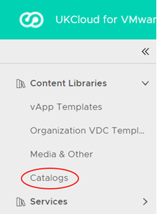
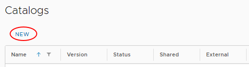
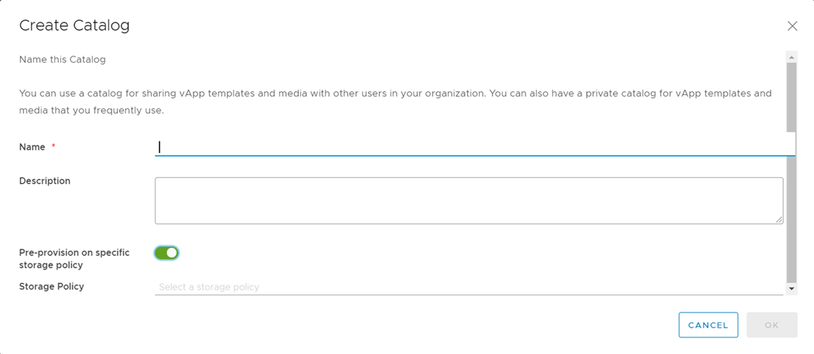
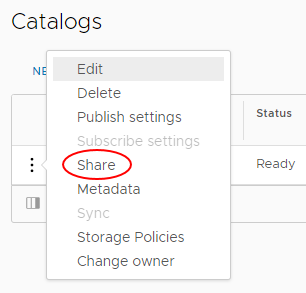
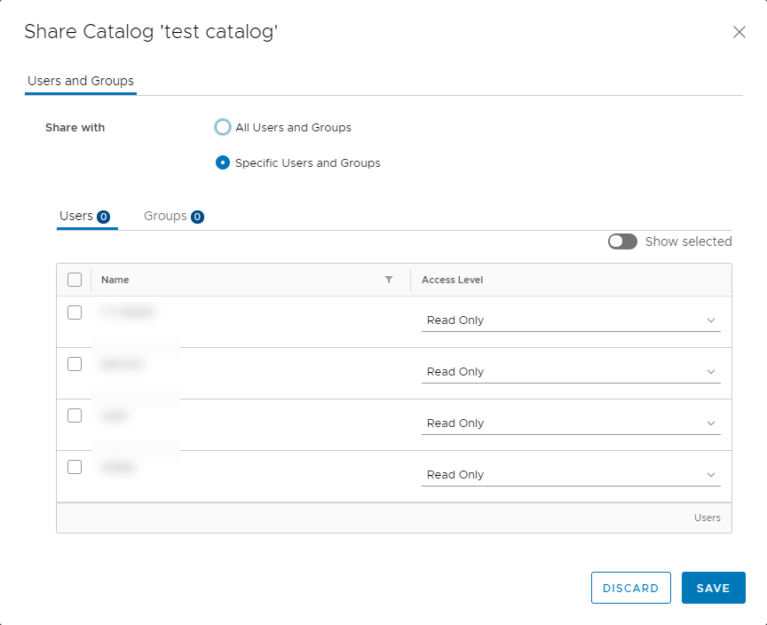
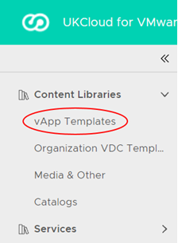
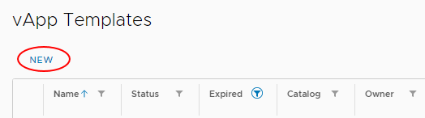
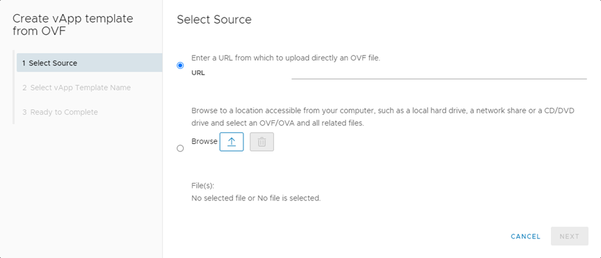
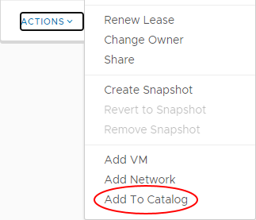
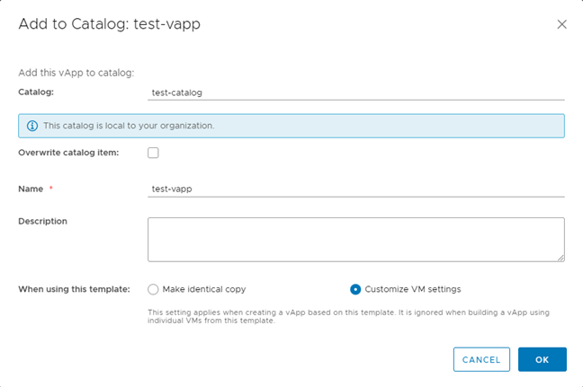

# How to create a catalog

## Overview

UKCloud provides a public catalog for you to use that contains standard virtual machine (VM) sizes and operating systems. The public catalog is a good place to start when you first deploy VMs into the UKCloud platform. However, you may want to create your own catalogs, containing specific applications or gold images, which you can then use to deploy VMs quickly.

## Creating a catalog

The first step is to create an empty catalog:

1. In the VMware Cloud Director menu bar, select **Libraries**.

    

2. In the left navigation panel, under *Content Libraries*, select **Catalogs**.

    

3. On the *Catalogs* page, click **New** to create a new catalog.

    

4. In the *Create Catalog* dialog box, enter a **Name** for the catalog and give it a **Description** if needed.

5. To specify a particular storage policy for the catalog, select the **Pre-provision on specific storage policy** option then select the desired **Storage Policy**:

    - **Tier1** is for high performance, high IOPS VMs

    - **Tier2** is for everything else less demanding (recommended for ISO and templates)

    

6. When you're done, click **OK**.

7. To make the catalog visible to others within your organisation, click the three vertical dots and select **Share**.

    

8. In the *Share Catalog* dialog box, from the **Share with** radio buttons, select:

    - **All Users and Groups** to share the catalog with everyone in the organisation.

    - **Specific Users and Groups** to share the catalog with individual users or groups of users. Select the users and groups from the lists below by selecting the check box for the user or group and selecting the appropriate access level (**Read Only**, **Read/Write** or **Full Control**).

    

9. When you've added all the people who you want to access the catalog, click **Save**.

## Populating a catalog

There are two ways to populate a catalog:

- By [creating a template from an OVF package](#creating-a-template-from-an-ovf-package)

- By [creating a template from an existing vApp](#adding-an-existing-vapp)

### Creating a template from an OVF package

> [!NOTE]
> Depending on the file size and network speed, the upload may take some time.

To upload an OVF package and assign it to a catalog:

1. On the *Libraries* page, in the left navigation panel, under *Content Libraries*, select **vApp Templates**.

    

2. On the *vApps Templates* page, click **New**.

    

3. In the *Create vApp template from OVF* dialog box, select the source of the OVF either by entering a **URL** or clicking the **Browse** icon to locate the file on your computer.

    

    > [!TIP]
    > You can select multiple files by pressing the CTRL key and selecting additional files.

4. Click **Next**.

5. On the *Review details* page, confirm the details of the OVF template and then click **Next**.

6. On the *Select vApp Template Name* page, enter a **Name** and **Description** for the template.

7. From the **Catalog** list, select the catalog in which you want to put the OVF, then click **Next**.

    

8. On the *Ready to Complete* page, review the details of the vApp template and when you're done, click **Finish** to deploy.

### Adding an existing vApp

1. In the VMware Cloud Director *Virtual Data Center* dashboard, select the VDC in which the vApp you want to use is located.

2. In the left navigation panel, select **vApps**.

    

3. In the card for the vApp that you want to add to the catalog, select **Actions** then **Add To Catalog**.

    

    You can add both running and stopped vApps to the catalog, although it's worth noting that creating a catalog image from a running vApp could affect performance.

4. In the *Add to Catalog* dialog box, click the **Catalog** list, then select the catalog you want to add the vApp to.

5. Give the vApp template a **Name** and **Description** and define whether vApps deployed using this template are identical or customisable.

    You can also overwrite an existing catalog item. If the catalog you are adding the vApp to is published externally, you'll see a warning.

    

6. When you're done, click **OK**.

    A status bar will appear on top with the message: **Please wait**. You can close the window and check the progress by expanding the *Recent Tasks* section at the bottom of the VMware Cloud Director interface.

## Feedback

If you find a problem with this article, click **Improve this Doc** to make the change yourself or raise an [issue](https://github.com/UKCloud/documentation/issues) in GitHub. If you have an idea for how we could improve any of our services, send an email to <feedback@ukcloud.com>.
