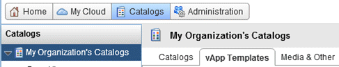
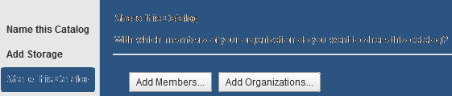

# How to create a catalog

Overview 

UKCloud provides a public catalogue for you to use that contains standard virtual machine (VM) sizes and operating systems. The public catalogue is a good place to start when you first deploy VMs into the UKCloud platform. However, you may want to create your own catalogues, containing specific applications or gold images, which you can then use to deploy VMs quickly.

The first step is to create an empty catalogue.

## Creating a catalog

To create an empty catalogue:

1. In vCloud Director, select the *Catalogs* tab.

    

2. Click the **+** button to add a new catalogue.

    

3. Name the catalogue and give it a description if needed.

    There's also an option to add a Subscribed Catalog, a read-only copy of an externally published catalogue. If you want to do this, you'll need to know the URL, and the password if there is one.

    

4. When you're done, click **Next**.

5. You now have the option to select the storage type used to store the catalog.

    - The default is **Use any storage**. Leave this selected if you don't need to store catalog items on specific storage.
    - Alternatively, you can indicate where your catalog items should be stored if they need to be stored on a specific storage policy.

    

6. When you're done, click **Next**.

7. To make the catalog visible to others, add specific people or your entire organisation.

    

8. Click the **Add Members** button to add everyone in the organisation or individual users. You can give individuals different access levels.

    

9. When you've added all the people who can access the catalogue, click **OK**, then review each individual's access level and adjust it if needed.

10.  When you're done, click **Next**.

11. You now have the choice to publish your catalog for the use of external organisations.

    - To enable external publishing, select the checkbox and add a password if needed.

    - If you don't want to share your catalog externally, just click **Next**.

    

12. Review the settings and click **Finish**.

## Populating a catalog

There are two ways to populate a catalog:

- By [uploading an OVF package](#uploading-an-ovf-package)
- By [creating a template from an existing vApp](#adding-an-existing-vapp)

### Uploading an OVF package

To upload an OVF package and assign it to a catalogue:

1. On the *Catalogs* tab, select the *vApp Templates* tab.

    

2. Click the **Upload** button to open an OVF upload window.

    

3. In the *Upload OVF package as a vApp Template* dialog box, select the source of the OVF: either a **URL** or a **Local file**.

4. Give a destination for the OVF, and give the OVF a name.

5. From the **Catalog** list, select the catalog you want to put the OVF in.

    

6. When you're done, click **Upload** to import the OVF into the catalog.

    Depending on template size and network speed, the upload may take some time.

### Adding an existing vApp

To create a catalog from an existing vApp:

1. In vCloud Director, select the *My Cloud* tab.

    

2. Right-click the vApp you want to add to the catalog and select **Add to Catalog**.

    You can add both running and stopped vApps to the catalog, although it's worth noting that creating a catalog image from a running vApp could affect performance.

3. You can now choose the catalog you want to add the vApp to, give the vApp a new name, assign a storage lease, and define whether vApps deployed using this template are identical or customisable.

    You can also overwrite an existing catalog item. If the catalog you are adding the vApp to is published externally, you\'ll see a warning.

    

4. When you're done, click **OK**.

## Feedback

If you have any comments on this document or any other aspect of your UKCloud experience, send them to <products@ukcloud.com>.