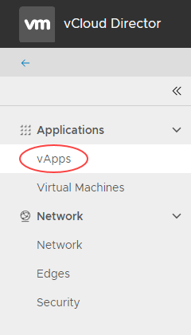

# How to create a catalog

## Overview

UKCloud provides a public catalog for you to use that contains standard virtual machine (VM) sizes and operating systems. The public catalog is a good place to start when you first deploy VMs into the UKCloud platform. However, you may want to create your own catalogues, containing specific applications or gold images, which you can then use to deploy VMs quickly.

## Creating a catalog

The first step is to create an empty catalog:

# [Using vCloud Director 8.20](#tab/tabid-1)

1. In vCloud Director, select the *Catalogs* tab.

    

2. Click the **+** button to add a new catalog.

    

3. Name the catalog and give it a description if needed.

    There's also an option to add a Subscribed Catalog, a read-only copy of an externally published catalog. If you want to do this, you'll need to know the URL, and the password if there is one.

    

4. When you're done, click **Next**.

5. You now have the option to select the storage type used to store the catalog.

    - The default is **Use any storage**. Leave this selected if you don't need to store catalog items on specific storage.

    - Alternatively, you can indicate where your catalog items should be stored if they need to be stored on a specific storage policy.

    

6. When you're done, click **Next**.

7. To make the catalog visible to others, add specific people or your entire organisation.

    

8. Click the **Add Members** button to add everyone in the organisation or individual users. You can give individuals different access levels.

    

9. When you've added all the people who can access the catalog, click **OK**, then review each individual's access level and adjust it if needed.

10. When you're done, click **Next**.

11. You now have the choice to publish your catalog for the use of external organisations.

    - To enable external publishing, select the checkbox and add a password if needed.

    - If you don't want to share your catalog externally, just click **Next**.

    

12. Review the settings and click **Finish**.

# [Using vCloud Director 9.1](#tab/tabid-2)

1. In vCloud Director, click the menu icon and select **Libraries**.

    

2. In the left navigation panel, click **Catalogs**.

    

3. Click the **Add** button to create a new catalog.

    

4. In the *Create Catalog* dialog box, **Name** the catalog and give it a **Description** if needed.

5. From the **Storage Policy** list, select the storage type used to store the catalog.

    - **Tier1** is for high performance, high IOPS VMs

    - **Tier2** is for everything else less demanding (recommended for ISO and templates)

    

6. When you're done, click **OK**.

7. To make the catalog visible to others within your organisation, click the three vertical dots and select **Share**.

    

8. In the *Share Catalog* dialog box, click the **Add** button.

    

9. In the *Share With Users and Groups* dialog box, select:

    - **Share with everyone in the organisation** to add everyone in the organisation

    - **Share with specific users or groups** to add individual users or groups of users

    You can give users different access levels: **Ready Only**, **Full Control** or **Change**. Change allows users to change permissions.

    

10. When you've added all the people who you want to access the catalog, click **OK**.

11. When you're done, click **OK**.

***

## Populating a catalog

There are two ways to populate a catalog:

- By [uploading an OVF package](#uploading-an-ovf-package)

- By [creating a template from an existing vApp](#adding-an-existing-vapp)

### Uploading an OVF package

To upload an OVF package and assign it to a catalog:

# [Using vCloud Director 8.20](#tab/tabid-1)

1. On the *Catalogs* tab, select the *vApp Templates* tab.

    

2. Click the **Upload** button to open an OVF upload window.

    

3. In the *Upload OVF package as a vApp Template* dialog box, select the source of the OVF: either a **URL** or a **Local file**.

4. Give a destination for the OVF, and give the OVF a name.

5. From the **Catalog** list, select the catalog you want to put the OVF in.

    

6. When you're done, click **Upload** to import the OVF into the catalog.

    Depending on template size and network speed, the upload may take some time.

# [Using vCloud Director 9.1](#tab/tabid-2)

1. In the *Libraries* pages, in the left navigation panel, select **vApp Templates**.

    

2. Click the **Add** button to open an OVF upload window.

    

3. In the *Create vApp template from OVF* dialog box, browse for the source of the OVF, then click **Next**.

    

    > [!TIP]
    > You can select multiple files by pressing the CTRL key and selecting other files.

4. Review the details of the OVF template and then click **Next**.

5. Enter a **Name** and **Description** for the template and from the **Catalog** list, select the catalog in which you want to put the OVF. Click **Next** to continue.

    

6. Review the details of the vApp template and when you're done, click **Finish** to deploy.

    Depending on template size and network speed, the upload may take some time.

***

### Adding an existing vApp

To create a catalog from an existing vApp:

# [Using vCloud Director 8.20](#tab/tabid-1)

1. In vCloud Director, select the *My Cloud* tab.

    

2. Right-click the vApp you want to add to the catalog and select **Add to Catalog**.

    You can add both running and stopped vApps to the catalog, although it's worth noting that creating a catalog image from a running vApp could affect performance.

3. You can now choose the catalog you want to add the vApp to, give the vApp a new name, assign a storage lease, and define whether vApps deployed using this template are identical or customisable.

    You can also overwrite an existing catalog item. If the catalog you are adding the vApp to is published externally, you\'ll see a warning.

    

4. When you're done, click **OK**.

# [Using vCloud Director 9.1](#tab/tabid-2)

1. In vCloud Director, click the menu icon and select **Datacenters**.

    

2. Select the VDC where the vApp is located.

3. In the left navigation panel, click **vApps**.

    

4. In the card for the vApp that you want to add to the catalog, click **More** then select **Add to Catalog**.

    

    You can add both running and stopped vApps to the catalog, although it's worth noting that creating a catalog image from a running vApp could affect performance.

5. You can now choose the catalog you want to add the vApp to, give the vApp a new name, assign a storage lease, and define whether vApps deployed using this template are identical or customisable.

    You can also overwrite an existing catalog item. If the catalog you are adding the vApp to is published externally, you'll see a warning.

    

6. When you're done, click **OK**.

    A status bar will appear on top with the message: Please wait. You can close the window and check the progress under Libraries > vApp Templates.

***

## Feedback

If you find an issue with this article, click **Improve this Doc** to suggest a change. If you have an idea for how we could improve any of our services, visit [UKCloud Ideas](https://ideas.ukcloud.com). Alternatively, you can contact us at <products@ukcloud.com>.