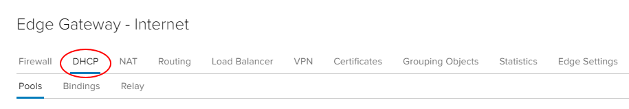
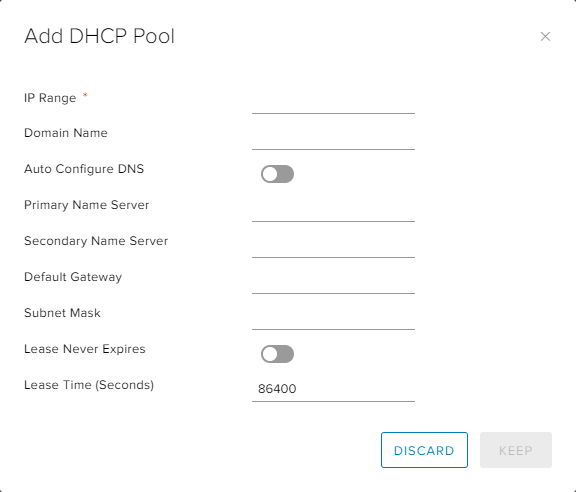

#### UKCloud Limited (“UKC”) and Virtual Infrastructure Group Limited (“VIG”) (together “the Companies”) – in Compulsory Liquidation

On 25 October 2022, the Companies were placed into Liquidation with the Official Receiver appointed as Liquidator and J Robinson and A M Hudson simultaneously appointed as Special Managers to manage the liquidation process on behalf of the Official Receiver.

Further information regarding the Liquidations can be found here: <https://www.gov.uk/government/news/virtual-infrastructure-group-limited-and-ukcloud-limited-information-for-creditors-and-interested-parties>

Contact details: 
For any general queries relating to the Liquidations please email <ukcloud@uk.ey.com> 
For customer related queries please email <ukcloudcustomers@uk.ey.com> 
For supplier related queries please email <ukcloudsuppliers@uk.ey.com>

# How to create a DHCP pool

## Overview

With VDC networks you have the option of creating an IP pool of addresses to be assigned automatically or manually (known as a static IP pool). These addresses are injected into virtual machines (VMs) via VMware Tools during guest customisation. They appear in the usual places in Windows and Linux where you would interrogate IP settings and show as static addresses.

In some situations, you may require true DHCP functionality in your VMs, so that IP addresses are shown as dynamically defined. As with an IP pool, you're defining a non-overlapping range of IP addresses to use on the network.

## Creating a DHCP pool

To create a DHCP pool:

1. In the VMware Cloud Director *Virtual Data Center* dashboard, select the VDC that contains the edge gateway in which you want to create the DHCP pool.

2. In the left navigation panel, under *Networking*, select **Edges**.

    

3. Select the edge that you want to configure and click **Services**.

    

4. Select the **DHCP** tab.

    

5. On the **Pools** tab, click the **+** button.

    

6. In the *Add DHCP Pool* dialog box, define an IP range for the pool. You can leave the lease times as default or change them.

    

7. When you're finished, click **Keep**.

## Next steps

In this article you've learned how to create a DHCP pool. Next, you need to make sure there's a VDC network, configured with a matching gateway and range, connected to the edge. Any VMs attached to this network and configured for DHCP will pick up an IP address from the pool. For more information about creating a network, see [*How to create a routed VDC network**](vmw-how-create-routed-network.md).

For other edge gateway configuration tasks, see:

- [*How to create firewall rules*](vmw-how-create-firewall-rules.md)

- [*How to create NAT rules*](vmw-how-create-nat-rules.md)

- [*How to configure IPsec VPN*](vmw-how-configure-ipsec-vpn.md)

- [*How to configure a load balancer*](vmw-how-configure-load-balancer.md)

- [*How to create a static route*](vmw-how-create-static-route.md)

## Feedback

If you find a problem with this article, click **Improve this Doc** to make the change yourself or raise an [issue](https://github.com/UKCloud/documentation/issues) in GitHub. If you have an idea for how we could improve any of our services, send an email to <feedback@ukcloud.com>.
