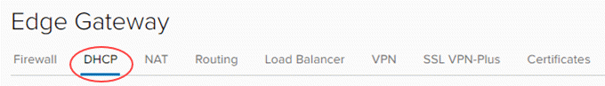
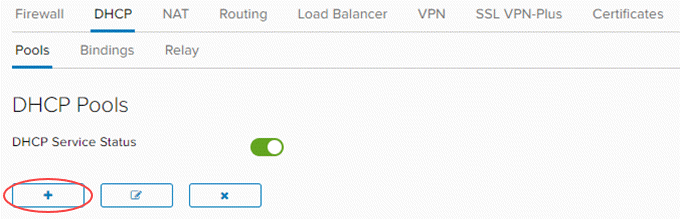
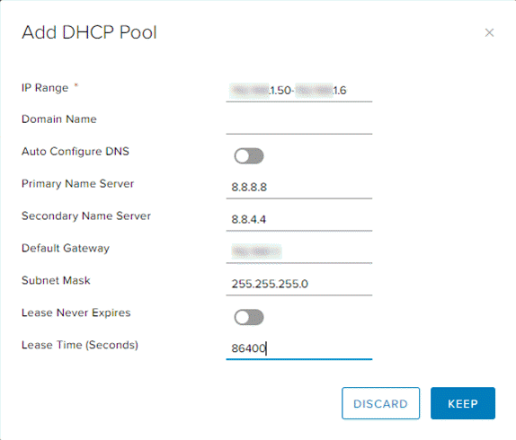
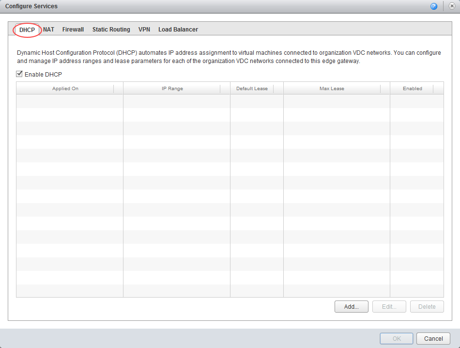
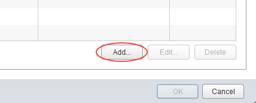
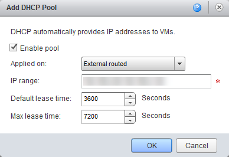

# How to create a DHCP pool

## Overview

With VDC networks you have the option of creating an IP pool of addresses to be assigned automatically or manually (known as a static IP pool). These addresses are injected into virtual machines (VMs) via VMware Tools during Guest Customisation. They appear in the usual places in Windows and Linux where you would interrogate IP settings, and show as static addresses.

In some situations, you may require true DHCP functionality in your VMs, so that IP addresses are shown as dynamically defined. As with an IP pool, you're defining a non-overlapping range of IP addresses to use on the network.

The steps for creating a DHCP pool vary depending on what type of edge gateway you're working with:

- [*Creating a DHCP pool for an advanced gateway*](#creating-a-dhcp-pool-for-an-advanced-gateway)

- [*Creating a DHCP pool for a standard edge*](#creating-a-dhcp-pool-for-a-standard-edge)

> [!NOTE]
> We recommend that you convert your edge to an advanced gateway to access the latest vCloud Director functionality. For more information, see [*How to convert your edge to an advanced gateway*](vmw-how-convert-edge.md).

## Creating a DHCP pool for an advanced gateway

To create DHCP pools on an advanced gateway:

1. In vCloud Director, access the edge gateway settings.

    For more detailed instructions, see [*How to access edge gateway settings*](vmw-how-access-edge.md)

2. Select the **DHCP** tab.

    

3. On the **Pools** tab, click the **Add** button.

    

4. Select the network to which you want to apply the DHCP pool, then define an IP range for the pool. You can leave the lease times as default or change them.

    

5. When you're finished, click **Keep**.

## Creating a DHCP pool for a standard edge

> [!NOTE]
> You can only manage advanced gateways in the new vCloud Director 9.1 tenant portal. If you're working with a standard edge gateway, you must first switch to the vCloud Director web console to manage the edge. For more information, see [*How to switch to the vCloud Director web console from the tenant portal*](vmw-how-switch-web-console.md).

To create DHCP pools on a standard edge:

1. In vCloud Director, select the **Administration** tab.

    

    For more detailed instructions, see the [*Getting Started Guide for UKCloud for VMware*](vmw-gs.md)

2. Double-click the virtual data centre (VDC) that you want to work with, or right-click the VDC and select **Open**.

3. Select the **Edge Gateways** tab.

    

4. Right-click the edge gateway and select **Edge Gateway Services**.

5. Select the **DHCP** tab.

    

6. Click **Add**.

    

7. Select the network to which you want to apply the DHCP pool, then define an IP range for the pool. You can leave the lease times as default or change them.

    

8. When you're finished, click **OK**.

## Next steps

In this article you've learned how to create a DHCP pool. For other edge gateway configuration tasks, see:

- [*How to create firewall rules*](vmw-how-create-firewall-rules.md)

- [*How to create NAT rules*](vmw-how-create-nat-rules.md)

- [*How to configure IPsec VPN*](vmw-how-configure-ipsec-vpn.md)

- [*How to configure a load balancer*](vmw-how-configure-load-balancer.md)

- [*How to create a static route*](vmw-how-create-static-route.md)

## Feedback

If you find an issue with this article, click **Improve this Doc** to suggest a change. If you have an idea for how we could improve any of our services, visit [UKCloud Ideas](https://ideas.ukcloud.com). Alternatively, you can contact us at <products@ukcloud.com>.
