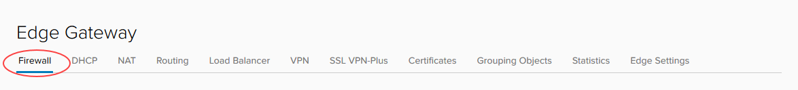
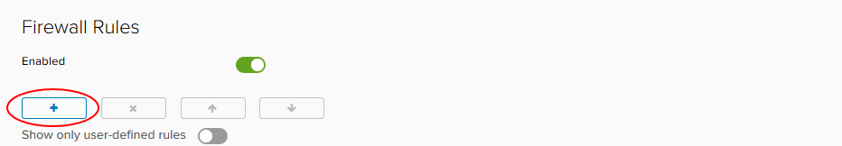
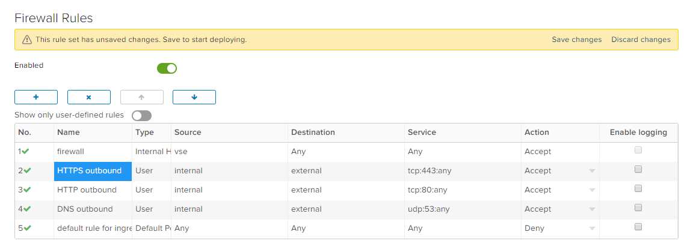
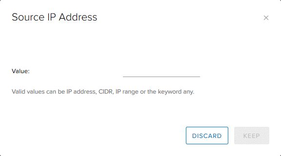
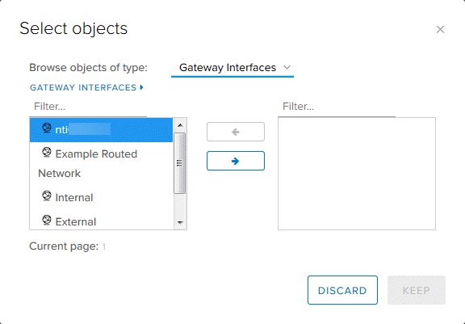
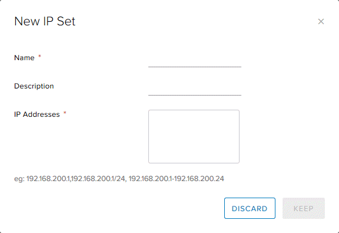
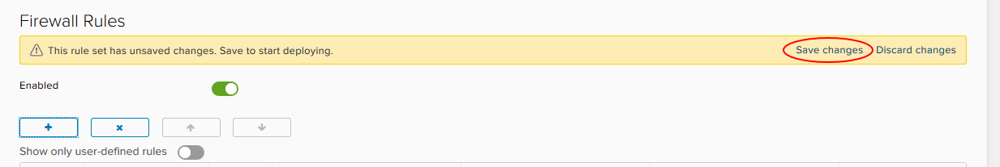
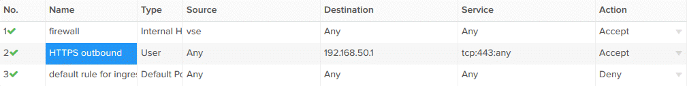

# How to create firewall rules

## Overview

vCloud Director provides a fully featured layer 3 firewall to control transit from inside to outside security boundaries, and within the various VDC networks you create.

When you specify networks or IP addresses, you can use:

- An individual IP address

- IP ranges separated by a dash (`-`)

- A CIDR, for example, `192.168.2.0/24`

- The keywords `internal`, `external` or `any`

> [!NOTE]
> NAT rules only work if the firewall is enabled. For security reasons, you should ensure that the firewall is always enabled.

## Creating firewall rules

To create a firewall rule:

1. In the vCloud Director *Virtual Datacenters* dashboard, select the VDC that contains the edge gateway in which you to create the firewall rules.

2. In the left navigation panel, click **Edges**.

    

3. Select the edge that you want to configure and click **Configure Services**.

    

4. Select the **Firewall** tab.

    

5. Click the **+** button to add a new row to the firewall rules table.

    

6. For the **New Rule**, specify a **Name**.

> [!NOTE]

> The Firewall rules above are just an example we do not advise you use Any, Any, Any, Accept.

    

7. In the **Source** and **Destination** fields, specify the source and destination addresses for the firewall rule.

    - To specify an IP address or range, click **IP** and enter the appropriate **Value**. When you're done, click **Keep**.

        

    - To specify a group of VMs or IPs, click **+** and select the desired objects. When you're done, click **Keep**.

        

    - If you're likely to reuse a group of the same source or destination IP addresses in multiple rules, select the **Grouping Objects** tab and click **+** to create an IP set. You can then select this IP set in the *Select objects* dialog box.

        

8. In the **Service** field, click **+** and, in the *Add Service* dialog box, specify the **Protocol**, **Source Port** and **Destination Port** for the rule. When you're done, click **Keep**.

    

9. Select whether the rule is an **Accept** or **Deny** rule.

10. If you have a syslog server configured, select the **Enable logging** check box.

    For more information about syslog servers, see [*How to access syslog data for your advanced gateway*](vmw-how-access-syslog-data-adv.md).

11. Click **Save changes**.

    

## Example

A common use case for a firewall rule is to allow SSH through from the internet. The following example uses allocated public IP addresses.

When your VDC is provisioned in the:

- Assured OFFICIAL platform, you're assigned five public IP addresses

- Elevated OFFICIAL platform, you're assigned three PSN IP addresses

In the example below, the source is `any` (any IP address within the VDC). The source port is also `any`. The destination is a public IP address and the destination port is `443` for HTTPS.

## Next steps

In this article you've learned how to create firewall rules. For other edge gateway configuration tasks, see:

- [*How to create NAT rules*](vmw-how-create-nat-rules.md)

- [*How to create a DHCP pool*](vmw-how-create-dhcp-pool.md)

- [*How to configure IPsec VPN*](vmw-how-configure-ipsec-vpn.md)

- [*How to configure a load balancer*](vmw-how-configure-load-balancer.md)

- [*How to create a static route*](vmw-how-create-static-route.md)

## Feedback

If you find a problem with this article, click **Improve this Doc** to make the change yourself or raise an [issue](https://github.com/UKCloud/documentation/issues) in GitHub. If you have an idea for how we could improve any of our services, send an email to <feedback@ukcloud.com>.
