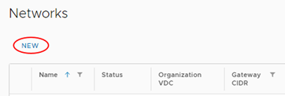
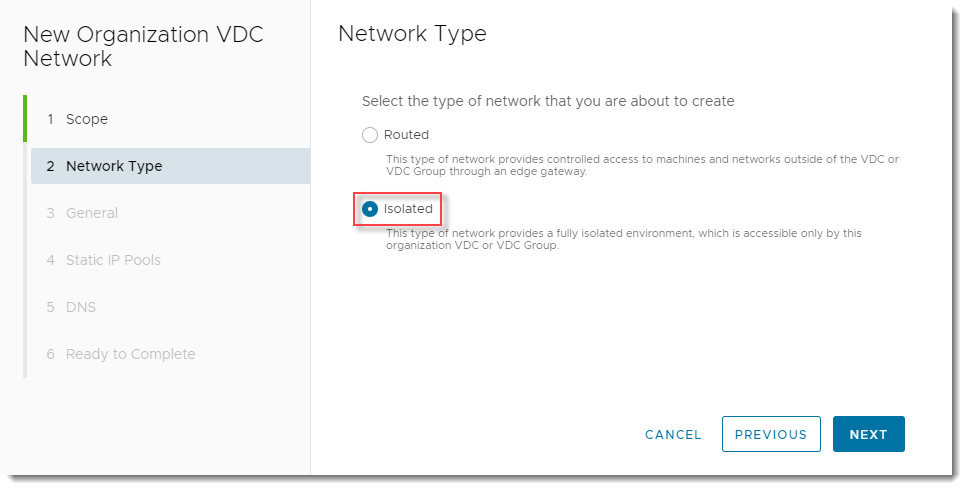
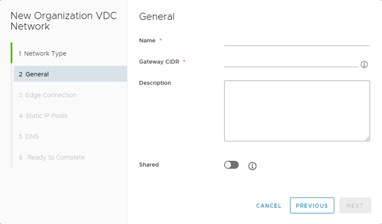
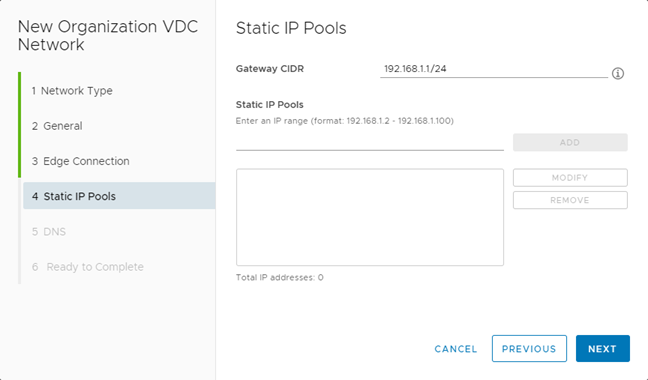
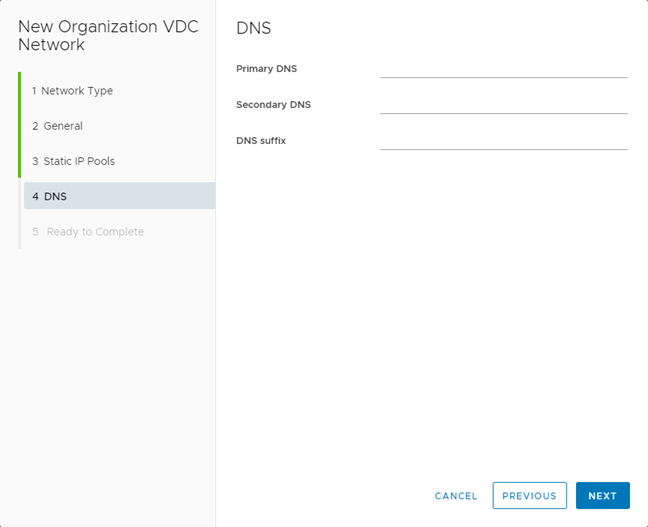

#### UKCloud Limited (“UKC”) and Virtual Infrastructure Group Limited (“VIG”) (together “the Companies”) – in Compulsory Liquidation

On 25 October 2022, the Companies were placed into Liquidation with the Official Receiver appointed as Liquidator and J Robinson and A M Hudson simultaneously appointed as Special Managers to manage the liquidation process on behalf of the Official Receiver.

Further information regarding the Liquidations can be found here: <https://www.gov.uk/government/news/virtual-infrastructure-group-limited-and-ukcloud-limited-information-for-creditors-and-interested-parties>

Contact details: 
For any general queries relating to the Liquidations please email <ukcloud@uk.ey.com> 
For customer related queries please email <ukcloudcustomers@uk.ey.com> 
For supplier related queries please email <ukcloudsuppliers@uk.ey.com>

# How to create an isolated VDC network

## Overview

An organisation virtual data centre network enables its virtual machines (VMs) to communicate with each other or to provide access to external networks. A single VDC can have multiple networks.

There are two types of organisation VDC networks:

- An isolated (internally connected) network is one that only VMs within the VDC can connect to. This article describes how to create an isolated VDC network.

- A routed network (externally connected) provides access to machines and networks outside the VDC via the edge gateway. You can have up to nine usable routed networks per VDC. Creation of routed networks is described in [*How to create a routed VDC network*](vmw-how-create-routed-network.md).

## Creating an isolated network

1. In the VMware Cloud Director *Virtual Data Center* dashboard, select the VDC in which you want to create the network.

2. In the left navigation panel, under *Networking*, select **Networks**.

   

3. Click **New**.

   

4. On the *Scope* page of the *New Organization VDC Network* dialog box, **Current Organization Virtual Data Center** should already be selected, so click **Next**.

5. On the *Network Type* page, select **Isolated**, then click **Next**.

   

6. On the *General* page:

   - Enter a **Name** and **Description** for the network.

   - In the **Gateway CIDR** field, enter the gateway address for the network.

   - Select the **Shared** option to make the network available to other VDCs within the same organisation.

   

7. Click **Next**.

8. On the *Static IP Pools* page, in the **Static IP Pools** field, enter a range of addresses to be consumed by the VMs connecting to the network, then click **Add**.

   As an example, if you give the gateway address as `192.168.1.1/24`, you may then want to create a static IP pool of `192.168.1.10-192.168.1.100`. This will give you a pool of 91 IP addresses to assign to machines within your network. You can always increase this later if needed.

   You can add multiple IP pools.

   

9. Click **Next**.

10. On the *DNS* page, enter DNS information if applicable, then click **Next**.

    

11. On the *Ready to Complete* page, review your selections then click **Finish**.

## Next steps

Now you've created your network to connect the VMs in your VDC, you may want to start building some VMs. For a walkthrough on how to do this, see [*How to build a virtual machine with UKCloud for VMware*](vmw-gs-build-vm-vcd.md).

## Feedback

If you find a problem with this article, click **Improve this Doc** to make the change yourself or raise an [issue](https://github.com/UKCloud/documentation/issues) in GitHub. If you have an idea for how we could improve any of our services, send an email to <feedback@ukcloud.com>.
