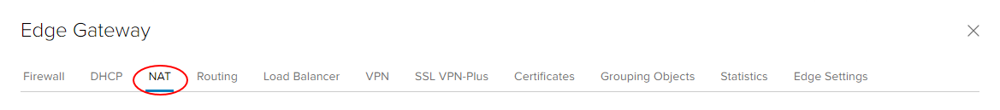
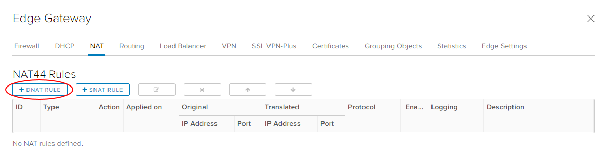
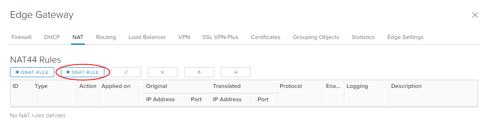
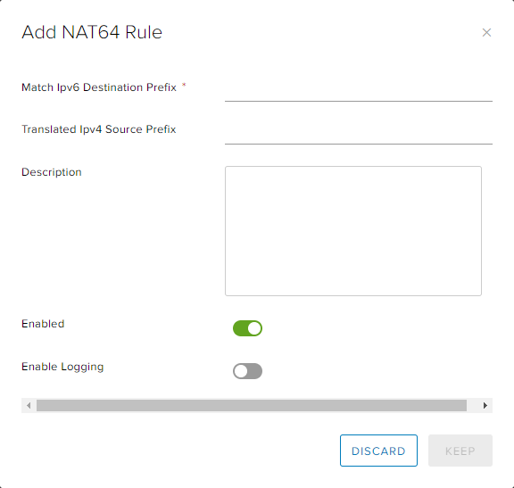

# How to create NAT rules

## Overview

Network Address Translation (NAT) allows the source or destination IP address to be changed to enable traffic to transition through a router or gateway.

You can use three types of NAT within your edge gateway:

- [Destination NAT (DNAT)](#creating-a-dnat-rule) - changes the destination IP of the packet

- [Source NAT (SNAT)](#creating-an-snat-rule) - changes the source IP of the packet

- [NAT64](#creating-a-nat64-rule) - allows access from IPv6 networks to IPv4 networks

For a virtual machine (VM) to access an external network resource from its virtual data centre (VDC), the IP address of its network needs to NAT to one of the following:

- The public internet IP addresses provided by UKCloud

- The private transit networks provided by UKCloud for PSN and HSCN connectivity

It's worth noting that for both DNAT and SNAT:

- The NAT rule will be applied to the edge gateway, rather than to the internal VDC network

- The firewall needs to be open for NAT rules

> [!NOTE]
> NAT rules only work if the firewall is enabled. For security reasons, you should ensure that the firewall is always enabled.

## Creating a DNAT rule

DNAT changes the destination IP address of a packet and performs the reverse function for any replies. You can use DNAT to publish a service located in a private network on a public IP address.

To create a DNAT rule:

1. In the vCloud Director *Virtual Datacenters* dashboard, select the VDC that contains the edge gateway in which you to create the DNAT rule.

2. In the left navigation panel, click **Edges**.

    

3. Select the edge that you want to configure and click the **Configure Services** button.

    

4. Select the **NAT** tab.

    

5. In the *NAT44 Rules* section, click **+ DNAT Rule**.

    

6. In the *Add DNAT Rule* dialog box, from the **Applied On** list, select the interface on which to apply the rule. Unless you have special requirements, this will be the external network (usually named nti* or nft*).

7. Enter an **Original IP/Range** and a **Translated IP/Range**.

8. Select the **Protocol**, **Original Port** and **Translated Port**.

9. Make sure the **Enabled** option is selected.

10. If you have a syslog server configured, select the **Enable logging** option.

    For more information about syslog servers, see [*How to access syslog data for your advanced gateway*](vmw-how-access-syslog-data-adv.md).

    

11. When you're done, click **Keep** then **Save changes**.

## Creating an SNAT rule

SNAT changes the source IP address of a packet and performs the reverse function for any replies.

When connecting to an external network, such as the internet, to access services (for example, DNS), you need to define an SNAT rule to translate your internal address into something available on the external network (for example, PSN, internet).

To create an SNAT rule:

1. In the vCloud Director *Virtual Datacenters* dashboard, select the VDC that contains the edge gateway in which you to create the SNAT rule.

2. In the left navigation panel, click **Edges**.

    

3. Select the edge that you want to configure and click the **Configure Services** button.

    

4. Select the **NAT** tab.

    

5. In the *NAT44 Rules* section, click **+ SNAT Rule**.

    

6. In the *Add SNAT Rule* dialog box, from the **Applied On** list, select the interface on which to apply the rule. Unless you have special requirements, this will be the external network (usually named nti* or nft*).

7. Enter an **Original Source IP/Range** and a **Translated Source IP/Range**.

8. Make sure the **Enabled** option is selected.

9. If you have a syslog server configured, select the **Enable logging** option.

    For more information about syslog servers, see [*How to access syslog data for your advanced gateway*](vmw-how-access-syslog-data-adv.md).

    

10. When you're done, click **Keep** then **Save changes**.

## Creating a NAT64 rule

If you have an IPv6 network and need to communicate to an IPv4 network, you'll need to translate IP addresses to enable that communication.

1. In the vCloud Director *Virtual Datacenters* dashboard, select the VDC that contains the edge gateway in which you to create the SNAT rule.

2. In the left navigation panel, click **Edges**.

    

3. Select the edge that you want to configure and click the **Configure Services** button.

    

4. Select the **NAT** tab.

    

5. In the *NAT64 Rules* section, click **+ NAT64 Rule**.

6. In the *Add NAT64 Rule* dialog box, in the **Match Ipv6 Destination Prefix** field, enter the IPv6 address to use to translate IPv6 destinations to IPv4 destinations.

7. In the **Translated Ipv4 Source Prefix** field, enter the IPv4 address to use to translate IPv6 source addresses into IPv4 source addresses.

8. Make sure the **Enabled** option is selected.

9. If you have a syslog server configured, select the **Enable logging** option.

    For more information about syslog servers, see [*How to access syslog data for your advanced gateway*](vmw-how-access-syslog-data-adv.md).

    

10. When you're done, click **Keep** then **Save changes**.

## Next steps

In this article you've learned how to create DNAT and SNAT rules. For other edge gateway configuration tasks, see:

- [*How to create firewall rules*](vmw-how-create-firewall-rules.md)

- [*How to create a DHCP pool*](vmw-how-create-dhcp-pool.md)

- [*How to configure IPsec VPN*](vmw-how-configure-ipsec-vpn.md)

- [*How to configure a load balancer*](vmw-how-configure-load-balancer.md)

- [*How to create a static route*](vmw-how-create-static-route.md)

## Feedback

If you find an issue with this article, click **Improve this Doc** to suggest a change. If you have an idea for how we could improve any of our services, visit the [Ideas](https://community.ukcloud.com/ideas) section of the [UKCloud Community](https://community.ukcloud.com).
