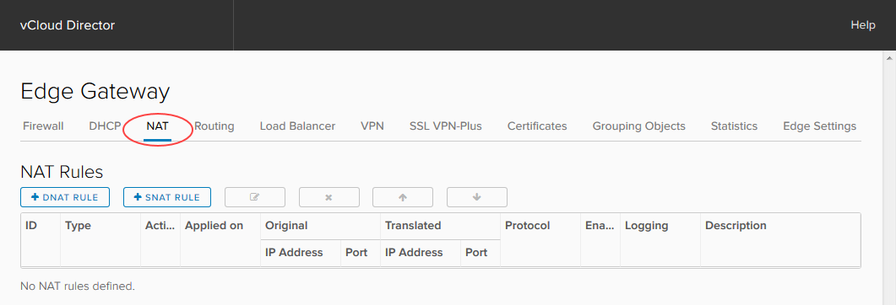
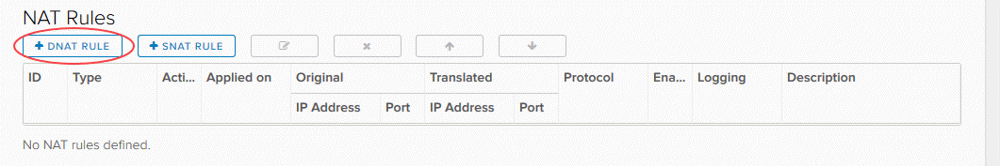
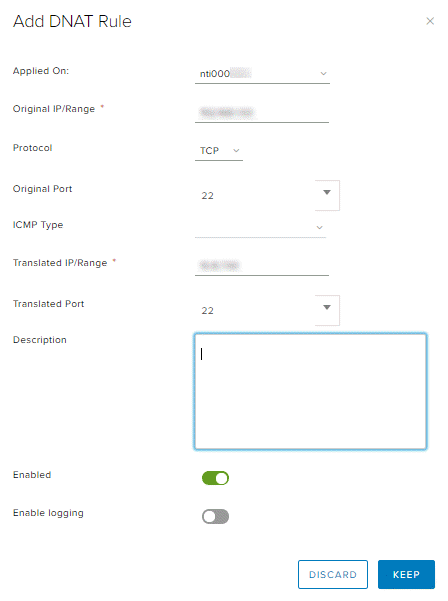
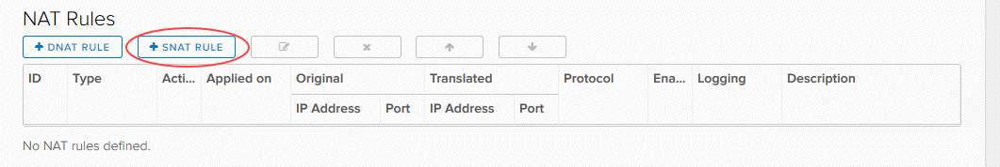
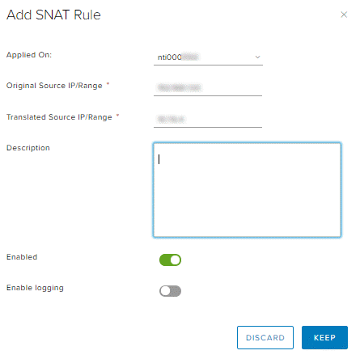
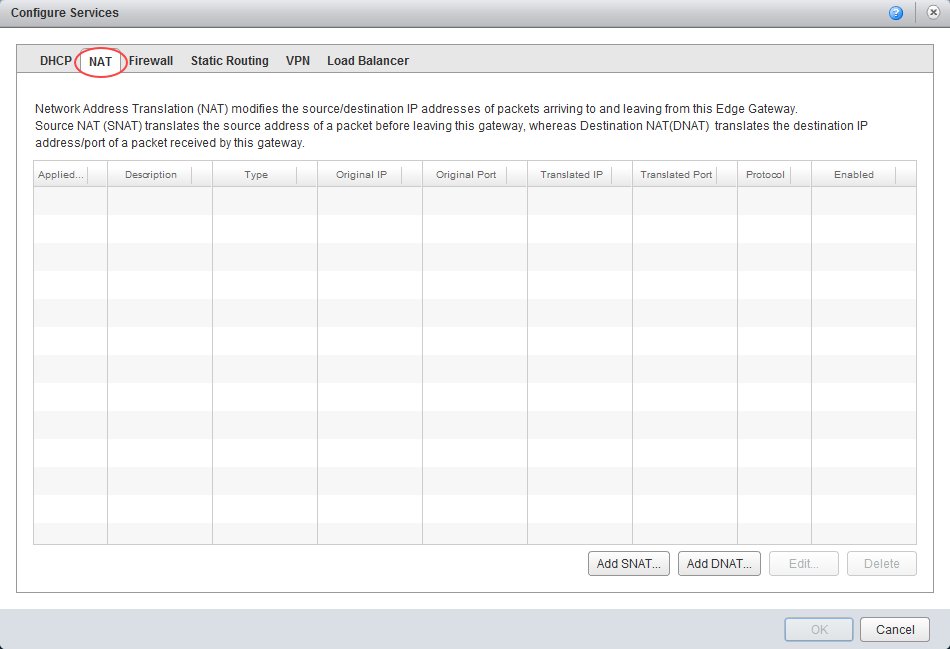
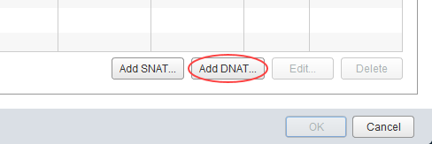
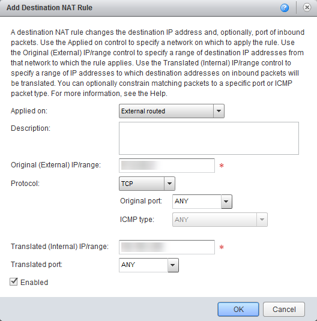
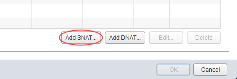

# How to create NAT rules

## Overview

Network Address Translation (NAT) allows the source or destination IP address to be changed to enable traffic to transition through a router or gateway.

You can use two types of NAT within your edge gateway:

- Destination NAT (DNAT) - changes the destination IP of the packet
- Source NAT (SNAT) - changes the source IP of the packet

For a virtual machine (VM) to access an external network resource from its virtual data centre (VDC), the IP address of its network needs to NAT to one of the following:

- The public internet IP addresses provided by UKCloud
- The private transit networks provided by UKCloud for PSN and HSCN connectivity

It's worth noting that for both DNAT and SNAT:

- The NAT rule will be applied to the edge gateway, rather than to the internal VDC network
- The firewall needs to be open for NAT rules

The steps for creating NAT rules vary depending on what type of edge gateway you're working with:

- [Creating NAT rules for an advanced gateway](#creating-nat-rules-for-an-advanced-gateway)
- [Creating nat rules for a standard edge](#creating-nat-rules-for-a-standard-edge)

> [!NOTE]
> We recommend that you convert your edge to an advanced gateway to access the latest vCloud Director functionality. For more information, see [*How to convert your edge to an advanced gateway*](vmw-how-convert-edge.md).

## Creating NAT rules for an advanced gateway

### Creating a DNAT rule for an advanced gateway

DNAT changes the destination IP address of a packet and performs the reverse function for any replies. You can use DNAT to publish a service located in a private network on a public IP address.

To create a DNAT rule on your advanced gateway:

1. In vCloud Director, access the edge gateway settings.

    For more detailed instructions, see [*How to access edge gateway settings*](vmw-how-access-edge.md)

2. Select the **NAT** tab.

    

3. Click **+ DNAT Rule**.

    

4. In the *Add DNAT Rule* dialog box, from the **Applied On** list, select the interface on which to apply the rule.

5. Enter an **Original IP/Range** and a **Translated IP/Range**.

6. Select the **Protocol**, **Original Port** and **Translated Port**.

7. Make sure the **Enabled** toggle is selected and then click **Keep**.

    

8. Click **Save changes**.

### Creating an SNAT rule for an advanced gateway

SNAT changes the source IP address of a packet and performs the reverse function for any replies.

When connecting to an external network, such as the internet, to access services (for example, DNS), you need to define an SNAT rule to translate your internal address into something available on the external network (for example, PSN, internet).

To create an SNAT rule on your advanced gateway:

1. In vCloud Director, access the edge gateway settings.

    For more detailed instructions, see [*How to access edge gateway settings*](vmw-how-access-edge.md)

2. Select the **NAT** tab.

    

3. Click **+ SNAT Rule**.

    

4. In the *Add SNAT Rule* dialog box, from the **Applied On** list, select the interface on which to apply the rule.

5. Enter an **Original Source IP/Range** and a **Translated Source IP/Range**.

6. Make sure the **Enabled** toggle is selected and then click **Keep**.

    

7. Click **Save changes**.

## Creating NAT rules for a standard edge

> [!NOTE]
> You can only manage advanced gateways in the new vCloud Director 9.1 tenant portal. If you're working with a standard edge gateway, you must first switch to the vCloud Director web console to manage the edge. For more information, see [*How to switch to the vCloud Director web console from the tenant portal*](vmw-how-switch-web-console.md).

### Creating a DNAT rule for a standard edge

DNAT changes the destination IP address of a packet and performs the reverse function for any replies. You can use DNAT to publish a service located in a private network on a public IP address.

To create a DNAT rule on your edge gateway:

1. In vCloud Director, click the **Administration** tab.

    

    For more detailed instructions, see the [*Getting Started Guide for UKCloud for VMware*](vmw-gs.md)

2. Double-click the virtual data centre (VDC) that you want to work with, or right-click the VDC and select **Open**.

3. Select the **Edge Gateways** tab.

    

4. Right-click the edge gateway and select **Edge Gateway Services**.

5. Select the **NAT** tab.

    

6. Click **Add DNAT**.

    

7. In the *Add Destination NAT Rule* dialog box, enter an **Original (External) IP/range** and a **Translated (Internal) IP/range**.

    > ![TIP]
    > You should have multiple external IP addresses to use. For how to find them, see [*How to find your allocated external IP addresses*](vmw-how-find-ip-addresses.md).

8. Select the **Protocol** and **Original port** type.

    

9. When you're finished, click **OK**.

### Creating an SNAT rule for a standard edge

Source NAT changes the source IP address of a packet and performs the reverse function for any replies.

When connecting to an external network, such as the internet, to access services (for example, DNS), you need to define an SNAT rule to translate your internal address into something available on the external network (for example, PSN, internet).

To create an SNAT rule on your edge gateway:

1. In vCloud Director, click the **Administration** tab.

    

    For more detailed instructions, see the [*Getting Started Guide for UKCloud for VMware*](vmw-gs.md)

2. Double-click the virtual data centre (VDC) that you want to work with, or right-click the VDC and select **Open**.

3. Select the **Edge Gateways** tab.

    

4. Right-click the edge gateway and select **Edge Gateway Services**.

5. Select the **NAT** tab.

    

6. Click **Add SNAT**.

    

7. In the *Add Source NAT Rule* dialog box, enter an **Original (Internal) source IP/range** and a **Translated (External) source IP/range**.

    > ![TIP]
    > You should have multiple external IP addresses to use. For how to find them, see [*How to find your allocated external IP addresses*](vmw-how-find-ip-addresses.md).

8. For SNAT there are no options for specifying the protocol or originating port type.

    

9. When you're finished, click **OK**.

## Next steps

In this article you've learned how to create DNAT and SNAT rules. For other edge gateway configuration tasks, see:

- [*How to create firewall rules*](vmw-how-create-firewall-rules.md)
- [*How to create a DHCP pool*](vmw-how-create-dhcp-pool.md)
- [*How to configure IPsec VPN*](vmw-how-configure-ipsec-vpn.md)
- [*How to configure a load balancer*](vmw-how-configure-load-balancer.md)
- [*How to create a static route*](vmw-how-create-static-route.md)

## Feedback

If you have any comments on this document or any other aspect of your UKCloud experience, send them to <products@ukcloud.com>.