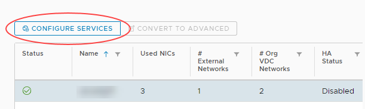

# How to create NAT rules

## Overview

Network Address Translation (NAT) allows the source or destination IP address to be changed to enable traffic to transition through a router or gateway.

You can use two types of NAT within your edge gateway:

- Destination NAT (DNAT) - changes the destination IP of the packet

- Source NAT (SNAT) - changes the source IP of the packet

For a virtual machine (VM) to access an external network resource from its virtual data centre (VDC), the IP address of its network needs to NAT to one of the following:

- The public internet IP addresses provided by UKCloud

- The private transit networks provided by UKCloud for PSN and HSCN connectivity

It's worth noting that for both DNAT and SNAT:

- The NAT rule will be applied to the edge gateway, rather than to the internal VDC network

- The firewall needs to be open for NAT rules

> [!NOTE]
> NAT rules only work if the firewall is enabled. For security reasons, you should ensure that the firewall is always enabled.

## Creating a DNAT rule

DNAT changes the destination IP address of a packet and performs the reverse function for any replies. You can use DNAT to publish a service located in a private network on a public IP address.

To create a DNAT rule:

1. In the vCloud Director *Virtual Datacenters* dashboard, select the VDC that contains the edge gateway in which you to create the DNAT rule.

2. In the left navigation panel, click **Edges**.

    

3. Select the edge that you want to configure and click the **Configure Services** button.

    

4. Select the **NAT** tab.

    

5. Click **+ DNAT Rule**.

    

6. In the *Add DNAT Rule* dialog box, from the **Applied On** list, select the interface on which to apply the rule.

7. Enter an **Original IP/Range** and a **Translated IP/Range**.

8. Select the **Protocol**, **Original Port** and **Translated Port**.

9. Make sure the **Enabled** toggle is selected and then click **Keep**.

    

10. Click **Save changes**.

## Creating an SNAT rule

SNAT changes the source IP address of a packet and performs the reverse function for any replies.

When connecting to an external network, such as the internet, to access services (for example, DNS), you need to define an SNAT rule to translate your internal address into something available on the external network (for example, PSN, internet).

To create an SNAT rule:

1. In the vCloud Director *Virtual Datacenters* dashboard, select the VDC that contains the edge gateway in which you to create the SNAT rule.

2. In the left navigation panel, click **Edges**.

    

3. Select the edge that you want to configure and click the **Configure Services** button.

    

4. Select the **NAT** tab.

    

5. Click **+ SNAT Rule**.

    

6. In the *Add SNAT Rule* dialog box, from the **Applied On** list, select the interface on which to apply the rule.

7. Enter an **Original Source IP/Range** and a **Translated Source IP/Range**.

8. Make sure the **Enabled** toggle is selected and then click **Keep**.

    

9. Click **Save changes**.

## Next steps

In this article you've learned how to create DNAT and SNAT rules. For other edge gateway configuration tasks, see:

- [*How to create firewall rules*](vmw-how-create-firewall-rules.md)

- [*How to create a DHCP pool*](vmw-how-create-dhcp-pool.md)

- [*How to configure IPsec VPN*](vmw-how-configure-ipsec-vpn.md)

- [*How to configure a load balancer*](vmw-how-configure-load-balancer.md)

- [*How to create a static route*](vmw-how-create-static-route.md)

## Feedback

If you find an issue with this article, click **Improve this Doc** to suggest a change. If you have an idea for how we could improve any of our services, visit [UKCloud Ideas](https://ideas.ukcloud.com). Alternatively, you can contact us at <products@ukcloud.com>.
