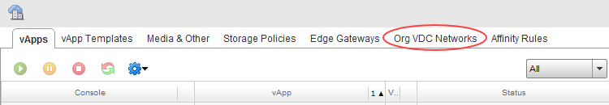
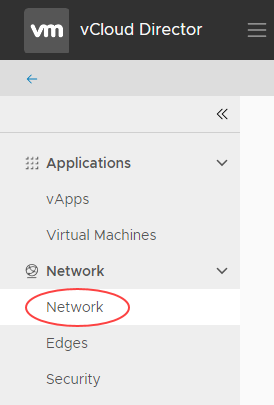

# How to create a routed VDC network

## Overview

An organisation virtual data centre network enables its virtual machines (VMs) to communicate with each other or to provide access to external networks. A single VDC can have multiple networks.

There are two network flavours, isolated and routed:

- An isolated (internally connected) network is one that only VMs within the VDC can connect to. Creation of isolated networks is described in [*How to create an isolated VDC network*](vmw-how-create-isolated-network.md).
- A routed network (externally connected) provides access to machines and networks outside the VDC via the edge gateway. You can have up to nine usable routed networks per VDC. This guide describes how to create a routed VDC network.

The steps for creating a routed VDC network depend on the version of vCloud Director available in your environment:

- [vCloud Director 8.20](#creating-a-routed-vdc-network-vcloud-director-820)

- [vCloud Director 9.1](#creating-a-routed-vdc-network-vcloud-director-91)

## Creating a routed VDC network (vCloud Director 8.20)

To create a routed VDC network:

1. In vCloud Director, click the **Administration** tab.

    

    For more detailed instructions, see the [*Getting Started Guide for UKCloud for VMware*](vmw-gs.md)

2. Double-click the virtual data centre (VDC) that you want to work with, or right-click the VDC and select **Open**.

3. Select the **Org VDC Networks** tab.

    

4. Click the green **+** icon (or right-click an empty row and select **Add Network**)

5. Select the option to **Create a routed network**.

    

6. Select the edge gateway that you want your network to connect to and then click **Next**.

    

    <!-- add info about what the Create as subinterface checkbox is for -->

7. In the *Configure Network* page, create a network **Gateway address** and **Network mask**, and add a **DNS** if possible.

    

8. The **Static IP pool** is similar to DHCP in the sense that it's a range of IP addresses to be consumed by the VMs connecting to the network. When a VM is configured it will have a static manual or a static IP pool address assigned to it.

    - For static manual, enter the address manually. This must be a valid address for the pool. The VM will keep this address for as long as it exists.
    - For static IP pool, enter a range of addresses. A free address from the IP pool will be allocated to the machine automatically.

    As an example, if you give the gateway address as `192.168.1.1`, you may then want to give a static IP pool of `192.168.1.10` to `192.168.1.100`. This will give you a pool of 91 IP  addresses to assign to machines within your network. You can always increase this later if needed.

    

9. Click **Next**.

10. Give the network a **Name** and **Description**.

11. If you want to make the network shareable with other VDCs, select the **Share this network** check box.

12. Click **Next** to review your settings, and then click **Finish**.

## Creating a routed VDC network (vCloud Director 9.1)

To create a routed VDC network:

1. In the vCloud Director *Virtual Datacenters* dashboard, select the VDC in which you want to create the network.

2. In the left navigation panel, select **Network**.

    

3. Click the **Add** button.

    

4. In the *Add Org VDC Network* dialog box, from the **Type** radio buttons, select **Routed network connecting to an existing edge gateway**.

    

5. Confirm that you're creating the network in the correct **Org VDC**.

6. Enter a **Name** and **Description** for the network.

7. If you want to make the network shareable with other VDCs, select the **Share this network with other VDCs in this organization** check box.

8. Select the **Edge Gateway** that you want your network to connect to.

9. Create a network **Gateway address** and **Network mask**, and add a **DNS** if possible.

10. The **Static IP Pool** is similar to DHCP in the sense that it's a range of IP addresses to be consumed by the VMs connecting to the network. When a VM is configured it will have a static manual or a static IP pool address assigned to it.

    - For static manual, enter the address manually. This must be a valid address for the pool. The VM will keep this address for as long as it exists.
    - For static IP pool, enter a range of addresses. A free address from the IP pool will be allocated to the machine automatically.

    As an example, if you give the gateway address as `192.168.1.1`, you may then want to create a **Static IP Pool** of `192.168.1.10-192.168.1.100`. This will give you a pool of 91 IP addresses to assign to machines within your network. You can always increase this later if needed.

    

    Click **Add** to create the static pool.

11. When you're done, click **Save**.

## Next steps

Now you've created your network to connect your VDC with the outside world, may want to configure your edge gateway to control what traffic is allowed into and out of your VDC. You may also wan to start building some VMs. For a quick guide on how to do this, see [*How to build a virtual machine with UKCloud for VMware*](vmw-how-build-vm.md).

## Feedback

If you have any comments on this document or any other aspect of your UKCloud experience, send them to <products@ukcloud.com>.