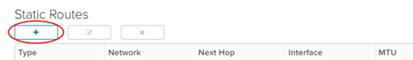

 **UKCloud Limited (“UKC”) and Virtual Infrastructure Group Limited (“VIG”) (together “the Companies”) – in Compulsory Liquidation**

On 25 October 2022, the Companies were placed into Liquidation with the Official Receiver appointed as Liquidator and J Robinson and A M Hudson simultaneously appointed as Special Managers to manage the liquidation process on behalf of the Official Receiver.

Further information regarding the Liquidations can be found here: <https://www.gov.uk/government/news/virtual-infrastructure-group-limited-and-ukcloud-limited-information-for-creditors-and-interested-parties>

Contact details: 
For any general queries relating to the Liquidations please email <ukcloud@uk.ey.com> 
For customer related queries please email <ukcloudcustomers@uk.ey.com> 
For supplier related queries please email <ukcloudsuppliers@uk.ey.com>

# How to create a static route

## Overview

Static routing enables you to configure your edge gateway with knowledge of other networks that are not directly connected to it. It's particularly useful if you need to route between virtual data centres (VDCs) in the same vOrg, or route traffic to vApp networks. Static routing is the only option on edge gateways; dynamic routing protocols cannot be used.

As an example, you may have a vApp network, `192.168.8.0/24`, routed to a VDC network called `Front end network`. You could create a static route to enable traffic to get to the outside IP of the vApp edge at `192.168.4.33` (a NAT will exist there).

> [!IMPORTANT]
> Selecting **Default gateway is not set** in the **Applied On** list under the *Static Routing Default Gateway* section will remove all existing static routes.  However, setting a global default **Gateway IP** when it is configured with **Default gateway is not set** will retain the entries on the Static Routes tab.

## Creating a static route

To create a static route:

1. In the VMware Cloud Director *Virtual Data Center* dashboard, select the VDC that contains the edge gateway in which you want to create the static route.

2. In the left navigation panel, under *Networking*, select **Edges**.

    

3. On the *Edge Gateways* page, select the edge that you want to configure and click **Services**.

    

4. On the *Edge Gateway* page, select the **Routing** tab then the **Static Routes** tab.

    

5. On the *Static Routes* page, click the **+** button.

    

6. In the *Add Static Route* dialog box, fill in the details of the network range, next hop (edge IP) and select the network interface to which you want to apply the static route.

    

7. When you're done, click **Keep** then **Save changes**.

8. Repeat the steps for the second VDC.

## Next steps

In this article you've learned how to create a static route. For other edge gateway configuration tasks, see:

- [*How to create firewall rules*](vmw-how-create-firewall-rules.md)

- [*How to create NAT rules*](vmw-how-create-nat-rules.md)

- [*How to create a DHCP pool*](vmw-how-create-dhcp-pool.md)

- [*How to configure IPsec VPN*](vmw-how-configure-ipsec-vpn.md)

- [*How to configure a load balancer*](vmw-how-configure-load-balancer.md)

## Feedback

If you find a problem with this article, click **Improve this Doc** to make the change yourself or raise an [issue](https://github.com/UKCloud/documentation/issues) in GitHub. If you have an idea for how we could improve any of our services, send an email to <feedback@ukcloud.com>.
