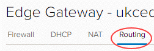
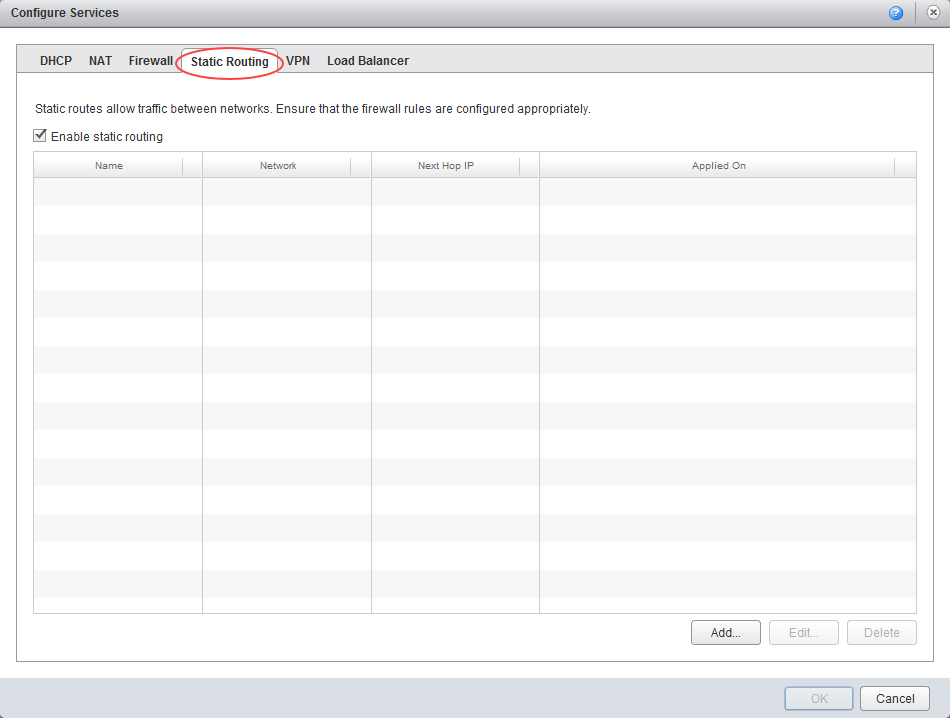
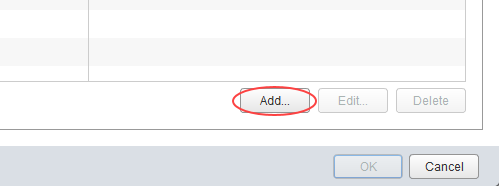
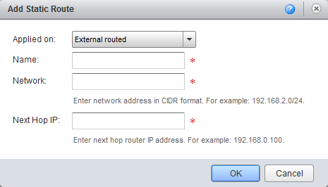

# How to create a static route

## Overview

Static routing allows you to configure your edge gateway to indicate to other networks how to get to further networks. It's particularly useful if you need to route between virtual data  centres (VDCs) in the same vOrg. Static routing is the only option in vCloud Director; routing protocol cannot be used.

As an example, you may have a vApp network `192.168.8.0/24` routed to a VDC network called `Front end network`. You could create a static route to enable traffic to get to the outside IP of the vApp edge at `192.168.4.33` (a NAT will exist there).

The steps for creating a static route vary depending on what type of edge gateway you're working with:

- [Creating a static route for an advanced gateway](#creating-a-static-route-for-an-advanced-gateway)

- [Creating a static route for a standard edge](#creating-a-static-route-for-a-standard-edge)

> [!NOTE]
> We recommend that you convert your edge to an advanced gateway to access the latest vCloud Director functionality. For more information, see [*How to convert your edge to an advanced gateway*](vmw-how-convert-edge.md).

## Creating a static route for an advanced gateway

To create a static route on your advanced gateway:

1. In vCloud Director, access the edge gateway settings.

    For more detailed instructions, see [*How to access edge gateway settings*](vmw-how-access-edge.md)

2. Select the **Routing** tab.

    

3. On the **Static Routes** tab, click the **+** button.

    

4. In the *Add Static Route* dialog box, fill in the details of the network range, next hop (edge IP) and select the network interface to which you want to apply the static route.

    

5. When you're done, click **Keep** then click **Save changes**.

6. Repeat the steps for the second VDC.

## Creating a static route for a standard edge

> [!NOTE]
> You can only manage advanced gateways in the new vCloud Director 9.1 tenant portal. If you're working with a standard edge gateway, you must first switch to the vCloud Director web console to manage the edge. For more information, see [*How to switch to the vCloud Director web console from the tenant portal*](vmw-how-switch-web-console.md).

To create a static route on your standard edge:

1. In vCloud Director, click the **Administration** tab.

    

    For more detailed instructions, see the [*Getting Started Guide for UKCloud for VMware*](vmw-gs.md)

2. Double-click the virtual data centre (VDC) that you want to work with, or right-click the VDC and select **Open**.

3. Select the **Edge Gateways** tab.

    

4. Right-click the edge gateway and select **Edge Gateway Services**.

5. Select the **Static Routing** tab.

    

6. Click **Add**.

    

7. Choose the network to which you want to apply the static route, give the static route a name, then fill in the network details.

    

8. When you're finished, click **OK**.

9. Repeat the steps for the second VDC.

## Next steps

In this article you've learned how to create a static route. For other edge gateway configuration tasks, see:

- [*How to create firewall rules*](vmw-how-create-firewall-rules.md)

- [*How to create NAT rules*](vmw-how-create-nat-rules.md)

- [*How to create a DHCP pool*](vmw-how-create-dhcp-pool.md)

- [*How to configure IPsec VPN*](vmw-how-configure-ipsec-vpn.md)

- [*How to configure a load balancer*](vmw-how-configure-load-balancer.md)

## Feedback

If you find an issue with this article, click **Improve this Doc** to suggest a change. If you have an idea for how we could improve any of our services, visit [UKCloud Ideas](https://ideas.ukcloud.com). Alternatively, you can contact us at <products@ukcloud.com>.
