# How to create a vApp network

## Overview

In addition to virtual data centre (VDC) networking, you can create individual vApp networks to have even greater control over your network infrastructure.

vApp networks enable you to create smaller networks within individual vApps that have a vApp edge, similar to the edge gateway on your VDC. Although a vApp edge isn't as feature rich as a VDC edge, it enables you to create firewall and NAT rules to separate your VDC networks from your vApp virtual machines (VMs). This means you can create some quite complex networks to satisfy application needs.

The example of a vApp network, below, shows the vApp edge.

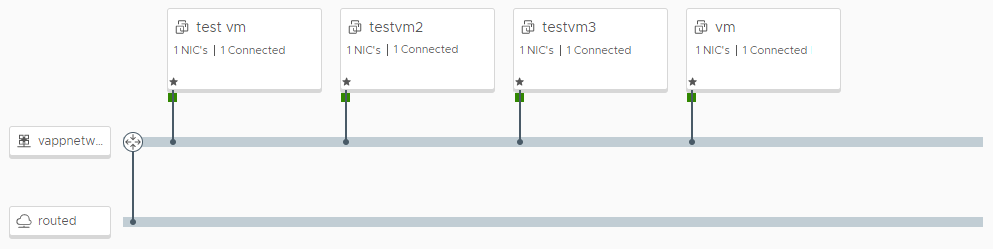

> [!NOTE]
> You cannot create vApp networks in the new vCloud Director 9.1 tenant portal. If your environment uses vCloud Director 9.1, you must first switch to the vCloud Director web console. For more information, see [*How to switch to the vCloud Director web console from the tenant portal*](vmw-how-switch-web-console.md).

## Creating a vApp network

There are two ways to create a vApp network within vCloud Director:

- [*During vApp creation*](#creating-a-vapp-network-during-vapp-creation)

- [*After vApp creation*](#creating-a-vapp-network-after-vapp-creation)

### Creating a vApp network during vApp creation

1. Follow the steps for creating a new vApp as shown in [*How to create a vApp*](vmw-how-create-vapp.md).

2. When you get to the *Configure Virtual Machines* page, where you select the network you want your VMs to connect to, from the **Network** list, select **Add Network**.

    > [!TIP]
    > The **Add Network** option is at the bottom of the **Network** list, so you may have to scroll down the list to find it.

    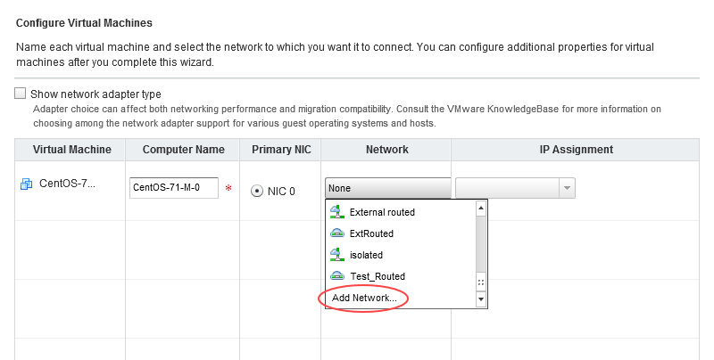

3. On the *Network Specification* page of the *New vApp Network Wizard*, fill out the fields as required for your network then click **Next**.

    Some options are pre-populated by default; you can change them if you want.

    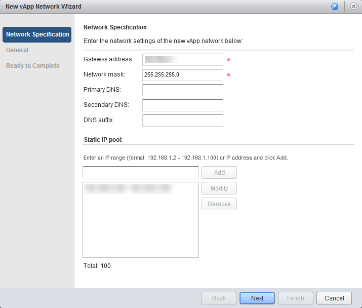

4. On the *General* page, enter a **Network name** and **Description**, then click **Next** and **Finish**.

    Your newly created vApp network is now included in the **Network** list.

    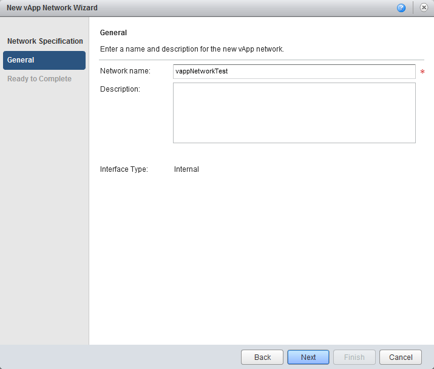

5. Your newly created vApp network is now included in the **Network** list.

    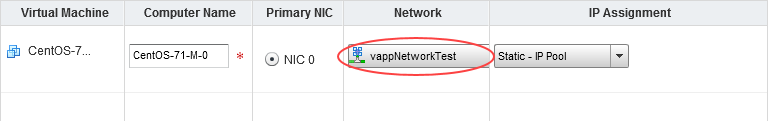

6. If you want to connect multiple VMs within the vApp to the new vApp network, go through and make sure they will all connect to it. When you're done, click **Next**.

7. On the *Configure Networking* page, to connect the vApp network to an external VDC network, from the **Connection** list, select the VDC network that you want to connect to.

8. In the **Routing** column, select whether to apply **NAT** and **Firewall** rules to the vApp edge (you can always change this later), then click **Next**.

    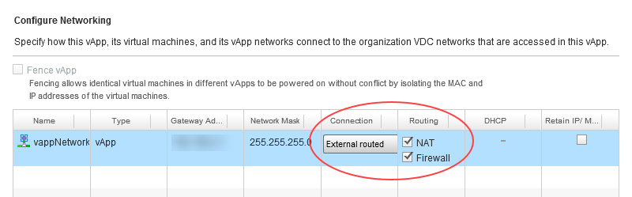

9. On the *Ready to Complete* page, review your configuration, then click **Finish** to deploy the vApp.

### Creating a vApp network after vApp creation

If you've created a vApp that is connected to a VDC network, and now you want to convert it to a vApp with an internal network:

1. On the **My Cloud** tab, double-click the vApp to open it.

2. As you're going to be changing network settings, all VMs within the vApp must be powered off, so, if necessary, on the **Virtual Machines** tab, right-click each VM and select **Power Off**.

    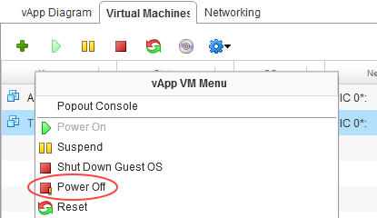

3. Select the **Networking** tab.

    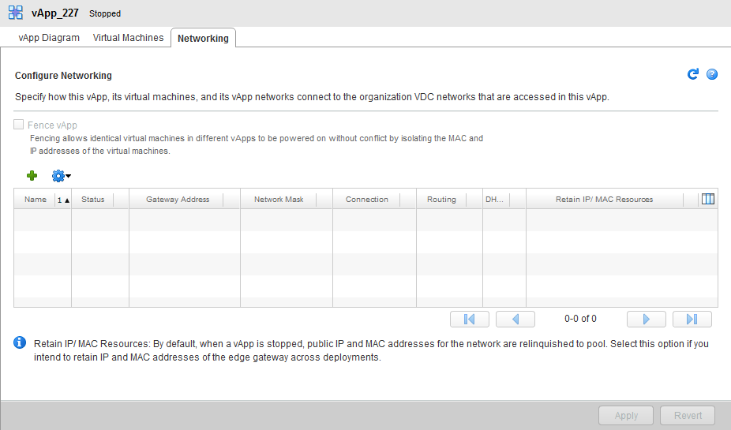

4. Click the green **+** icon to add a new network. 

    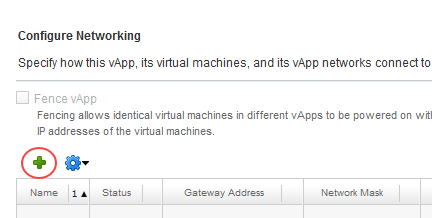

5. On the *Network Type* page of the *New vApp Network Wizard*, select **vApp network** then click **Next**.

    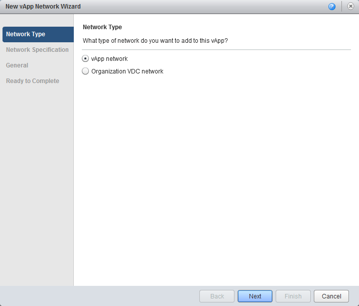

6. On the *Network Specification* page of the *New vApp Network Wizard*, fill out the fields as required for your network then click **Next**.

    Some options are pre-populated by default; you can change them if you want.

    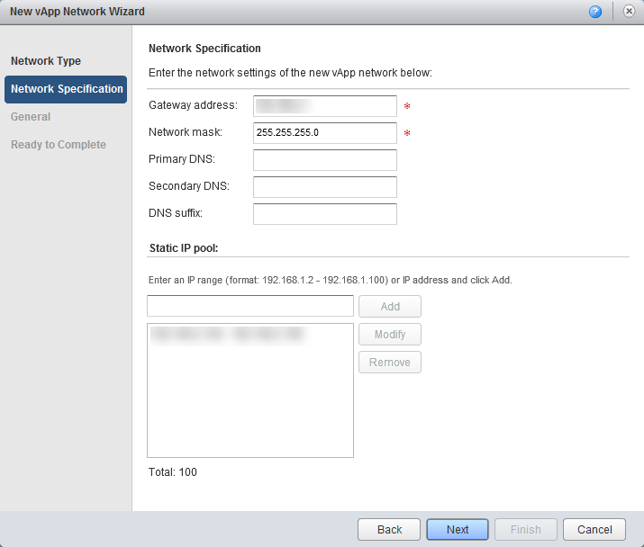

7. On the *General* page, enter a **Network name** and **Description**, then click **Next** and **Finish**.

    Your newly created vApp network is now included in the **Network** list.

    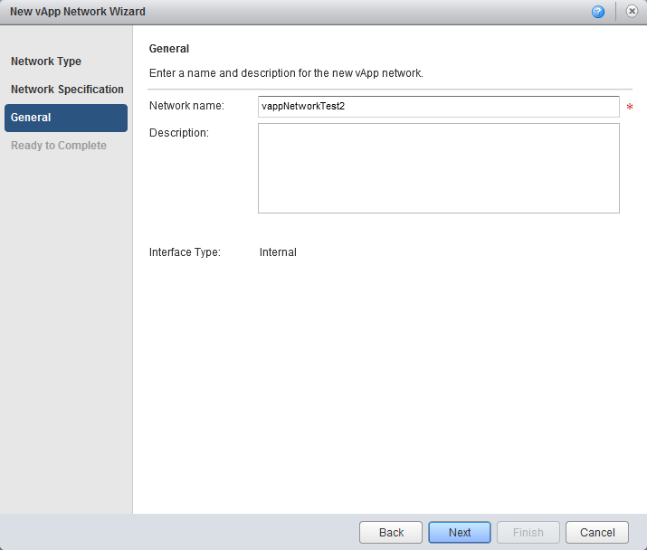

8. To connect the vApp network to an external VDC network, from the **Connection** list, select the VDC network that you want to connect to.

9. In the **Routing** column, select whether to apply **NAT** and **Firewall** rules to the vApp edge (you can always change this later), then click **Next**.

    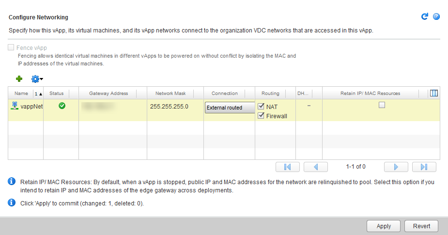

10. When you're done, click **Apply** at the bottom of the page.

    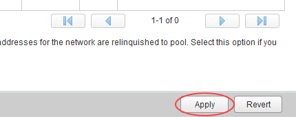

11. If your vApp is already populated with VMs that are connected to a VDC network, you may want to move them over to the vApp network.

12. To change the network a VM connects to, on the **vApp Diagram** tab, right-click the VM and select **Properties**.

13. In the *Virtual Machine Properties* dialog box, select the **Hardware** tab.

    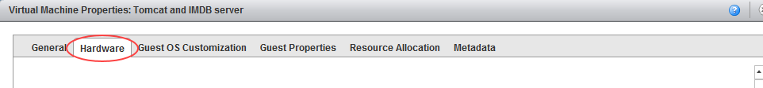

14. In the *NICs* section, from the **Networks** list, select the vApp network to connect the VM to.

    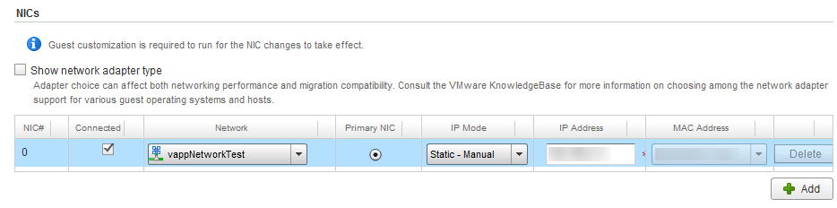

15. If you want to dual-home your VM, click the **Add** button to add a second network.

16. When you're done, click **OK**.

    You can go back to the VM properties to see the new IP address assigned to the VM.

## Viewing and adjusting vApp network settings

When you've created your vApp network and assigned VMs to it, you may want to review the vApp network settings and adjust them if needed.

1. On the **My Cloud** tab, open the vApp you want to work with then select the **Networking** tab.

    

2. Right-click the vApp network and select **Configure Services**.

    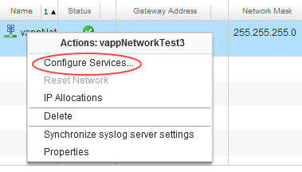

3. You can now view the default network services and change them if necessary.

### Enabling DHCP

DHCP isn't enabled by default. To enable it, on the *DHCP* page of the *Configure Services* dialog box, select the **Enable DHCP** check box, enter appropriate information then click **OK**.

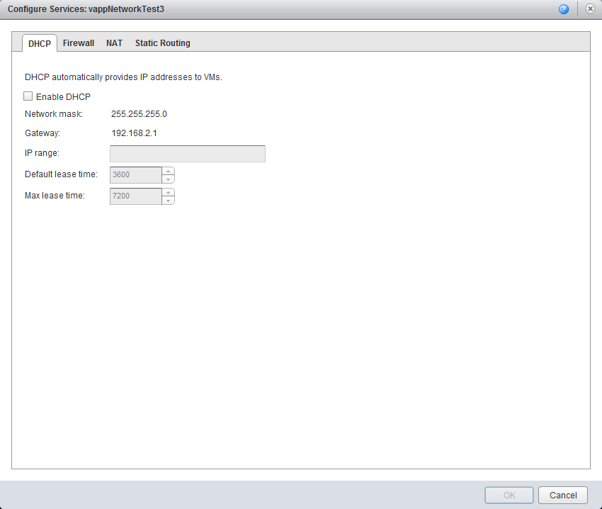

For more information about DHCP, see [*How to create a DHCP pool*](vmw-how-create-dhcp-pool.md).

### Creating firewall rules

There will be a rule in place to allow any traffic to traverse the firewall. You can amend or delete this rule, or create new rules.

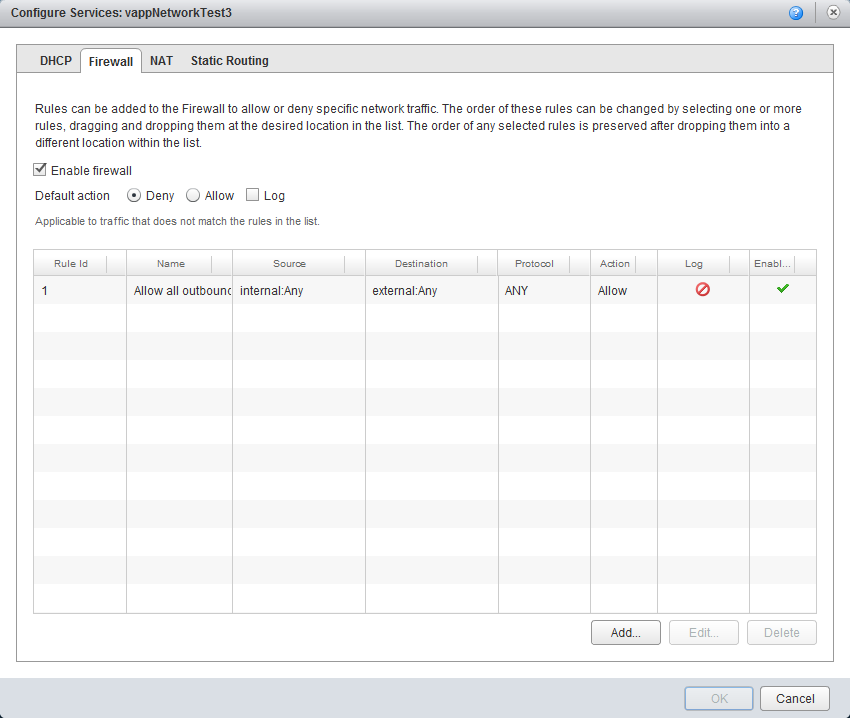

On the *Firewall* page of the *Configure Services* dialog box, select the rule you want to edit, then click **Edit**

For more about firewall rules, see [*How to create firewall rules*](vmw-how-create-firewall-rules.md).

### Creating NAT rules

NAT rules, enabled by default, enable mapping between internal VM interfaces and external IP addresses. To edit the mapping rules for a VM:

1. On the *NAT* page of the *Configure Services* dialog box, select the rule you want to edit and click **Edit**.

    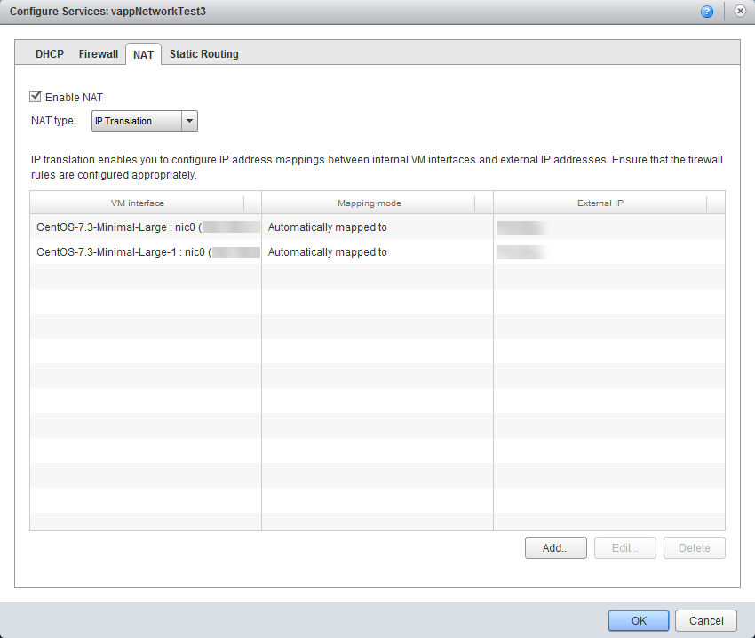

2. In the *Edit IP Translation Rule* dialog box, select the VM interface for which you want to edit the NAT rule.

3. From the **Mapping Mode** list, select the mapping mode.

    The default mapping is **Automatic**. You can change this to **Manual**, in which case, enter an **External IP** address to which the VM can map.

4. When you're done, click **OK**.

    The external IP address will be on the same subnet as the VDC network that connects to the vApp Edge.

    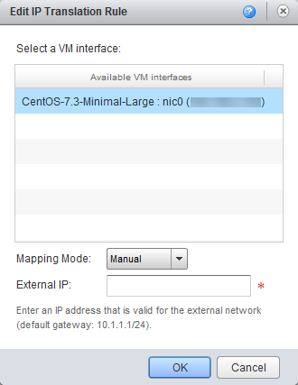

For more information about NAT rules, see [*How to create NAT rules*](vmw-how-create-nat-rules.md).

### Creating static routes

Static routing at the vApp network level allows traffic to route between different vApp networks, across the VDC networks.

The prerequisites for static routing are as follows:

- Static routing must be enabled for the VDC network you're connecting to (see [*How to create a static route*](vmw-how-create-static-route.md)).

- The two vApp networks must be routed to the same VDC network.

- The vApp networks must be in vApps that have been started at least once.

To add a static route:

1. On the *Static Routing* page of the *Configure Services* dialog box, click **Add**

2. In the *Add Static Route* dialog box, enter a **Name** for the static route.

3. Enter the following details:

    - **Network** - The address of the first vApp network to which you're adding a static route

    - **Next Hop IP** - The external IP address of that vApp network's router

    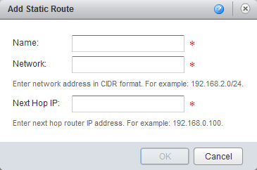

4. When you're done, click **OK**.

5. Repeat for the second vApp network.

The tables below provides examples of the settings needed to create a static route between two vApps.

#### Network Information

Network name | Network specification | Router external IP address
-------------|-----------------------|---------------------------
vApp network 1 | `192.168.1.0/24` | `192.168.0.100`
vApp network 2 | `192.168.2.0/24` | `192.168.0.101`
VDC network shared | `192.168.0.0/24` | N/A

#### Static routing settings

Static route to network | Route name | Network | Next hop IP address
------------------------|------------|---------|--------------------
vApp network 1 | To-vapp1 | `192.168.1.0/24` | `192.168.0.100`
vApp network 2 | To-vapp2 | `192.168.2.0/24` | `192.168.0.101`

> [!NOTE]
> Make sure your firewall rules allow traffic on the static routes.

## vApp fencing

Fencing a vApp allows identical VMs within different vApps to be powered on without conflict, by isolating the MAC and IP addresses of the VMs. This feature is particularly useful if you are copying vApps or creating catalog images of vApps where these details can't be altered.

vApp fencing can be done during or after vApp creation. It is done when the VMs within the vApp sit on the VDC network, rather than on their own vApp network.

To apply vApp fencing during vApp creation, select the **Fence vApp** check box on the *Configure Networking* page of the *New vApp* wizard.

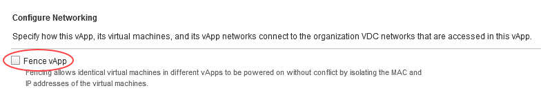

If you're converting a vApp after creation, on the **My Cloud** tab, open the vApp you want to fence, then, on the **Networking** tab, select the **Fence vApp** checkbox. Make sure you click **Apply** when you're done to save any changes.

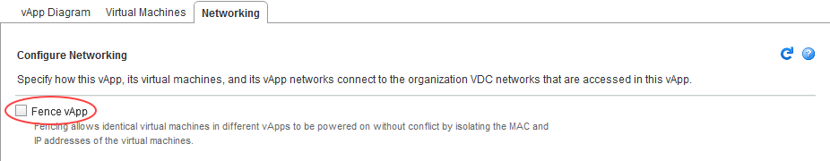

## Feedback

If you find an issue with this article, click **Improve this Doc** to suggest a change. If you have an idea for how we could improve any of our services, visit the [Ideas](https://community.ukcloud.com/ideas) section of the [UKCloud Community](https://community.ukcloud.com).
