# How to create a vApp network

## Overview

In addition to virtual data centre (VDC) networking, you can create individual vApp networks to have even greater control over your network infrastructure.

vApp networks enable you to create smaller networks within individual vApps that have a vApp edge, similar to the edge gateway on your VDC. Although a vApp edge isn't as feature rich as a VDC edge, it enables you to create firewall and NAT rules to separate your VDC networks from your vApp virtual machines (VMs). This means you can create some quite complex networks to satisfy application needs.

The vApp network diagram below shows the vApp edge.

## Creating a vApp network

> [!NOTE]
> As you're going to be changing network settings, all VMs within the vApp must be powered off.

1. In the vCloud Director *Virtual Datacenters* dashboard, select the VDC that contains your vApp.

    For more detailed instructions, see the [*Getting Started Guide for UKCloud for VMware*](vmw-gs.md).

2. In the left navigation panel, select **vApps**.

    

3. In the card for your vApp, select **Actions**, then **Add network**.

    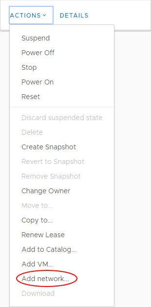

4. In the *Add Network* dialog box, select **vApp Network**.

    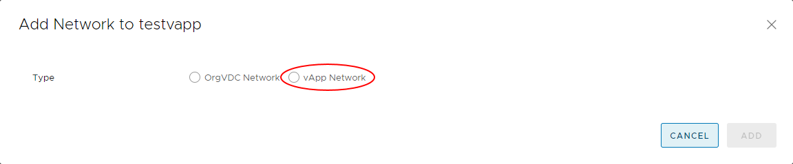

5. Enter a **Name** and **Description** for the network.

6. In the *Address and DNS* section, fill out the fields as required for your network.

7. When you're done, click **Add**.

## Connecting a VM to a vApp network

If your vApp is already populated with VMs that are connected to a VDC network, you may want to move them over to the vApp network.

To change the network a VM connects to:

1. In the card for the vApp, select **Details**.

2. Click each VM, expand *Hardware* and in the *NICs* section select the vApp network from the **Network** list.

    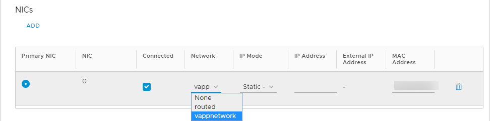

3. If you want to dual-home your VM, click the **Add** button to add a second network.

4. When you're done, click **Save**.

5. You can go back to the VM hardware properties to see the new IP address assigned to the VM.

## Viewing and adjusting vApp network settings

When you've created your vApp network and assigned VMs to it, you may want to review the vApp network settings and adjust them if needed.

1. In the left navigation panel, select **vApps**.

2. In the card for the vApp, select **Details**.

3. Select the **Networks** tab.

4. Click your vApp network to view its network settings.

5. The **General** tab displays general network settings. Click **Edit** to adjust these settings.

6. The **IP Management** tab displays the IP settings for the network, including static pool and DNS and DHCP. Click **Edit** to adjust these settings.

    For more information about enabling DHCP for your vApp network, see [*Enabling DHCP](#enabling-dhcp).

7. The **Services** tab enables you to set up firewall and NAT rules for your network. For more information, see [*Creating firewall rules*](#creating-firewall-rules) and [*Creating NAT rules*](#creating-nat-rules).

8. The **Routing** tab enables you to create static routes for your network. For more information, see [*Creating static routes*](#creating-static-routes).

### Enabling DHCP

DHCP isn't enabled by default.

To enable DHCP:

1. In the left navigation panel, select **vApps**.

2. In the card for the vApp, select **Details**.

3. Select the **Networks** tab.

4. Click your vApp network to view its network settings.

5. Select the **IP Management** tab then **DHCP**.

6. Click **Edit**.

    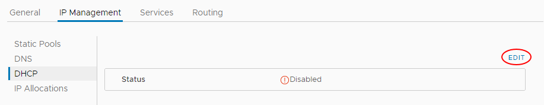

7. In the *Edit network* dialog box, select the **Enabled** option.

8. Enter **IP Pool** and lease information for your DHCP addresses then click **Save**.

    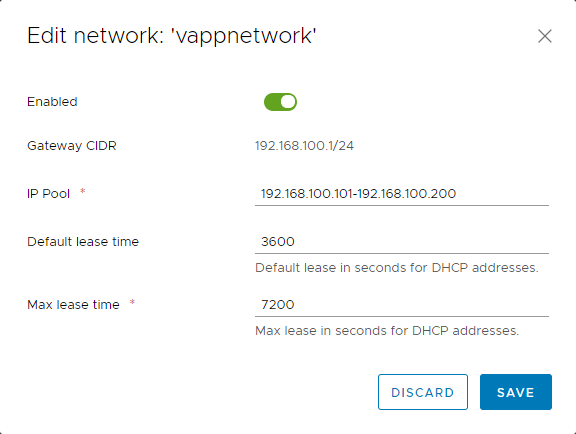

For more information about DHCP, see [*How to create a DHCP pool*](vmw-how-create-dhcp-pool.md).

### Creating firewall rules

There will be a rule in place to allow any traffic to traverse the firewall. You can amend or delete this rule, or create new rules.

To create a firewall rule:

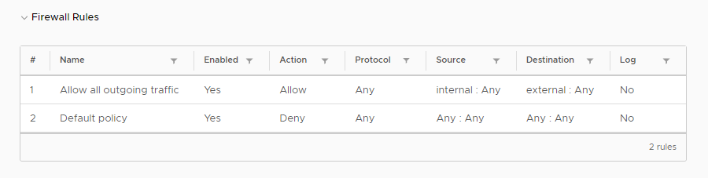

1. In the left navigation panel, select **vApps**.

2. In the card for the vApp, select **Details**.

3. Select the **Networks** tab.

4. Click your vApp network to view its network settings.

5. Select the **Services** tab.

6. Click **Edit**.

    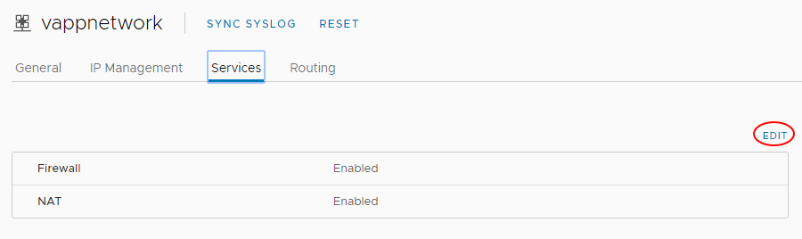

7. On the **Firewall** tab, click **Add**, specify the details for the firewall rule then click **Save**.

    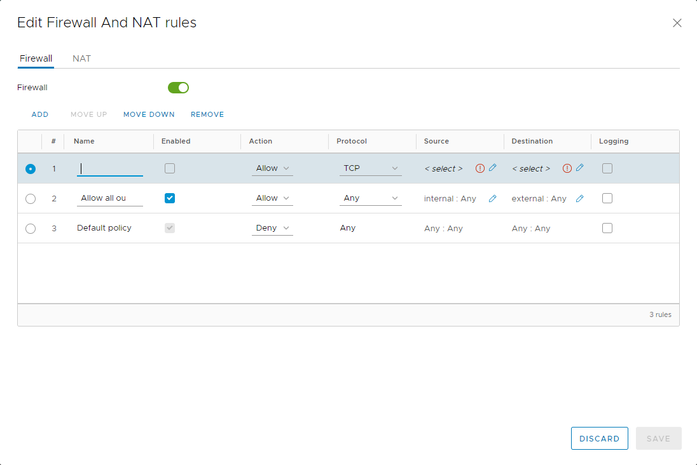

For more about firewall rules, see [*How to create firewall rules*](vmw-how-create-firewall-rules.md).

### Creating NAT rules

NAT rules, enabled by default, enable mapping between internal VM interfaces and external IP addresses.

To edit the mapping rules for a VM:

1. In the left navigation panel, select **vApps**.

2. In the card for the vApp, select **Details**.

3. Select the **Networks** tab.

4. Click your vApp network to view its network settings.

5. Select the **Services** tab.

6. Click **Edit**.

    

7. On the **NAT** tab, click **Add**.

8. In the **VM Interface** field, click the edit (pencil) icon, then select the VM interface for which you want to add the NAT rule.

9. From the **Mapping Mode** list, select the mapping mode.

    The default mapping is **Automatic**. You can change this to **Manual**, in which case, enter an **External IP** address to which the VM can map.

    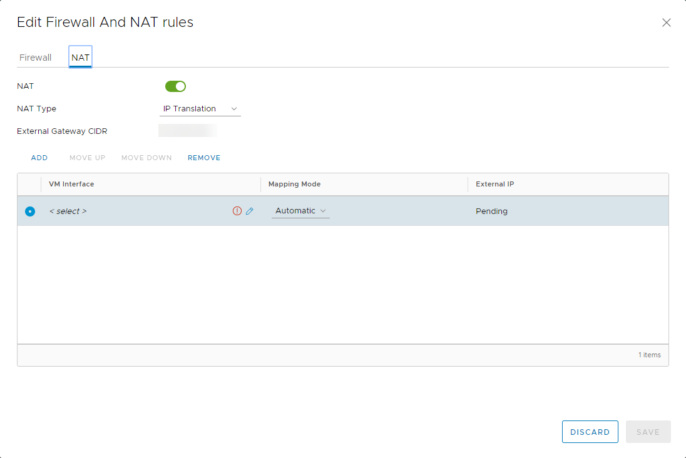

10. When you're done, click **Save**.

    The external IP address will be on the same subnet as the VDC network that connects to the vApp edge.

For more information about NAT rules, see [*How to create NAT rules*](vmw-how-create-nat-rules.md).

### Creating static routes

Static routing at the vApp network level allows traffic to route between different vApp networks, across the VDC networks.

The prerequisites for static routing are as follows:

- Static routing must be enabled for the VDC network you're connecting to (see [*How to create a static route*](vmw-how-create-static-route.md)).

- The two vApp networks must be routed to the same VDC network.

- The vApp networks must be in vApps that have been started at least once.

To add a static route:

1. In the left navigation panel, select **vApps**.

2. In the card for the vApp, select **Details**.

3. Select the **Networks** tab.

4. Click the first vApp network to view its network settings.

5. Select the **Routing** tab.

6. Click **Add**

    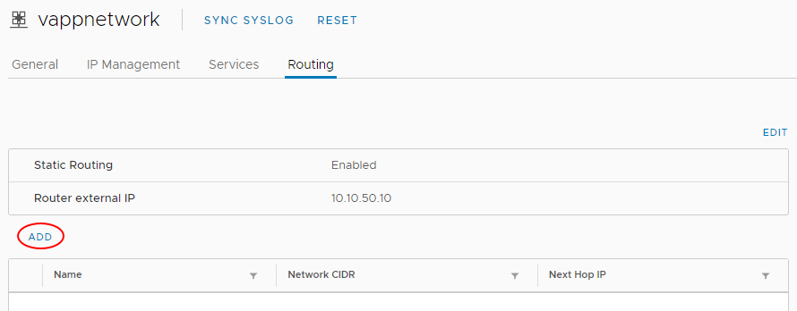

7. In the *Add Static Route* dialog box, enter a **Name** for the static route.

8. Enter the following details:

    - **Network CIDR** - The address of the first vApp network to which you're adding a static route

    - **Next Hop IP** - The external IP address of that vApp network's router

    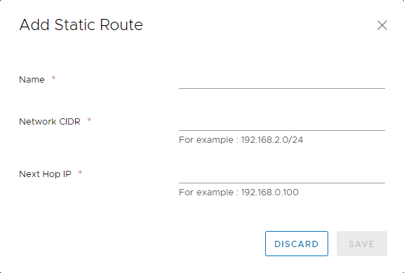

9. When you're done, click **Save**.

10. Repeat for the second vApp network.

The tables below provides examples of the settings needed to create a static route between two vApps.

#### Network Information

Network name | Network specification | Router external IP address
-------------|-----------------------|---------------------------
vApp network 1 | `192.168.1.0/24` | `192.168.0.100`
vApp network 2 | `192.168.2.0/24` | `192.168.0.101`
VDC network shared | `192.168.0.0/24` | N/A

#### Static routing settings

Static route to network | Route name | Network | Next hop IP address
------------------------|------------|---------|--------------------
vApp network 1 | To-vapp1 | `192.168.1.0/24` | `192.168.0.100`
vApp network 2 | To-vapp2 | `192.168.2.0/24` | `192.168.0.101`

> [!NOTE]
> Make sure your firewall rules allow traffic on the static routes.

## vApp fencing

Fencing a vApp allows identical VMs within different vApps to be powered on without conflict, by isolating the MAC and IP addresses of the VMs. This feature is particularly useful if you are copying vApps or creating catalog images of vApps where these details can't be altered.

vApp fencing can be done during or after vApp creation. It is done when the VMs within the vApp sit on the VDC network, rather than on their own vApp network.

To apply vApp fencing during vApp creation:

1. In the left navigation panel, select **vApps**.

2. In the card for the vApp, select **Details**.

3. Select the **Networks** tab.

4. In the *vApp Fencing* section, click **Edit**.

    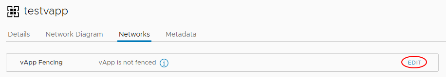

5. Select the **Fence vApp** option then click **OK**.

    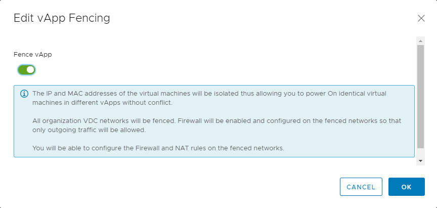

## Feedback

If you find an issue with this article, click **Improve this Doc** to suggest a change. If you have an idea for how we could improve any of our services, visit the [Ideas](https://community.ukcloud.com/ideas) section of the [UKCloud Community](https://community.ukcloud.com).
