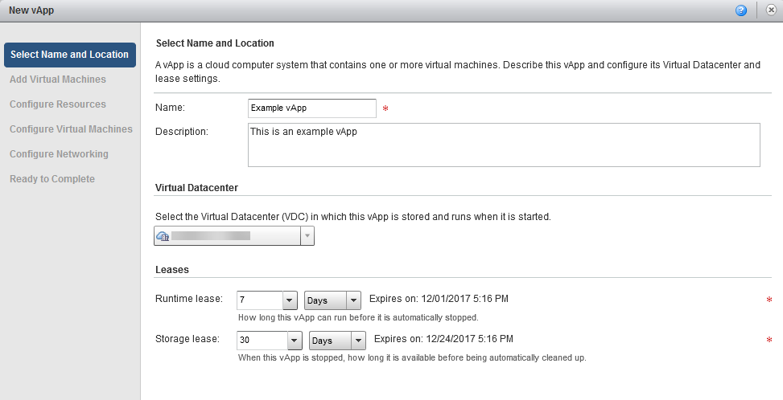
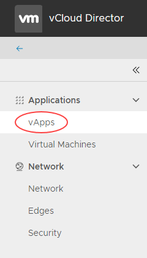
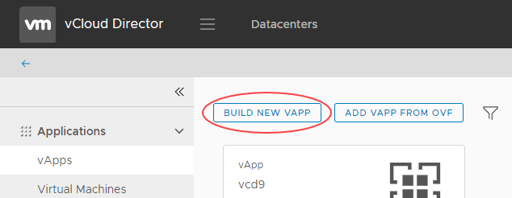
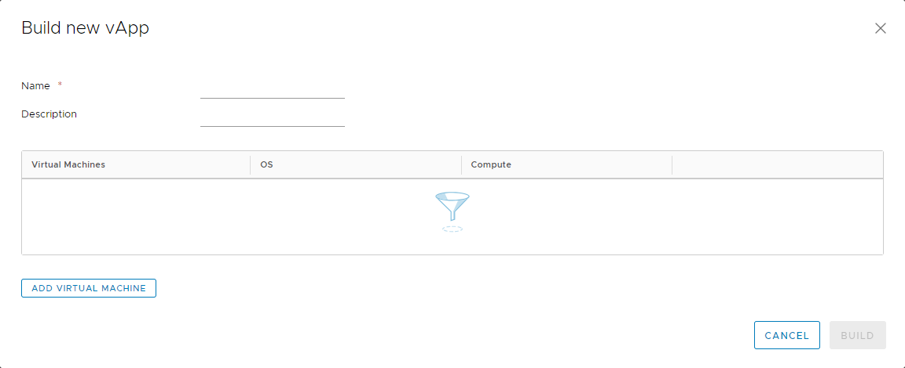

# How to create a vApp

## Overview

vCloud Director uses vApps to make virtual machine (VM) creation and management easy and flexible. vApps are essentially containers for VMs and can be used in many ways. One of the most common uses of a vApp is to group similar VMs together for easy management. Or you can put VMs that form a multi-tier application into the same vApp for greater control. Up to 128 vApps can be created within a virtual data centre (VDC) and intelligently networked to create complex architectures that can be managed easily.

In this guide we'll look at how to create a vApp from scratch.

The steps for creating a vApp depend on the version of vCloud Director available in your environment:

- [vCloud Director 8.20](#creating-a-vapp-vcloud-director-820)

- [vCloud Director 9.1](#creating-a-vapp-vcloud-director-91)

## Creating a vApp (vCloud Director 8.20)

1. In vCloud Director, on the *Home* tab, click the Build New vApp button.

    

2. Enter a name for your vApp. This should be a name that will easily identify it if you're building a large environment with multiple vApps. If you have multiple VDCs on the UKCloud platform, you can decide later which one the new vApp sits in. You can also choose how long the vApp can exist for, which is useful for test & dev projects.

    

3. When you're happy with these settings, click **Next**.

4. You can now populate the vApp with VMs. There are several ways to create a VM:

    - From an existing template. The template can be in your own organisation's catalogue or in UKClouds's public catalogue (see [*How to create a VM from a template*](vmw-how-create-vm-from-template.md)).

        Catalogue creation is covered in [*How to create a catalog*](vmw-how-create-catalog.md).

    - From scratch, without using a template (see [*How to create a virtual machine from scratch*](vmw-how-create-vm-from-scratch.md)).

5. When you've finished creating your vApp, click **Finish**.

6. When your vApp has finished deploying, on the *Home* page, right-click the newly created vApp and click **Start** to power it on.

## Creating a vApp (vCloud Director 9.1)

1. In the vCloud Director *Virtual Datacenters* dashboard, select the VDC in which you want to create the vApp.

2. In the left navigation panel, select **vApps** to view a list of vApps within the VDC.

    

3. Click **Build New vApp**.

    

4. In the *Build new vApp* dialog box, enter a **Name** and **Description** for your vApp. The name should be something that will easily identify it if you're building a large environment with multiple vApps.

    

5. You can now click **Add Virtual Machine** to populate the vApp with VMs. There are several ways to create a VM:

    - From an existing template (see [*How to create a VM from a template*](vmw-how-create-vm-from-template.md)).

        Catalog creation is covered in [*How to create a catalog*](vmw-how-create-catalog.md).

    - From scratch, without using a template (see [*How to create a virtual machine from scratch*](vmw-how-create-vm-from-scratch.md)).

6. When you've finished creating your vApp, click **Build**.

7. When your vApp has finished deploying, in the card for the vApp, click **Power** then **Power On** to power it on.

## Feedback

If you have any comments on this document or any other aspect of your UKCloud experience, send them to <products@ukcloud.com>.