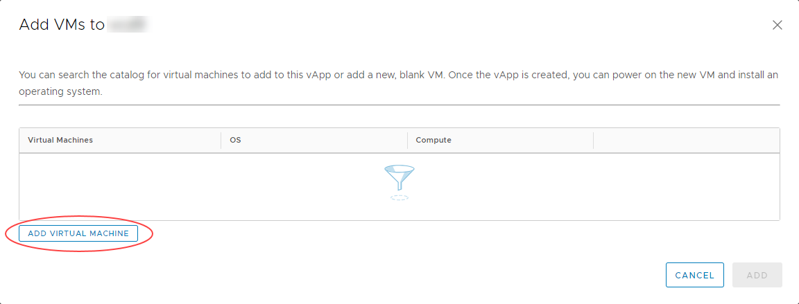
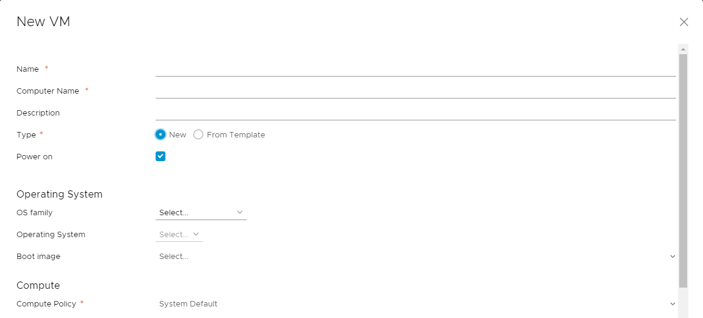
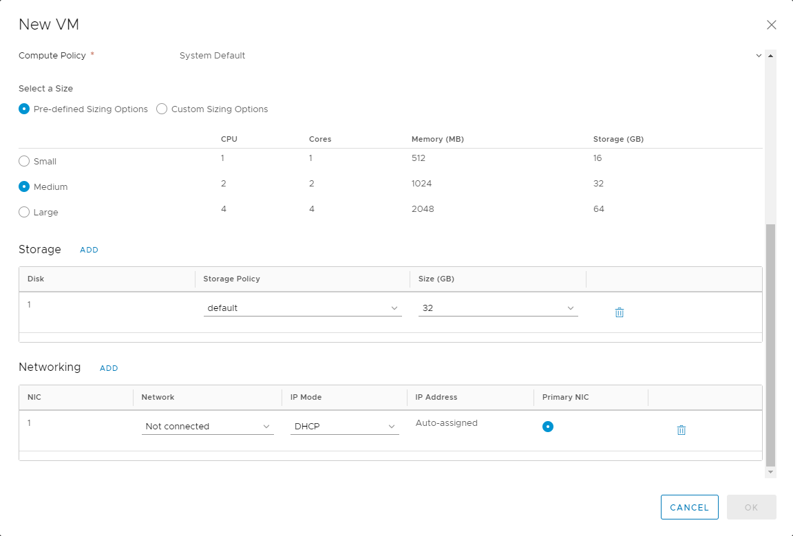
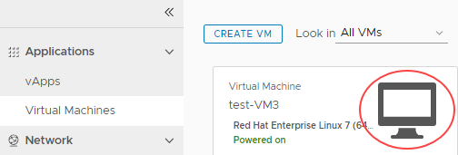
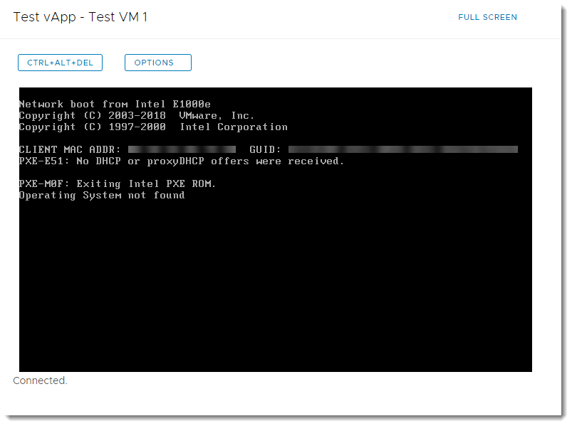
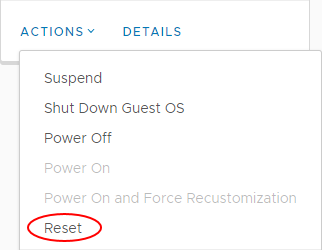
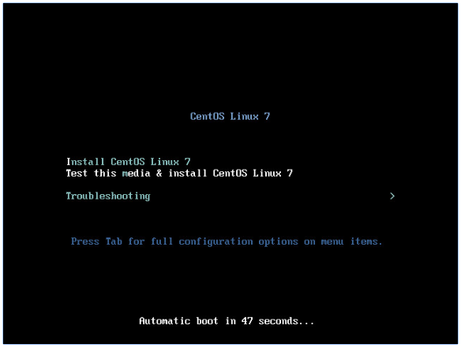

# How to create a VM from scratch

## Overview

As well as deploying pre-built VMs from a catalog, you can build your own VMs from scratch, as you would do on a physical machine, using an ISO image in place of a physical CD or DVD.

For information about creating a VM from a template, see [*How to create a VM from a template*](vmw-how-create-vm-from-template.md).

## Creating an empty VM

1. In the vCloud Director *Virtual Datacenters* dashboard, select the VDC that contains the vApp in which you want to create the VM.

2. In the left navigation panel, select **vApps** to view a list of vApps within the VDC.

    

3. In the card for the vApp in which you want to create the VM, select **Actions** then **Add VM**.

    

    > [!TIP]
    > To create a new vApp, see [*How to create a vApp*](vmw-how-create-vapp.md).
    > 
    > To create a standalone VM, in the left navigation panel, select **Virtual Machines**, then click **New VM**.

4. In the *Add VMs* dialog box, click **Add Virtual Machine**.

    

5. In the *New VM* dialog box, from the **Type** radio buttons, select **New**.

6. Enter a **Name**, **Computer Name** and **Description** for your VM.

    > [!NOTE]
    > **Name** is a name to identify the VM, **Computer Name** is the host name of the VM.
    > 
    > The **Computer Name** is copied from the **Name** field but can contain only alphanumeric characters and hyphens so you may need to edit it if your VM **Name** contains spaces or special characters.

7. Select the **OS Family** to use for your VM, then from the **Operating System** list, select the specific OS that you want to use.

    

8. Select a **Size** for your VM based on the number of vCPUs and cores you require.

    You can select from **Pre-defined Sizing Options** or select **Custom Sizing Options** to enter specific compute, memory and storage settings.

    > [!TIP]
    >- Although you can build a VM to your own specification in terms of the number of vCPUs, and amount of memory and disk space, you'll be billed based on the closest (next highest) match to a UKCloud pre-defined VM size.
    >
    >- Given the flexibility of VMs, and the ability to change the number of vCPUs and amount of memory and disk space on the fly, it's often better to start small as you're not tied by the constraints of a physical server. Remember too that more vCPUs or RAM won't necessarily make a server faster, and could cost a lot more. You need to understand how well your application can make use of multi-threading.
    >
    >- For Windows, select at least two vCPUs if you think you'll need two or more in the future, as the multi-processor HAL will be loaded as part of the OS build.

9. If you want to run virtualisation servers as a VM, you can edit the properties of the VM after it has been deployed and, in the *Hardware* section, select the **Expose hardware-assisted CPU virtualization to guest OS** check box.

    For example, you can run a Windows 2008 or 2012 server with Hyper‑V, or a VMware ESX host.

10. In the *Storage* section, set the **Storage Policy** and **Size** (in GB) of storage for the VM. You can also add more disks.

11. In the *Network* section, specify which **Network** to connect the VM to and select an **IP Mode** to determine how IP addresses are assigned:

    - **DHCP** vCloud Director interacts with the OS via VMware Tools to use DHCP rather than static IPs. You'll need to define a DHCP server on your edge gateway. Check with UKCloud or your organisation administrator that this is set up before you use it.11. how many network interface controllers (NICs) you need in the first instance.

    - **IP Pool** is the usual method, which injects an IP address into the VM via VMware Tools from a list of available IP addresses. The address may vary with each boot, but there is a check box to keep IP address assignments elsewhere within the UI once the VMs are
    created.

    - **Manual IP** is similar to IP Pool, but you need to enter a valid **IP Address** from the pool, which the VM will then keep.

    

    > [!TIP]
    > You can the VM to multiple networks, by clicking **Add**.

12. When you're done, click **OK**.

    > [!IMPORTANT]
    > By default, the **Power on** check box is selected. If you do not want the VM to power on and start incurring charges immediately, make sure to deselect this check box.

13. Back in the *Add VMs* dialog box, you can add more VMs or click **Add** when you're done.

    You can monitor progress in the *Add VMs* dialog box, or click **Cancel** to return to the list of vApps while the VM is created in the background.

    The VM will be deployed without any operating system.

### Installing an operating system into the VM

1. On the card for the vApp that contains the VM, click **Power** then select **Power On**.

    This starts the vApp and all the VMs within it. The vApp shows a status of **Powering on**, then **Running**.

2. In the left navigation panel, select **Virtual Machines** to view a list of VMs within the VDC.

3. In the card for your VM, click the picture of the monitor to launch the VM console.

    

4. As with a physical server, no virtual CD or DVD is available at first boot, so the server will attempt to PXE boot.

    

5. In the main vCloud Director interface (not the console), in the card for the VM you want to work with, select **Actions** then **Insert Media**.

    

6. Select the ISO image you want to mount from a catalog, then click **Insert**.

7. In the card for the VM, select **Actions** then **Reset** to reset the VM so that it picks up the virtual CD/DVD.

    

    After a short while the VM will start the boot process and pick up the CD/DVD. Resize the VM console if necessary or go to full screen.

    

8. Carry out the operating system install as normal. When you've finished, remember to install VMware Tools.

    For more information, see [*VMware Tools Installation*](vmw-ref-vmware-tools-installation.md).

## Feedback

If you find an issue with this article, click **Improve this Doc** to suggest a change. If you have an idea for how we could improve any of our services, visit [UKCloud Ideas](https://ideas.ukcloud.com). Alternatively, you can contact us at <products@ukcloud.com>.
