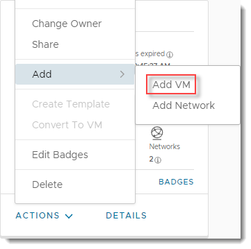
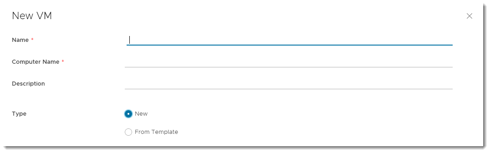
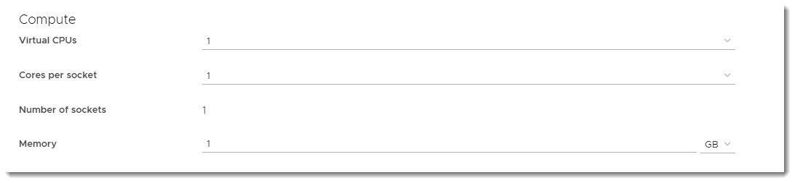
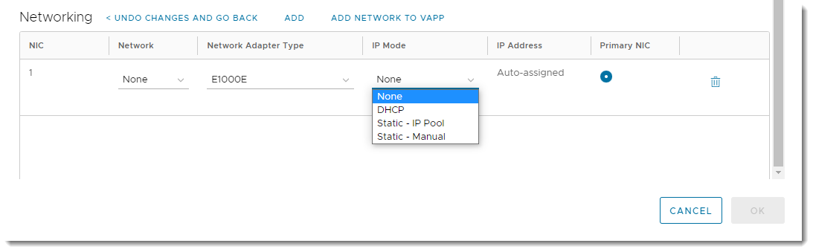
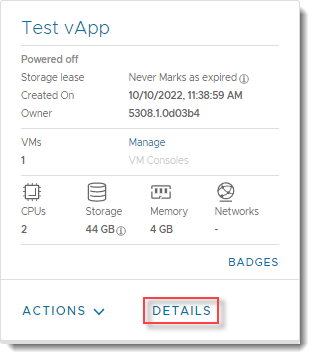
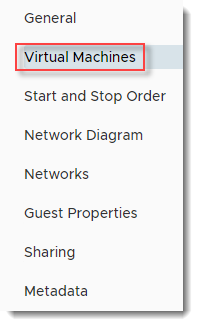
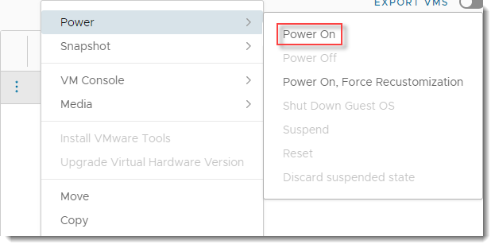
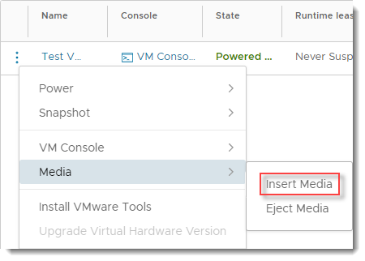
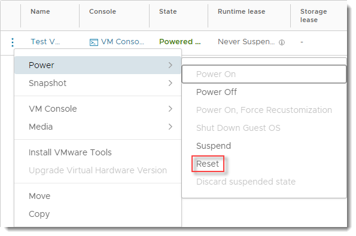
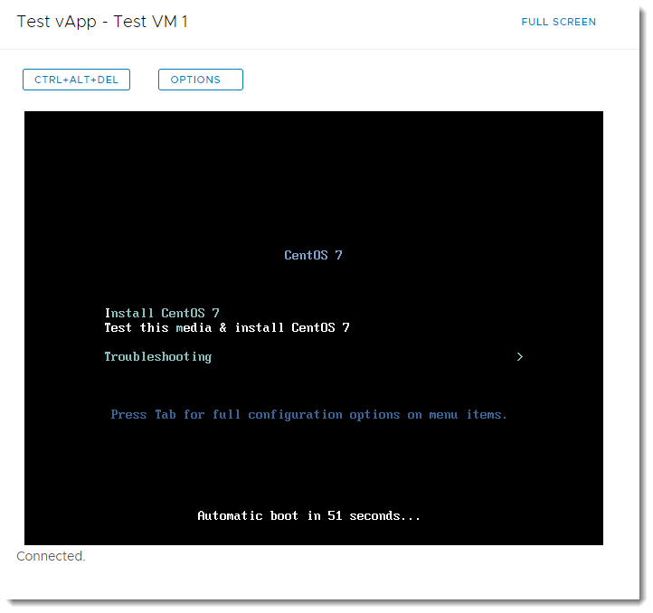

# How to create a VM from scratch

## Overview

As well as deploying pre-built VMs from a catalog, you can build your own VMs from scratch, as you would do on a physical machine, using an ISO image in place of a physical CD or DVD.

For information about creating a VM from a template, see [*How to create a VM from a template*](vmw-how-create-vm-from-template.md).

## Creating an empty VM

1. In the VMware Cloud Director *Virtual Data Center* dashboard, select the VDC that contains the vApp in which you want to create the VM.

2. In the left navigation panel, under *Compute*, select **vApps** to view a list of vApps within the VDC.

   

   > [!TIP]
   > To create a standalone VM, in the left navigation panel, select **Virtual Machines**, then click **New VM**.

3. In the card for the vApp in which you want to create the VM, select **Actions** > **Add** > **Add VM**.

   

   > [!TIP]
   > To create a new vApp, see [*How to create a vApp*](vmw-how-create-vapp.md).

4. In the *Add VMs* dialog box, click **Add Virtual Machine**.

   

5. In the *New VM* dialog box, enter a **Name**, **Computer Name** and **Description** for your VM.

   > [!NOTE]
   > **Name** is a name to identify the VM, **Computer Name** is the host name of the VM.
   >
   > The **Computer Name** is copied from the **Name** field but can contain only alphanumeric characters and hyphens so you may need to edit it if your VM **Name** contains spaces or special characters.

6. As you're creating the VM from scratch (not from a template), from the **Type** radio buttons, select **New**.

   

7. Select the **OS family** to use for your VM, then from the **Operating System** list, select the specific OS that you want to use.

   

8. In the *Compute* section, select the compute and memory settings for your VM.

   Although you can build a VM to your own specification in terms of the number of vCPUs and amount of memory, you'll be billed based on the closest (next highest) match to a UKCloud pre-defined VM size.

   Size                    | vCPU | RAM (GiB)
   ------------------------|------|----------
   Micro                   | 1    | 0.5
   Tiny                    | 1    | 2
   Small                   | 2    | 4
   Medium                  | 4    | 8
   Medium High Memory      | 4    | 16
   Large                   | 8    | 16
   Large High Memory       | 8    | 32
   Tier 1 Apps Small       | 8    | 48
   Tier 1 Apps Medium      | 8    | 64
   Tier 1 Apps Large       | 8    | 96
   Tier 1 Apps Extra Large | 12   | 128

   For more information, see the [UKCloud Pricing Guide](https://ukcloud.com/pricing-guide).

   > [!TIP]
   >
   > - Given the flexibility of VMs, and the ability to change the number of vCPUs and amount of memory and disk space on the fly, it's often better to start small as you're not tied by the constraints of a physical server. Remember too, that more vCPUs or RAM won't necessarily make a server faster, and could cost a lot more. You need to understand how well your application can make use of multi-threading.
   >
   > - For Windows, select at least two vCPUs if you think you'll need two or more in the future, as the multi-processor HAL will be loaded as part of the OS build.

   

9. In the *Storage* section, set the **Storage Policy** and **Size** of storage for the VM. You can also add more disks if required.

   > [!TIP]
   > When setting the storage size, be sure to select the appropriate units (**MB**, **GB** or **TB**).

   

10. In the *Networking* section, click **Customize** to configure network settings, if necessary. You can set the **IP Mode** to determine how IP addresses are assigned:

    - **DHCP** Cloud Director interacts with the OS via VMware Tools to use DHCP rather than static IPs. You'll need to define a DHCP server on your edge gateway. Check with UKCloud or your organisation administrator that this is set up before you use it.

    - **IP Pool** is the usual method, which injects an IP address into the VM via VMware Tools from a list of available IP addresses. The address may vary with each boot, but there is a check box to keep IP address assignments elsewhere within the UI once the VMs are
    created.

    - **Manual IP** is similar to IP Pool, but you need to enter a valid **IP Address** from the pool, which the VM will then keep.

    > [!TIP]
    > You can connect the VM to multiple networks, by clicking **Add**.

    

11. When you're done, click **OK**.

12. Back in the *Add VMs* dialog box, you can add more VMs or click **Add** when you're done.

    The VM will be deployed without any operating system.

## Installing an operating system into the VM

When you create a VM from scratch, it's initially deployed without any operating system. So, after you've created it, you need to install the appropriate operating system.

1. In the card for the vApp that contains the new VM, click **Details**.

   

2. From the vApp navigation panel, select **Virtual Machines**.

   

3. From the VM menu (three dots) select **Power** > **Power On**.

   

4. Once the VM has powered on, click the **VM Console** option.

   

   > [!TIP]
   > For a standalone VM, in the left navigation panel, under *Compute*, select **Virtual Machines** to view a list of all VMs within the VDC. Then, in the card for your new VM, click **VM Console**.
   >
   > 

5. As with a physical server, no virtual CD or DVD is available at first boot, so the server will attempt to PXE boot.

   

6. In the main Cloud Director interface (not the console), from the VM menu select **Media** > **Insert Media**.

   

7. In the *Insert CD* dialog box, select the ISO image you want to mount from a catalog, then click **Insert**.

8. In VM menu, select **Power** > **Reset** to reset the VM so that it picks up the virtual CD/DVD.

   

9. After a short while the VM will start the boot process and pick up the CD/DVD. Resize the VM console if necessary or go to full screen.

   

10. Carry out the operating system install as normal.

    When you've finished, remember to install VMware Tools (for more information, see [*VMware Tools installation*](vmw-ref-vmware-tools-installation.md)).

## Feedback

If you find a problem with this article, click **Improve this Doc** to make the change yourself or raise an [issue](https://github.com/UKCloud/documentation/issues) in GitHub. If you have an idea for how we could improve any of our services, send an email to <feedback@ukcloud.com>.
