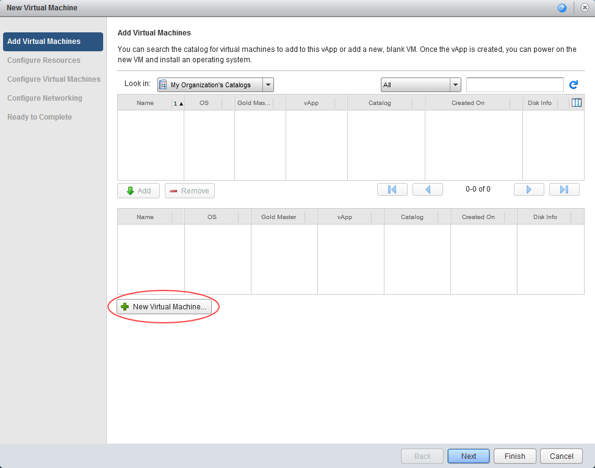
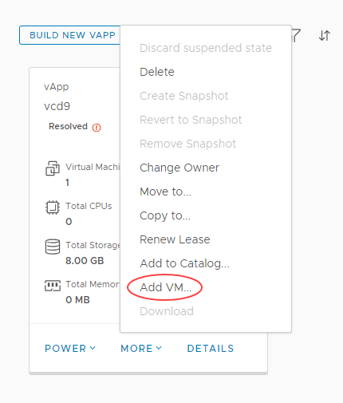

# How to create a VM from scratch

## Overview

As well as deploying pre-built VMs from a catalog, you can build your own VMs from scratch, as you would do on a physical machine, using an ISO image in place of a physical CD or DVD.

For information about creating a VM from a template, see [*How to create a VM from a template*](vmw-how-create-vm-from-template.md).

The steps for creating a VM depend on the version of vCloud Director available in your environment:

- [vCloud Director 8.20](#creating-a-vm-from-scratch-vcloud-director-820)

- [vCloud Director 9.1](#creating-a-vm-from-scratch-vcloud-director-91)

## Creating a VM from scratch (vCloud Director 8.20)

1. In vCloud Director, select the **My Cloud** tab.

    

2. Open the vApp in which you want to create the VM.

    > [!TIP]
    > To create a new vApp, see [*How to create a vApp*](vmw-how-create-vapp.md)

3. On the **Virtual Machines** tab, click the **Add VM** icon.

    

4. On the *Add Virtual Machines* page of the *New Virtual Machine* wizard, click **New Virtual Machine**.

    

5. In the *New Virtual Machine* dialog box, enter a **Virtual Machine name** and, in the **Computer name** field, enter a name for the server within the operating system (OS) once built.

6. Leave the **Virtual hardware version** at the default value, unless you have a particular reason to change it.

7. Select the **Operating System Family** to use for your VM, then from the **Operating System** list, select the specific OS that you want to use.

8. Select the **Number of virtual CPUs** for your VM

    > [!NOTE]
    > With a Windows OS, select at least two vCPUs if you think you'll need two or more in the future, as the multi-processor HAL will be loaded as part of the OS build.

9. You can additionally select the number of **Cores per socket**. This may be useful if you're deploying software that uses sockets for its licensing model.

10. If you want to run virtualisation servers as a VM, select the **Expose hardware-assisted CPU virtualisation** check box.

    For example, you can run a Windows 2008 or 2012 server with Hyper‑V, or a VMware ESX host.

11. Select the amount of **Memory** (RAM) and the **Hard disk size*.

    > [!NOTE]
    >Although you can build a VM to your own specification in terms of the number of vCPUs, and amount of memory and disk space, you'll be billed based on the closest (next highest) match to a UKCloud pre-defined VM size.
    >
    > Given the flexibility of VMs, and the ability to change the number of vCPUs and amount of memory and disk space on the fly, it's often better to start small as you're not tied by the constraints of a physical server. Remember too that more vCPUs or RAM won't necessarily make a server faster, and could cost a lot more. You need to understand how well your application can make use of multi-threading.

12. Leave **Bus type** as the default.

13. Select the **Number of NICs** (network interface cards) you need in the first instance.

    

14. When you're finished, click **OK** then click **Next**.

15. On the *Configure Resources* page, select the **Storage Policy** for the VM and click **Next**.

    We recommend using the `*-*-*-Any` option as this will assume your VMs are balanced evenly across all storage pools. However, you could use this option to specifically separate VMs on different storage if required for high availability purposes. In this example, two VMs could be specifically placed on `*.*.*-Storage1` as opposed to `*.*.*-Storage2`.

    

16. On the *Configure Virtual Machines* page, select which **Network** to connect the VM to.

17. Select an *IP Assignment* method:

    - **Static - IP Pool** is the usual method, which injects an IP address into the VM via VMware Tools from a list of available IP addresses. The address may vary with each boot, but there is a checkbox to keep IP address assignments elsewhere within the UI once the VMs are
    created.
    - **Static - Manual** is similar to Static - IP Pool, but you need to type in a valid IP address from the pool, which the VM will then keep.
    - **DHCP** vCloud Director interacts with the OS via VMware Tools to use DHCP rather than static IPs. You'll need to define a DHCP server on your edge gateway. Check with UKCloud or your organisation administrator that this is set up before you use it.

    

18. Click **Next**.

19. On the *Configure Networking* page you can change how the vApp and its virtual machines connect to the VDC networks.

    You can find out about network fencing in [*How to create a vApp network*](vmw-how-create-vapp-network.md).

20. Click **Next**.

21. Review the information on the summary page and then click **Finish**.

    The VM will then be deployed as bare metal.

### Installing an operating system into a bare metal VM (vCloud Director 8.20)

1. On the **Home** or **My Cloud** page, right-click the vApp and select **Start**.

    This starts the vApp and all the VMs within it. The vApp shows a status of **Starting**, then **Running**.

2. Click the monitor icon, or right-click on the VM within the vApp and select **Popout Console**.

    > [!NOTE]
    > The first time you use vCloud Director, you'll be asked to download a Remote Console client, which is a Windows installable file. You'll only need to do this once. The Remote Console client is available only on Windows, under Internet Explorer (compatibility mode) and Firefox.

3. As with a physical server, no virtual CD or DVD is available at first boot, so the server will attempt to PXE boot.

    

4. Right-click on the VM within the main vCloud Director interface (not the popout console) and select **Insert CD/DVD from Catalog**.

5. Select the ISO image you want, then click **OK**.

6. In the popout console, click the **Reset** icon then click **OK** to reset the VM so that it picks up the virtual CD/DVD.

    

    After a short while the VM will start the boot process and pick up the CD/DVD. Resize the VM window if necessary to see the whole screen.

7. Carry out the operating system install as normal. When you've finished, remember to install VMware Tools.

    For more information, see [*VMware Tools Installation*](vmw-ref-vmware-tools-installation.md).

## Creating a VM from scratch (vCloud Director 9.1)

1. In the vCloud Director *Virtual Datacenters* dashboard, select the VDC that contains the vApp in which you want to create the VM.

2. In the left navigation panel, select **vApps** to view a list of vApps within the VDC.

    

3. In the card for the vApp in which you want to create the VM, click **More** then select **Add VM**.

    

    > [!TIP]
    > To create a new vApp, see [*How to create a vApp*](vmw-how-create-vapp.md).

4. In the *Add VMs to \<vApp>* page, click **Add Virtual Machine**.

    

5. In the *Create VM* dialog box, from the **Type** radio buttons, select **New**.

6. Enter a **Name**, **Computer Name** and **Description** for your VM.

    > [!TIP]
    > **Name** is a name to identify the VM, **Computer Name** is the host name of the VM.

7. Select the **OS Family** to use for your VM, then from the **Operating System** list, select the specific OS that you want to use.

8. Select a **Size** for your VM based on the number of vCPUs and cores you require.

    You can select a predefined size or click **Customize** to enter specific compute, memory and storage settings.

    > [!NOTE]
    >- Although you can build a VM to your own specification in terms of the number of vCPUs, and amount of memory and disk space, you'll be billed based on the closest (next highest) match to a UKCloud pre-defined VM size.
    >
    >- Given the flexibility of VMs, and the ability to change the number of vCPUs and amount of memory and disk space on the fly, it's often better to start small as you're not tied by the constraints of a physical server. Remember too that more vCPUs or RAM won't necessarily make a server faster, and could cost a lot more. You need to understand how well your application can make use of multi-threading.
    >
    >- For Windows, select at least two vCPUs if you think you'll need two or more in the future, as the multi-processor HAL will be loaded as part of the OS build.

9. If you want to run virtualisation servers as a VM, you can edit the properties of the VM after it has been deployed to select the **Expose hardware-assisted CPU virtualisation** check box.

    For example, you can run a Windows 2008 or 2012 server with Hyper‑V, or a VMware ESX host.

10. Select which **Network** to connect the VM to and select an **IP Mode** to determine how IP addresses are assigned:

    - **Static - IP Pool** is the usual method, which injects an IP address into the VM via VMware Tools from a list of available IP addresses. The address may vary with each boot, but there is a checkbox to keep IP address assignments elsewhere within the UI once the VMs are
    created.
    - **Static - Manual** is similar to Static - IP Pool, but you need to type in a valid IP address from the pool, which the VM will then keep.
    - **DHCP** vCloud Director interacts with the OS via VMware Tools to use DHCP rather than static IPs. You'll need to define a DHCP server on your edge gateway. Check with UKCloud or your organisation administrator that this is set up before you use it.11. how many network interface controllers (NICs) you need in the first instance.

11. Click **Add** to create more NICs.

    

12. When you're done, click **OK**.

13. In the *Add VMs to \<vApp>* dialog box, you can create more VMs or click **Add** when you're done.

    You can stay in the dialog box to monitor progress or click **Cancel** to return to the list of vApps.

    The VM will be deployed as bare metal.

### Installing an operating system into a bare metal VM (vCloud Director 9.1)

1. On the card for the vApp that contains the VM, click **Power** then select **Power On**.

    This starts the vApp and all the VMs within it. The vApp shows a status of **Starting**, then **Running**.

2. In the left navigation panel, select **Virtual Machines** to view a list of VMs within the VDC.

3. Click the picture of the monitor to launch the VM console.

    

4. As with a physical server, no virtual CD or DVD is available at first boot, so the server will attempt to PXE boot.

    

5. In the main vCloud Director interface (not the console), in the card for the VM you want to work with, click **More** then select **Insert Media**.

    

6. Select the ISO image you want to mount from a catalog, then click **Insert**.

7. In the card for the VM, click **Power** then select **Reset** to reset the VM so that it picks up the virtual CD/DVD.

    

    After a short while the VM will start the boot process and pick up the CD/DVD. Resize the VM console if necessary or go to full screen.

    

8. Carry out the operating system install as normal. When you've finished, remember to install VMware Tools.

    For more information, see [*VMware Tools Installation*](vmw-ref-vmware-tools-installation.md).

## Feedback

If you have any comments on this document or any other aspect of your UKCloud experience, send them to <products@ukcloud.com>.