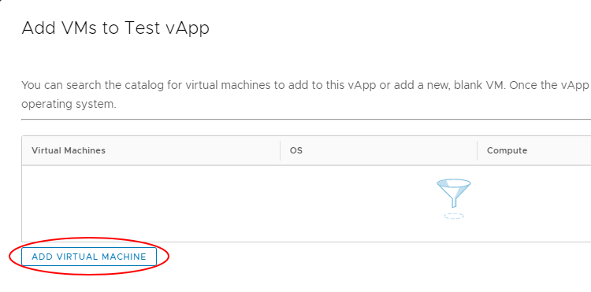
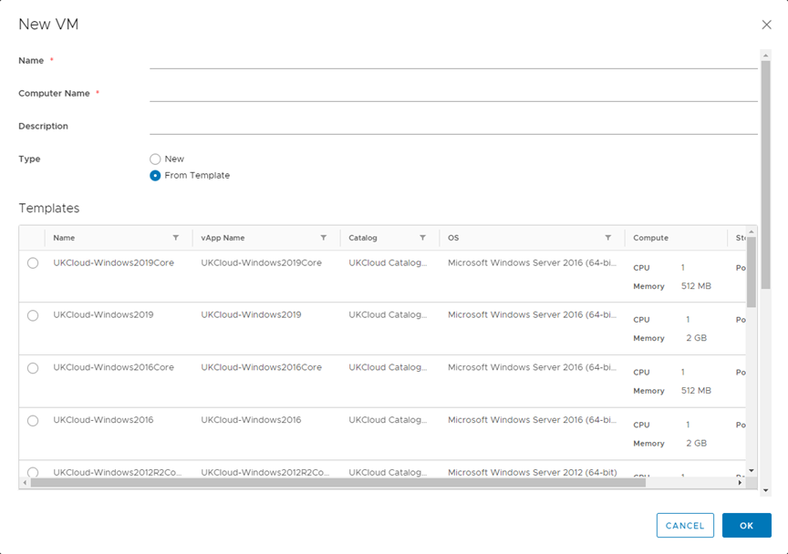
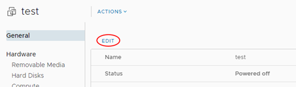
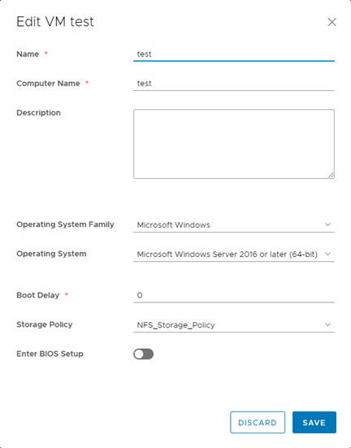

# How to create a virtual machine from a template

## Overview

To simplify the process of creating a virtual machine (VM), you can use a pre-built VM template from a catalog.

For information about catalogs, see [*How to create a catalog*](vmw-how-create-catalog.md). For information about creating a VM from scratch, see [*How to create a VM from scratch*](vmw-how-create-vm-from-scratch.md).

## Creating a VM from a template

1. In the VMware Cloud Director *Virtual Data Center* dashboard, select the VDC that contains the vApp in which you want to create the VM.

2. In the left navigation panel, under *Compute*, select **vApps** to view a list of vApps within the VDC.

    

    > [!TIP]
    > To create a standalone VM, in the left navigation panel, select **Virtual Machines**, then click **New VM**.

3. In the card for the vApp in which you want to create the VM, select **Actions** then **Add VM**.

    

    > [!TIP]
    > To create a new vApp, see [*How to create a vApp*](vmw-how-create-vapp.md).

4. In the *Add VMs* dialog box, click **Add Virtual Machine**.

    

5. In the *New VM* dialog box, enter a **Name**, **Computer Name** and **Description** for your VM.

    > [!NOTE]
    > **Name** is a name to identify the VM, **Computer Name** is the host name of the VM.
    >
    > The **Computer Name** is copied from the **Name** field but can contain only alphanumeric characters and hyphens so you may need to edit it if your VM **Name** contains spaces or special characters.

6. From the **Type** radio buttons, select **From Template**.

7. In the *Templates* section, select the template that you want to use for your VM, depending on your required operating system and VM size.

    

    > [!TIP]
    > Creating vApp catalogs is covered in [*How to create a vApp catalog*](vmw-how-create-catalog.md)

8. When you're done, click **OK**.

9. Back in the *Add VMs* dialog box, you can create more VMs or click **Add** when you're done.

## Editing the properties of a new VM

After you initially create your VM, you'll probably want to edit some of the properties to finish setting it up.

1. In the card for the vApp that contains the new VM, click **Details**.

   

2. Select **Virtual Machines**.

3. Click the VM to edit its properties.

   > [!TIP]
   > To edit the properties of a standalone VM, in the left navigation panel, under *Compute*, select **Virtual Machines** to view a list of all VMs within the VDC. Then, in the card for your new VM, click **Details**.

4. On the *General* page, click **Edit**.

    

5. In the *Edit VM* dialog box, from the **Storage Policy** list, select a storage policy to assign the VM to, then click **Save**.

    

6. Under *Hardware*, select **Hard Disks**, then click **Edit** to configure storage or **Add** more disks. Click **Save** when done.

    

7. Select **Compute**, then click the appropriate **Edit** link to configure *CPU* and *Memory*.

    

8. Select **NICs**, then click **Edit** to configure network settings You can set the **IP Mode** to determine how IP addresses are assigned:

    - **DHCP** VMware Cloud Director interacts with the OS via VMware Tools to use DHCP rather than static IPs. You'll need to define a DHCP server on your edge gateway. Check with UKCloud or your organisation administrator that this is set up before you use it.

    - **Static - IP Pool** is the usual method, which injects an IP address into the VM via VMware Tools from a list of available IP addresses. The address may vary with each boot, but there is a check box to keep IP address assignments elsewhere within the UI once the VMs are
    created.

    - **Static - Manual** is similar to IP Pool, but you need to enter a valid **IP Address** from the pool, which the VM will then keep.

    Click **Save** when done.

    > [!TIP]
    > If the MAC address for a newly added NIC is blank, click **Save** to generate one.

    

    > [!NOTE]
    > We recommend using the VMXNET3 network adapter where possible. The VMXNET virtual network adapter has no physical counterpart and is optimised for performance in a VM. Because operating system vendors don't provide built-in drivers for this card you must install VMware Tools to have a driver for the VMXNET network adapter available.
    >
    > If you want a more comprehensive guide on network adapter types, see the VMware documentation for [Network Adapter Basics](https://docs.vmware.com/en/VMware-vSphere/7.0/com.vmware.vsphere.vm_admin.doc/GUID-AF9E24A8-2CFA-447B-AC83-35D563119667.html).

## Feedback

If you find a problem with this article, click **Improve this Doc** to make the change yourself or raise an [issue](https://github.com/UKCloud/documentation/issues) in GitHub. If you have an idea for how we could improve any of our services, send an email to <feedback@ukcloud.com>.
