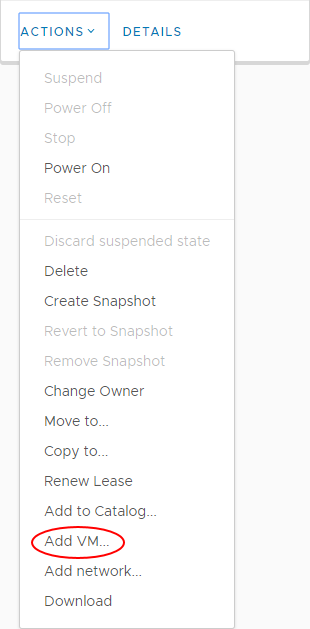
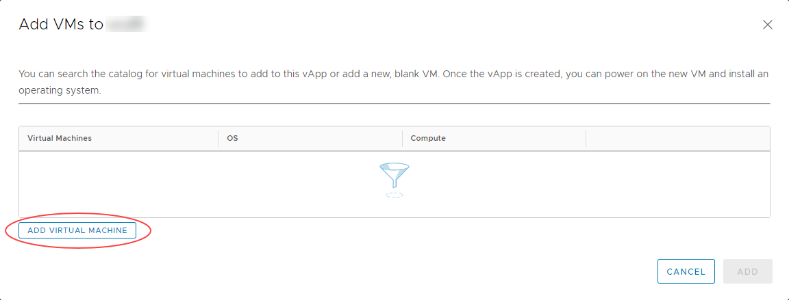

# How to create a VM from a template

## Overview

To simplify the process of creating a VM, you can use a pre-built VM template from a catalog.

For information about creating a VM from scratch, see [*How to create a VM from scratch*](vmw-how-create-vm-from-scratch.md).

## Creating a VM from a template

1. In the vCloud Director *Virtual Datacenters* dashboard, select the VDC that contains the vApp in which you want to create the VM.

2. In the left navigation panel, select **vApps** to view a list of vApps within the VDC.

    

3. In the card for the vApp in which you want to create the VM, select **Actions** then **Add VM**.

    

    > [!TIP]
    > To create a new vApp, see [*How to create a vApp*](vmw-how-create-vapp.md).
    > 
    > To create a standalone VM, in the left navigation panel, select **Virtual Machines**, then click **New VM**.

4. In the *Add VMs* dialog box, click **Add Virtual Machine**.

    

5. In the *New VM* dialog box, from the **Type** radio buttons, select **From Template**.

6. Enter a **Name**, **Computer Name** and **Description** for your VM.

    > [!NOTE]
    > **Name** is a name to identify the VM, **Computer Name** is the host name of the VM.
    > 
    > The **Computer Name** is copied from the **Name** field but can contain only alphanumeric characters and hyphens so you may need to edit it if your VM **Name** contains spaces or special characters.

7. In the *Templates* section, select the template that you want to use for your VM, depending on your required operating system and VM size.

    

    > [!TIP]
    > Creating vApp catalogs is covered in [*How to create a vApp catalog*](vmw-how-create-catalog.md)

8. When you're done, click **OK**.

    > [!IMPORTANT]
    > By default, the **Power on** check box is selected. If you do not want the VM to power on and start incurring charges immediately, make sure to deselect this check box.

9. Back in the *Add VMs* dialog box, you can create more VMs or click **Add** when you're done.

    You can monitor progress in the *Add VMs* dialog box, or click **Cancel** to return to the list of vApps while the VM is created in the background.

10. In the left navigation panel, select **Virtual Machines** to view a list of VMs within the VDC.

    

11. In the card for your new VM, select **Details**.

12. In the *General* section, from the **Storage Policy** list, select a storage policy to assign the VM to.

    > [!NOTE]
    > We recommend using the `*-*-*-Any` option as this will ensure your VMs are balanced evenly across all storage pools. However, you could use this option to specifically separate VMs on different storage if required for high availability purposes. For example, you could specifically place VMs on `*.*.*-Storage1` as opposed to `*.*.*-Storage2`. For more information, visit the Knowledge Centre.

    

13. Expand the *Hardware* section.

    Here, you can:

    - Configure *CPU* and *Memory*.

    - In the *Storage* section, you can configure storage or **Add** more disks.

    - In the *NICs* section, you can **Add** the VM to a network and select an **IP Mode** to determine how IP addresses are assigned:

      - **DHCP** vCloud Director interacts with the OS via VMware Tools to use DHCP rather than static IPs. You'll need to define a DHCP server on your edge gateway. Check with UKCloud or your organisation administrator that this is set up before you use it.11. how many network interface controllers (NICs) you need in the first instance.

      - **Static - IP Pool** is the usual method, which injects an IP address into the VM via VMware Tools from a list of available IP addresses. The address may vary with each boot, but there is a check box to keep IP address assignments elsewhere within the UI once the VMs are
    created.

      - **Static - Manual** is similar to IP Pool, but you need to enter a valid **IP Address** from the pool, which the VM will then keep.

    > [!TIP]
    > If the MAC address for a newly added NIC is blank, click **Save** to generate one.

    

14. When you're done, click **Save**.

## Feedback

If you find a problem with this article, click **Improve this Doc** to make the change yourself or raise an [issue](https://github.com/UKCloud/documentation/issues) in GitHub. If you have an idea for how we could improve any of our services, send an email to <feedback@ukcloud.com>.
