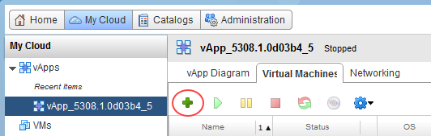
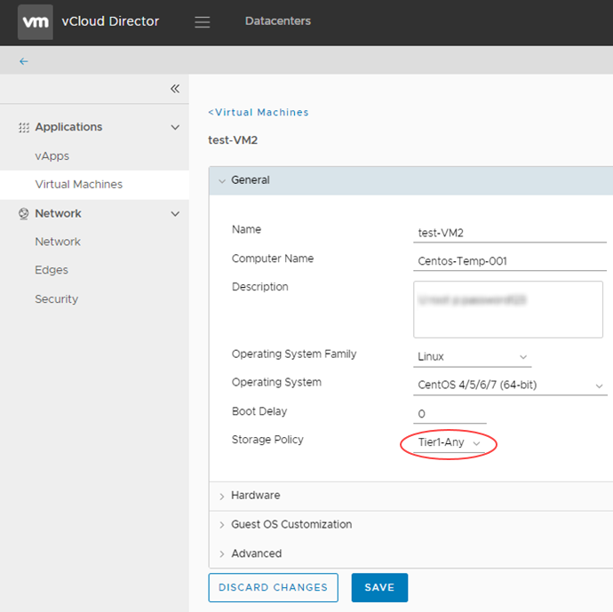

# How to create a VM from a template

## Overview

To simplify the process of creating a VM, you can use a pre-built VM template from a catalog.

For information about creating a VM from scratch, see [*How to create a VM from scratch*](vmw-how-create-vm-from-scratch.md).

The steps for creating a VM depend on the version of vCloud Director available in your environment:

- [vCloud Director 8.20](#creating-a-vm-from-a-template-vcloud-director-820)

- [vCloud Director 9.1](#creating-a-vm-from-a-template-vcloud-director-91)

## Creating a VM from a template (vCloud Director 8.20)

1. In vCloud Director, select the **My Cloud** tab.

    

2. Open the vApp in which you want to create the VM.

    > [!TIP]
    > To create a new vApp, see [*How to create a vApp*](vmw-how-create-vapp.md).

3. On the **Virtual Machines** tab, click the **Add VM** icon.

    

4. On the *Add Virtual Machines* page, you can create a VM using a template in your own organisation's catalog (creating vApp catalogs is covered in [*How to create a vApp catalog*](vmw-how-create-catalog.md)) or from UKCloud's public catalog.

    For example, to create a VM from the UKCloud public catalog, from the **Look in** list, select **Public Catalogs**.

    

5. Select the template you want to use depending on the operating system and VM size.

    > [!TIP]
    > You can use the search field to find the template you're looking for, or use the arrows to scroll through the available choices.

6. When you've found the template you want to use, click **Add** to add a VM based on that template to the vApp. The VM should now be visible in the lower box.

    

    > [!TIP]
    > You can add multiple VMs to the vApp at the same time using the catalogs.

7. When you've finished adding VMs, click **Next**.

8. On the *Configure Resources* page, in the **Virtual Machine** field, enter a name your VM.

    > [!NOTE]
    > This is the name of the VM, not the actual OS host name.

9. From the **Storage Policy** list, select a storage policy to assign the VM to.

    > [!NOTE]
    > We recommend using the `*-*-*-Any` option as this will ensure your VMs are balanced evenly across all storage pools. However, you could use this option to specifically separate VMs on different storage if required for high availability purposes. For example, you could specifically place VMs on `*.*.*-Storage1` as opposed to `*.*.*-Storage2`. For more information, visit the Knowledge Centre.

    

10. Click **Next**.

11. On the *Configure Virtual Machines* page, in the **Computer Name** field, define the host name of the VM.

12. From the **Network** list, select the network to connect the VM to.

13. From the **IP Assignment** list, select:

    - **Static - IP Pool** (the usual method) to inject an IP address into the VM via VMware Tools from a list of available IP addresses. The address may vary with each boot, but there is a checkbox to keep
    IP address assignments elsewhere within the UI once the VMs are created.

    - **Static - Manual** to specify a valid IP address from the pool that the VM will then keep.

    - **DHCP** to specify that vCloud Director should interact with the OS via VMware Tools to
    use DHCP rather than static IPs. You'll need to define a DHCP server on your edge gateway.

    

14. Click **Next**.

15. On the *Configure Networking* page, configure the networking for your VM and then click **Next**.

    > [!NOTE]
    > For information about vApp network fencing, see [*How to create a vApp network*](vmw-how-create-vapp-network.md).

    

16. On the summary page, review your settings and then click **Finish**.

    The platform will start creating your VM.

17. When your VM has finished deploying, right-click the newly created VM within the vApp and select **Power On**.

    

## Creating a VM from a template (vCloud Director 9.1)

1. In the vCloud Director *Virtual Datacenters* dashboard, select the VDC that contains the vApp in which you want to create the VM.

2. In the left navigation panel, select **vApps** to view a list of vApps within the VDC.

    

3. In the card for the vApp in which you want to create the VM, click **More** then select **Add VM**.

    

    > [!TIP]
    > To create a new vApp, see [*How to create a vApp*](vmw-how-create-vapp.md).

4. In the *Add VMs to \<vApp>* page, click **Add Virtual Machine**.

    

5. In the *Create VM* dialog box, from the **Type** radio buttons, select **From Template**.

6. Enter a **Name**, **Computer Name** and **Description** for your VM.

    > [!TIP]
    > **Name** is a name to identify the VM, **Computer Name** is the host name of the VM.

7. From the list of **Templates**, select the template that you want to use for your VM, depending on your required operating system and VM size.

    

    > [!TIP]
    > Creating vApp catalogs is covered in [*How to create a vApp catalog*](vmw-how-create-catalog.md)

8. When you're done, click **OK**.

9. In the *Add VMs to \<vApp>* dialog box, you can create more VMs or click **Add** when you're done.

    You can stay in the dialog box to monitor progress or click **Cancel** to return to the list of vApps.

10. In the left navigation panel, select **Virtual Machines** to view a list of VMs within the VDC.

    

11. In the card for your new VM, click **Details** then select **General**.

12. On the **General** tab, from the **Storage Policy** list, select a storage policy to assign the VM to.

    > [!NOTE]
    > We recommend using the `*-*-*-Any` option as this will ensure your VMs are balanced evenly across all storage pools. However, you could use this option to specifically separate VMs on different storage if required for high availability purposes. For example, you could specifically place VMs on `*.*.*-Storage1` as opposed to `*.*.*-Storage2`. For more information, visit the Knowledge Centre.

    

13. Select the **Hardware** tab.

    

    On this tab you can configure CPU, memory, hard disks and networking.

14. To add a new network interface controller (NIC), in the *NICs* section, click **Add**, configure the parameters as required, then select the **Connected** check box.

    From the **IP Mode** list, select:

    - **Static - IP Pool** (the usual method) to inject an IP address into the VM via VMware Tools from a list of available IP addresses. The address may vary with each boot, but there is a check box to keep IP address assignments elsewhere within the UI once the VMs are created.

    - **Static - Manual** to specify a valid IP address from the pool that the VM will then keep.

    - **DHCP** to specify that vCloud Director should interact with the OS via VMware Tools to
    use DHCP rather than static IPs. You'll need to define a DHCP server on your edge gateway.

    > [!TIP]
    > If the MAC address for a newly added NIC is blank, click **Save** to generate one.

    

15. When you're done, click **Save**.

16. To power on your new VM, click **Power** then select **Power On**.

## Feedback

If you find an issue with this article, click **Improve this Doc** to suggest a change. If you have an idea for how we could improve any of our services, visit [UKCloud Ideas](https://ideas.ukcloud.com). Alternatively, you can contact us at <products@ukcloud.com>.
