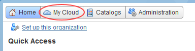

# Deploying an FTPS server for data transfer

## Deploy Template

1. Login to vCloud Director via the UKCloud Portal.

2. Select the My Cloud tab.

    .

3. Click the **Add vApp from Catalog** icon.

4. Select **Public Catalogs** from the drop down and select **All templates** and search for **ftps**.

5. Select the template **UKCloud_Centos_6_FTPS_...** and click **Next**.

    

6. Name the vApp and choose the data centre you want to deploy to.

7. Select the network you want to deploy to (this network must be connected to the internet).

8. Click **Next*

9. Select **Power On** and click **Finish**.

10. When the deployment is complete open the vApp and take note of the private IP address.

## Configure Firewall

Determine your cloud IP addresses:

1. Select **Administration** from the top tabs.

2. Double-click your virtual data centre.

3. Select the **Edge gateways** tab.

4. Right click your edge gateway and select **Properties**.

    

5. Select the **Sub-Allocated pools** tab and record the IP addresses in the lower corner.

6. Click **OK**.

## Add NAT rules

1. Navigate back to the edge gateway, then right-click it and select **Edge Gateway Services**.

2. Select the **NAT** tab.

3. Click **Add DNAT**.

4. Select the external interface **nft...**.

5. Add the external IP address recorded above.

6. Add the port listed in the table below to both original and translated port.

7. Add the private IP address recorded during the virtual machine deployment.

8. Repeat this for each port listed in the table below:

    Applied on | External IP | Protocol | Source port | Internal IP | Translated port
    -----------|-------------|----------|-------------|-------------|----------------
    nft... | Public IP | TCP | 989 | FTPS Server | private IP | 989
    nft... | Public IP | TCP | 990 | FTPS Server | private IP | 990
    nft... | Public IP | TCP | 8080 | FTPS Server | private IP | 8080

## Add firewall rules

1. Navigate back to the edge gateway, then right-click it and select **Edge Gateway Services**.

2. Select the **Firewall** tab.

3. Click **Add** in the bottom right-hand corner.

4. Enter the following details:

    - Enabled: Select this
    - Name: FTPS
    - Source: `37.26.88.70`
    - Source port: `any`
    - Destination: The first address from the Sub-Allocated pool list above
    - Destination port: From the list below
    - Protocol: TCP
    - Action: Allow
    - Log Network traffic: Select this

5. Click **OK**.

    Name | Source | Protocol | Source port | Internal IP | Translated port
    -----|--------|----------|-------------|-------------|----------------
    FTPS | 37.26.88.70 | TCP | Any | Public IP | 989
    FTPS | 37.26.88.70 | TCP | Any | Public IP | 990
    FTPS | 37.26.88.70 | TCP | Any | Public IP | 8080

## Configure FTPS

1. Login to the FTPS server and run the following command.

        /usr/local/bin/setupFTPS.sh <public ip address>

2. Connect with Filezilla.

3. Configure Filezilla with the following settings:

4. Click **File > Site manager** and select **New Site**.

    - Host: public IP
    - FTP protocol: FTP…
    - Encryption: Require implicit FTP over SSL
    - Logon Type: Interactive
    - User: ftpuser

5. Select the **Transfer settings** tab.

6. Transfer mode: Passive.

7. Click **Connect**.

## Feedback

If you have any comments on this document or any other aspect of your UKCloud experience, send them to <products@ukcloud.com>.