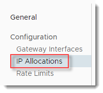
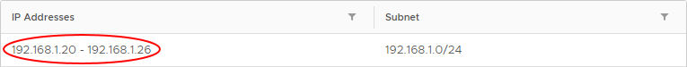
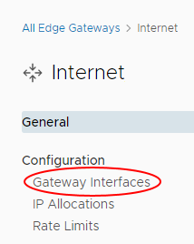
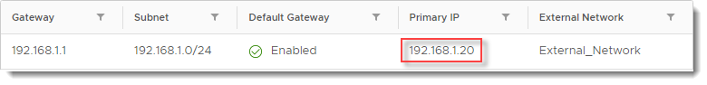

# How to find your allocated external IP addresses

## Overview

To route traffic to your external network (for example internet, PSN), you need to know your  external IP addresses.

## Finding your allocated external IP addresses

To find your allocated external IP address range:

### [VMware Cloud Director 10.1](#tab/tabid-a)

1. In the VMware Cloud Director *Virtual Data Center* dashboard, select the VDC that contains the edge gateway.

2. In the left navigation panel, under *Networking*, select **Edges**.

    

3. On the *Edge Gateways* page, select the edge.

4. Under *Configuration*, select **IP Allocations**.

    

5. In the **IP Addresses** column, you'll see the range of external IP addresses allocated for your use.

    

    You'll need to know this range when you configure settings such as NAT rules.

### [vCloud Director 9.7](#tab/tabid-b)

1. In the vCloud Director *Virtual Datacenters* dashboard, select the VDC that contains the edge gateway.

2. In the left navigation panel, click **Edges**.

    

3. Select the edge.

4. In the *Edge Gateway Settings* section, in the *Sub-allocated IP Addresses* table, you'll see the range of external IP addresses allocated for your use.

    You'll need to know this range when you configure settings such as NAT rules.

***

## Finding your primary external IP address

For some tasks, such as configuring an IPsec VPN, you'll need to know your primary external IP address.

### [VMware Cloud Director 10.1](#tab/tabid-a)

1. In the VMware Cloud Director *Virtual Data Center* dashboard, select the VDC that contains the edge gateway.

2. In the left navigation panel, under *Networking*, select **Edges**.

    

3. On the *Edge Gateways* page, select the edge.

4. Under *Configuration*, select **Gateway Interfaces**.

    

5. In the **Primary IP** column, you'll see your primary external IP address.

    

### [vCloud Director 9.7](#tab/tabid-b)

1. In the vCloud Director *Virtual Datacenters* dashboard, select the VDC that contains the edge gateway.

2. In the left navigation panel, click **Edges**.

    

3. Select the edge.

4. In the *Edge Gateway Settings* section, in the *IP Addresses* table, you'll see your primary external IP address in the **IP Addresses** field.

***

## Next steps

In this article you've learned how to find your allocated external IP addresses. For other edge gateway configuration tasks, see:

- [*How to create firewall rules*](vmw-how-create-firewall-rules.md)

- [*How to create NAT rules*](vmw-how-create-nat-rules.md)

- [*How to create a DHCP pool*](vmw-how-create-dhcp-pool.md)

- [*How to configure IPsec VPN*](vmw-how-configure-ipsec-vpn.md)

- [*How to configure a load balancer*](vmw-how-configure-load-balancer.md)

- [*How to create a static route*](vmw-how-create-static-route.md)

## Feedback

If you find a problem with this article, click **Improve this Doc** to make the change yourself or raise an [issue](https://github.com/UKCloud/documentation/issues) in GitHub. If you have an idea for how we could improve any of our services, send an email to <feedback@ukcloud.com>.
