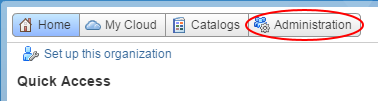
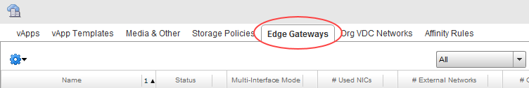
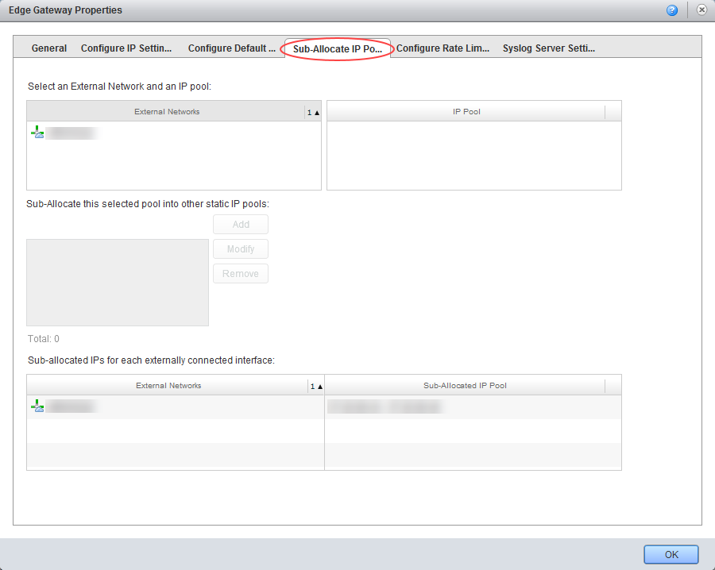
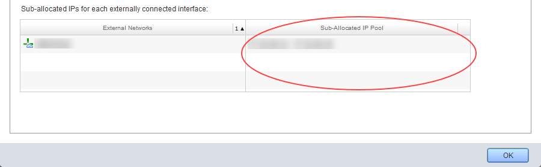
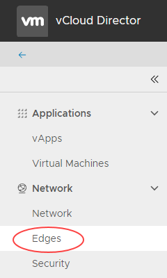

# How to find your allocated external IP addresses

## Overview

To route traffic to your external network (for example internet, PSN), you need to know your  external IP addresses.

## Finding your IP addresses

To find your allocated external IP address range:

# [Using vCloud Director 8.20](#tab/tabid-1)

1. In vCloud Director, click the **Administration** tab.

    

    For more detailed instructions, see the [*Getting Started Guide for UKCloud for VMware*](vmw-gs.md)

2. Double-click the virtual data centre (VDC) that you want to work with, or right-click the VDC and select **Open**.

3. Select the **Edge Gateways** tab.

    

4. Right-click the edge gateway and select **Properties**.

5. In the *Edge Gateway Properties* dialog box, select the **Sub-Allocate IP Pools** tab.

    

6. At the bottom of the window you'll see a box containing the range of external IP addresses allocated for your use.

    

    You'll need to know this range when you configure settings such as NAT rules.

# [Using vCloud Director 9.1](#tab/tabid-2)

1. In the vCloud Director *Virtual Datacenters* dashboard, select the VDC that contains the edge gateway you want to configure.

2. In the left navigation panel, click **Edges**.

    

3. Select the edge that you want to configure.

4. In the *Edge Gateway Settings* section, in the *Sub-allocated IP Addresses* table, you'll see the range of external IP addresses allocated for your use.

    You'll need to know this range when you configure settings such as NAT rules.

***

## Next steps

In this article you've learned how to find your allocated external IP addresses. For other edge gateway configuration tasks, see:

- [*How to create firewall rules*](vmw-how-create-firewall-rules.md)

- [*How to create NAT rules*](vmw-how-create-nat-rules.md)

- [*How to create a DHCP pool*](vmw-how-create-dhcp-pool.md)

- [*How to configure IPsec VPN*](vmw-how-configure-ipsec-vpn.md)

- [*How to configure a load balancer*](vmw-how-configure-load-balancer.md)

- [*How to create a static route*](vmw-how-create-static-route.md)

## Feedback

If you find an issue with this article, click **Improve this Doc** to suggest a change. If you have an idea for how we could improve any of our services, visit [UKCloud Ideas](https://ideas.ukcloud.com). Alternatively, you can contact us at <products@ukcloud.com>.
