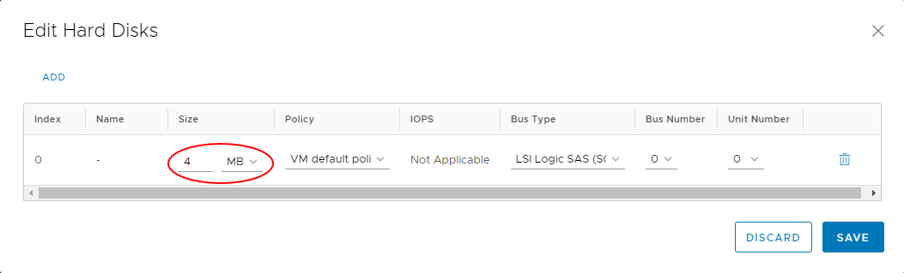

# How to increase block storage for a virtual machine

## Overview

You can increase the block storage available for a virtual machine (VM) as long as the increase does not exceed the limits of your storage policy allocation.

## Before you begin

Before increasing the size of block storage for a VM, if the VM has a snapshot, you'll need to remove this before making changes to the hard disk size. You may need to perform a re-scan from the OS level.

## Checking storage allocation

Before increasing block storage for a VM, you can check the storage allocation for its VDC:

### [vCloud Director 9.7](#tab/tabid-a)

1. In the vCloud Director *Virtual Datacenters* dashboard, select the VDC that contains your VM.

2. In the left navigation panel, select **Storage Policies**.

    

3. In the row for the appropriate storage policy, check the **Limit** column.

    

> [!NOTE]
> If you need to increase the storage allocation for your storage policy, raise a Service Request in the My Calls section of the UKCloud Portal.

### [VMware Cloud Director 10.1](#tab/tabid-b)

1. In the VMware Cloud Director *Virtual Data Center* dashboard, select the VDC that contains the VM.

2. In the left navigation panel, under *Storage* select **Storage Policies**.

    

3. In the row for the appropriate storage policy, check the **Limit** column.

    

> [!NOTE]
> If you need to increase the storage allocation for your storage policy, raise a Service Request in the My Calls section of the UKCloud Portal.

***

## Increasing storage for a virtual machine

To increase the amount of block storage for your VM:

### [vCloud Director 9.7](#tab/tabid-a)

1. In the vCloud Director *Virtual Datacenters* dashboard, select the VDC that contains your VM.

2. In the *Virtual Machines* page, in the card for your VM, click **Details**.

    

3. Expand the *Hardware* section.

4. In the *Hard Disks* section, in the row for the hard disk that you want to increase, enter the new value (in MB) in the **Size** field.

    

5. If required, you can add more hard disks to your VM by clicking **Add** and specifying the details for the new disk.

6. When you're done, click **Save**.

### [VMware Cloud Director 10.1](#tab/tabid-b)

1. In the VMware Cloud Director *Virtual Data Center* dashboard, select the VDC that contains the VM.

2. In the card for your VM, click **Details**.

    

3. Under *Hardware*, select **Hard Disks**.

4. Click **Edit**.

    

5. In the *Edit Hard Disks* dialog box, in the row for the hard disk that you want to increase, enter the new value in the **Size** field.

    

    > [!TIP]
    > Make sure to select the correct units (**MB** or **GB**) from the list in the **Size** field.

6. If required, you can add more hard disks to your VM by clicking **Add** and specifying the details for the new disk.

7. When you're done, click **Save**.

***

## Feedback

If you find a problem with this article, click **Improve this Doc** to make the change yourself or raise an [issue](https://github.com/UKCloud/documentation/issues) in GitHub. If you have an idea for how we could improve any of our services, send an email to <feedback@ukcloud.com>.
