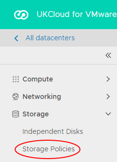
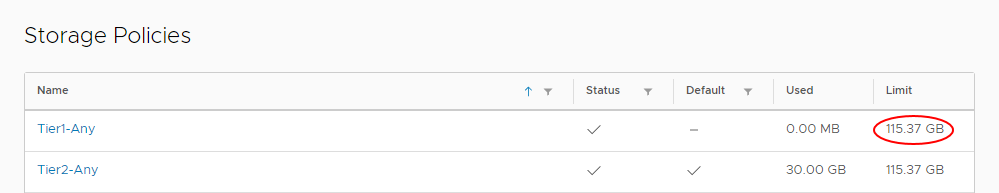
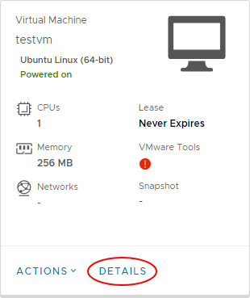
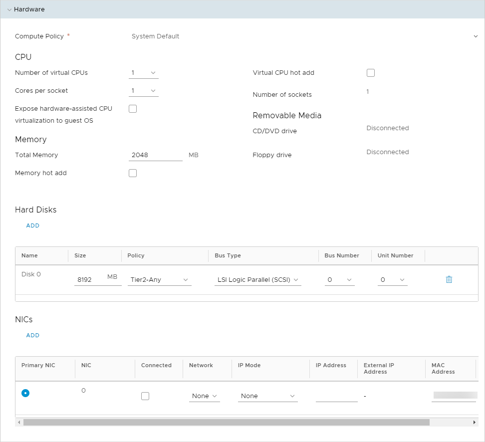

# How to increase block storage for a virtual machine

## Overview

You can increase the block storage available for a virtual machine (VM) as long as the increase does not exceed the limits of your storage policy allocation.

## Before you begin

Before increasing the size of block storage for a VM, consider the following:

- If the VM has a snapshot, you'll need to remove this before making changes to the hard disk size. You may need to perform a re-scan from the OS level.

- To ensure optimal vMotion performance, each hard disk should not exceed 2TB. For more information, see [*Virtual machine disk limits and considerations*](vmw-ref-vmdk-limits.md).

- There is an upper limit of 2TB per disk for any VM that uses UKCloud's Snapshot Protection.

## Checking storage allocation

Before increasing block storage for a VM, you can check the storage allocation for its VDC:

1. In the vCloud Director *Virtual Datacenters* dashboard, select the VDC that contains your VM.

2. In the left navigation panel, select **Storage Policies**.

    

3. In the row for the appropriate storage policy, check the **Limit** column.

    

> [!NOTE]
> If you need to increase the storage allocation for your storage policy, raise a Service Request in the My Calls section of the UKCloud Portal.

## Increasing storage for a virtual machine

To increase the amount of block storage for your VM:

1. In the vCloud Director *Virtual Datacenters* dashboard, select the VDC that contains your VM.

2. In the *Virtual Machines* page, in the card for your VM, click **Details**.

    

3. Expand the *Hardware* section.

4. In the *Hard Disks* section, in the row for the hard disk that you want to increase, enter the new value (in MB) in the **Size** field.

    

5. If required, you can add more hard disks to your VM by clicking **Add** and specifying the details for the new disk.

6. When you're done, click **Save**.

## Feedback

If you find an issue with this article, click **Improve this Doc** to suggest a change. If you have an idea for how we could improve any of our services, visit the [Ideas](https://community.ukcloud.com/ideas) section of the [UKCloud Community](https://community.ukcloud.com).
