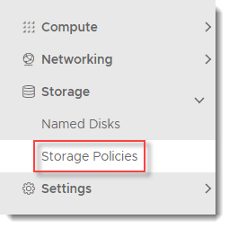
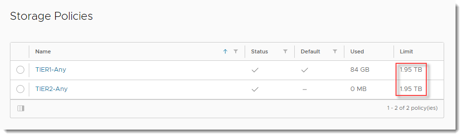
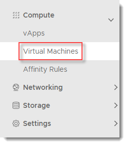
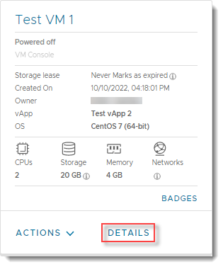
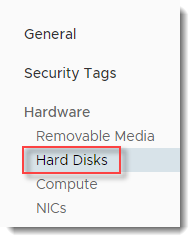
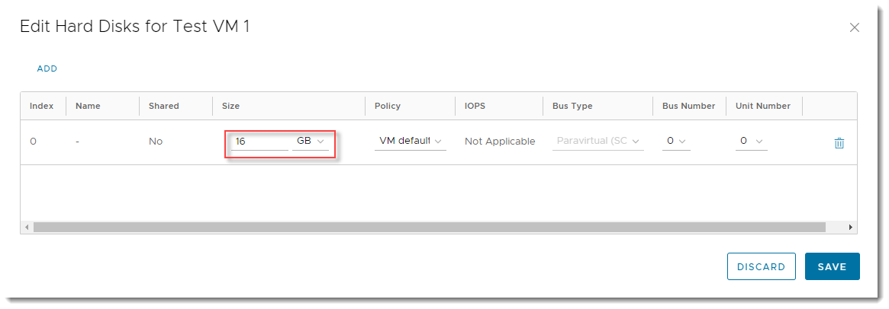

#### UKCloud Limited (“UKC”) and Virtual Infrastructure Group Limited (“VIG”) (together “the Companies”) – in Compulsory Liquidation

On 25 October 2022, the Companies were placed into Liquidation with the Official Receiver appointed as Liquidator and J Robinson and A M Hudson simultaneously appointed as Special Managers to manage the liquidation process on behalf of the Official Receiver.

Further information regarding the Liquidations can be found here: <https://www.gov.uk/government/news/virtual-infrastructure-group-limited-and-ukcloud-limited-information-for-creditors-and-interested-parties>

Contact details: 
For any general queries relating to the Liquidations please email <ukcloud@uk.ey.com> 
For customer related queries please email <ukcloudcustomers@uk.ey.com> 
For supplier related queries please email <ukcloudsuppliers@uk.ey.com>

# How to increase block storage for a virtual machine

## Overview

You can increase the block storage available for a virtual machine (VM) as long as the increase does not exceed the limits of your storage policy allocation.

## Before you begin

Before increasing the size of block storage for a VM, if the VM has a snapshot, you'll need to remove this before making changes to the hard disk size. You may need to perform a re-scan from the OS level.

## Checking storage allocation

Before increasing block storage for a VM, you can check the storage allocation for its VDC:

1. In the VMware Cloud Director *Virtual Data Center* dashboard, select the VDC that contains the VM.

2. In the left navigation panel, under *Storage* select **Storage Policies**.

    

3. In the row for the appropriate storage policy, check the **Limit** column.

    

> [!NOTE]
> If you need to increase the storage allocation for your storage policy, raise a Service Request in the My Calls section of the UKCloud Portal.

## Increasing storage for a virtual machine

To increase the amount of block storage for your VM:

1. In the VMware Cloud Director *Virtual Data Center* dashboard, select the VDC that contains the VM.

2. In the left navigation panel, under *Compute*, select **Virtual Machines** to view a list of VMs within the VDC.

   

3. In the card for your VM, click **Details**.

    

4. Under *Hardware*, select **Hard Disks**.

   

5. Click **Edit**.

    

6. In the *Edit Hard Disks* dialog box, in the row for the hard disk that you want to increase, enter the new value in the **Size** field.

    

    > [!TIP]
    > Make sure to select the correct units (**MB** or **GB**) from the list in the **Size** field.

7. If required, you can add more hard disks to your VM by clicking **Add** and specifying the details for the new disk.

8. When you're done, click **Save**.

## Related articles

To learn about other VM settings, see [*How to view and update virtual machine settings*](vmw-how-update-vm-settings.md).

## Feedback

If you find a problem with this article, click **Improve this Doc** to make the change yourself or raise an [issue](https://github.com/UKCloud/documentation/issues) in GitHub. If you have an idea for how we could improve any of our services, send an email to <feedback@ukcloud.com>.
