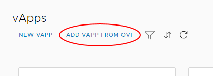
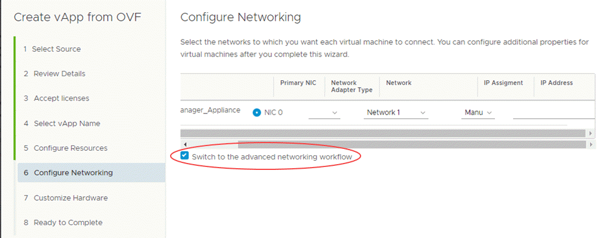

# How to install and configure OpenVPN

## Overview

Secure remote access to the cloud is essential to cloud adoption and use. UKCloud for VMware comes with a dedicated edge gateway, providing a simple and easy-to-use solution that supports IPsec site-to-site virtual private networks (VPNs) and a limited number of remote access client VPNs designed for occasional use.

If you require a more flexible or scalable solution, you can deploy your own choice of virtual appliances (either open-source solutions, such as OpenVPN or commercial solutions from a supplier, such as Cisco, F5 or Palo Alto), instead of using the limited VPN service provided with the default edge gateway.

This article details the steps required to obtain, deploy and configure an OpenVPN virtual appliance to obtain remote access to your virtual data centres (VDCs) running on the UKCloud platform.

> [!NOTE]
> OpenVPN is a licensed product. Without a licence key, you are limited to only two concurrent VPN connections. If you require additional concurrent connections, you'll need to obtain and install a licence key.

## Preparing your virtual data centre

### Create a new VDC network

To secure your environment, we recommend that you deploy the OpenVPN appliance into a new, routed VDC network. Ideally, no other virtual machines (VMs) should connect to this network. This enables you to tightly control access from VPN clients to the VMs in your environment using firewall rules on the edge gateway. However, if you're approaching the network interface limit of your edge gateway, it's possible to deploy the OpenVPN appliance into an existing network.

**More information!** [*How to create a routed VDC network*](vmw-how-create-routed-network.md)

### Configuring the edge gateway

After you've created the network, you'll need to configure the edge gateway to control access to the VMs in your environment by creating:

- A Source NAT rule to allow the OpenVPN appliance outbound access to the internet.

- A Destination NAT rule to allow inbound access from the internet.

- A firewall rule to allow inbound access from the internet on port `443`.

- One or more firewall rules to allow users connected to the OpenVPN appliance to access VMs on other networks for administration purposes. Note that all VPN users will be NATed to the IP address of the OpenVPN appliance.

- One or more firewall rules to allow access from trusted environments to the OpenVPN appliance on the admin port (`943` by default, but can be changed).

**More information!** [*How to create NAT rules*](vmw-how-create-nat-rules.md) and [*How to create firewall rules*](vmw-how-create-firewall-rules.md).

## Obtaining the latest OpenVPN appliance

To ensure you're running the latest release of OpenVPN, we recommend that you download the latest version of the appliance directly from the OpenVPN website:

1. Go to the following location to download the latest OVA file:

    <https://swupdate.openvpn.org/appliances/AS2.ova>

2. In vCloud Director, select the **Catalogs** tab.

3. In the left navigation panel, select **My Organization's Catalogs**.

4. Open the catalog you'd like to add the appliance to, or create a new catalog.

5. Click the **Upload** button and upload the OVA file to the catalog.

## Deploying the OpenVPN appliance

To deploy the OpenVPN appliance:

1. In the vCloud Director *Virtual Datacenters* dashboard, select the VDC in which you want to depoly the OpenVPN appliance.

2. In the left navigation panel, select **vApps**.

    

3. Click **Add vApp from OVF**.

    

4. Select the OVA that you downloaded then click **Next**.

5. Review the details of the OVA to confirm that it's the right images then click **Next**.

6. The appliance will be deployed as a single VM inside a vApp. Provide a name for the vApp then click **Next**.

7. Provide a valid NetBIOS host name and your desired storage policy then click **Next**.

8. Configure the network by selecting **Switch to advanced networking workflow**.

    

9. Select the network adapter type, network and IP pool assignment (**Manual**) then click **Next**.

10. Select the number of vCPUs, sockets and memory this appliance will have then click **Next**.

11. Review the details then click **Finish** to deploy the vApp and appliance.

12. When the vApp has deployed and is powered on, you'll need to reset (reboot) the VM before logging in for the first time to force the networking changes made during VMWare's guest customisations to take effect before you start configuring OpenVPN.

## Performing initial configuration

To perform initial configuration:

1. In vCloud Director, open the console for your OpenVPN VM.

2. Log in to the VM as the root user.

    > [!TIP]
    > To obtain the root password:
    >
    > - In vCloud Director 8.20, right-click the VM, select **Properties**, click the **Guest OS Customization** tab and make a note of the password.
    > - In vCloud Director 9.1, in the card for the VM, click **Details** then select **Guest OS Customization** and make a note of the password.

3. You'll be prompted to answer a series of questions:

    - **Licence agreement:** --- Enter `yes` to accept.

    - **Will this be the primary Access Server node?** --- Enter `yes`.

    - **Please specify the network interface and IP address to be used by the Admin Web UI** -- If the guest customisations were applied correctly, this should default to `eth0`, which should be configured with an IP address on the network you selected during deployment.

    - **Please specify the port number for the Admin Web UI** --- Enter your desired port number, or accept the default of `943`. A separate port is not strictly needed for administration but is recommended.

    - **Please specify the TCP port number for the OpenVPN Daemon** --- We recommend that you use the default of `443` where possible as the use of a non-standard port may cause problems when connecting from corporate networks.

    - **Should client traffic be routed by default through VPN?** --- Entering `yes` will prevent your client device from accessing any other networks (for example, your corporate network) while the VPN is connected. For ease of use, we suggest you answer `no` to this question.

    - **Should client DNS traffic be routed by default through the VPN?** --- If you answered `yes` to the previous question, all traffic will be routed through the VPN anyway, so your answer here will not matter. If you answered `no` to the previous question, you'll probably want to answer `no` to this question so that your DNS queries are answered by the usual servers.

    - **Use local authentication via internal DB?** --- Enter `yes` unless you want to authenticate users from an existing directory service (Active Directory/LDAP).

    - **Should private subnets be accessible to clients by default?** --- Answer `yes` to enable access to your cloud networks via the VPN.

    - **Do you wish to login to the Admin UI as "openvpn"?** --- Answer `yes` to create a local user account named `openvpn`. If you answer `no`, you'll need to set up a different user name and password.

    - **Please specify your OpenVPN-AS license key** --- If you've purchased a licence, enter the licence key, otherwise leave this blank.

4. When you've completed the setup wizard, you'll need to create user accounts and passwords on the local operating system (unless you configured an LDAP directory).

5. If you opted to use the default `openvpn` account, you'll need to configure its password:

        #passwd openvpn

6. Press **^D** to log off the console, but before you do so, there are some additional system configurations, detailed in the following sections, that you might want to perform while you're connected to the console.

### Check the DNS resolver configuration is in place

During our tests, the DNS resolver configuration was not added by the VMware customisations.

1. Enter the following command:

        # pico /etc/network/interfaces

2. Use the arrow keys to scroll down. Below the line specifying the default gateway, add the following:

        dns-nameservers 8.8.8.8

3. Press **^O** to save the file, then **^X** to exit the text editor.

4. Restart the networking service for the change to take effect:

        # service networking restart

### Configure the keyboard

The default configuration is for a US keyboard. To reconfigure for UK:

1. Enter the following command:

        # dpkg-reconfigure keyboard-configuration

2. Step through the wizard. There's no need to restart anything when you're finished.

### Apply updates

It's a good idea to apply the latest upgrades to the system.

1. Enter the following command:

        # apt-get update && apt-get upgrade

2. You'll be prompted to approve the installation of any updates.

### Install NTP

Installing NTP is good practice anyway, but is required if you intend to use two-factor authentication via Google Authenticator.

1. Enter the following command:

        # apt-get install ntp

2. When the installation is complete, update the configuration file to point to UKCloud's NTP servers.

        # pico /etc/ntp.config

3. Use the arrow keys to scroll down until you reach the lines beginning with `server`. Change the first two lines to reflect the UKCloud servers, and comment out the remaining two lines.

    Contact UKCloud Support for the UKCloud server IP addresses.

## Configuring administration options

To configure administration options:

1. Log on to the admin interface at:

    `https://<ip_address>/admin`

2. To set the hostname, under *Configuration*, select **Server Network Settings** and then set the **Hostname or IP Address** to either a public IP address or a fully qualified domain name (FQDN) that your client will be able to resolve.

3. Save the settings on this page.

4. Under *Configuration*, select **VPN settings** and, in the *Routing* section, add any additional subnets that your VPN users should have access to. These will usually be the IP subnets configured on all of your VDC networks.

    This is the minimum configuration required to be able to establish a VPN connection.

5. If you want to create new user accounts, under *User Management*, select **User Permissions**.

6. You can configure the password for each account by clicking the **Show** link in the *More Settings* column.

    > [!NOTE]
    > Be sure to use complex passwords.

## Logging in and connecting

You can download the VPN client software and connection profiles directly from the appliance by browsing to the following location and logging in with a valid user name and password:

`https://<ip_address>/`

The downloaded client software and profile includes the client certificate that is required for authentication.

When you've installed the client software or profile, you can initiate connections directly from the client.

## Securing the appliance

We strongly recommend that you further secure the appliance by making the changes suggested in the following sections.

### Change all default passwords

If you've not already done so, change the root password to something more secure.

1. Log in to the OpenVPN VM console as the root user.

2. Enter the following command:

        # passwd

### Lock down unused ports with iptables

The OpenVPN configuration utility adds the required `ALLOW` entries to `iptables` automatically. To deny all other traffic, enter the following command:

    # iptables -A INPUT -j DROP

### Enable two-factor authentication via Google Authenticator

You can enable two-factor authentication via the OpenVPN administration interface.

1. Log on to the administration interface with the default account at:

    `https://<ip_address>/admin`

2. Under *Configuration*, select **Client Settings** then click the checkbox to enable Google Authenticator support.

    > [!NOTE]
    > Users will need to enter or scan the Google Authenticator secret by logging into the client portal (`http://<ip_address>/`). When they've configured the secret, they should click the **I scanned the QR code** button to enforce two-factor authentication.

### Lock down the Admin Web UI and Client Web UI

By default, both Admin and Client UIs are accessible over port `443`. This can pose a security risk if you've opened port `443` to the internet to allow users to connect from anywhere. Besides the obvious risk of unauthorised access to the administration interface, should an attacker gain access to the client interface, they'll be able to download the client
certificates necessary to establish a VPN connection.

You can limit the administration and client interfaces so that they are accessible only via the administration port number (`943` by default). This enables you to restrict access to this port to a trusted IP address or network, while allowing VPN access on port `443` from anywhere.

Your users will need to log in initially from the trusted network to install the client software, client certificate and configure Google Authenticator, before being able to establish VPN access.

To lock down the administration and client interfaces:

1. Log on to the administration interface with the default account at:

    `https://<ip_address>/admin`

2. Under *Configuration*, select **Server Network Settings**.

3. Under *Service Forwarding* in the *VPN Server* section, clear the check boxes for **Admin Web Server** and **Client Web Server**.

### Disable root SSH login

If connecting via SSH, it's best practice to connect with a non-privileged account, then sudo to root if needed. This prevents an attacker from brute-forcing the root password.

1. Enter the following command:

        # pico /etc/ssh/sshd\_config

2. Use the arrow keys to scroll down the file, and change the `PermitRootLogin` to `no`.

### Disable the default account

During the initial setup, you created an user name and password to log in to the administration interface. This account, with the name `openvpn`, is configured to be always active, disregarding its status in the *User Permissions* area. In addition, if you configured two-factor authentication via Google Authenticator, this is not enforced for the default account.

To disable the default account:

1. Enter the following command:

        # pico /usr/local/openvpn_as/etc/as.conf

2. Use the arrow keys to scroll down the file until you see entries starting with `boot_pam_users`.

3. Comment out the entry for the user name you chose for the default account. Usually this is the `boot_pam_users.0=` entry.

4. Restart the OpenVPN service for the change to take effect:

        # service restart openvpnas

## More help

If you have any issues regarding the updating or support of Microsoft Server, contact the UKCloud support team by raising a Service Request via the [My Calls](https://portal.skyscapecloud.com/support/ivanti) section of the UKCloud Portal.

## Feedback

If you find an issue with this article, click **Improve this Doc** to suggest a change. If you have an idea for how we could improve any of our services, visit the [Ideas](https://community.ukcloud.com/ideas) section of the [UKCloud Community](https://community.ukcloud.com).
