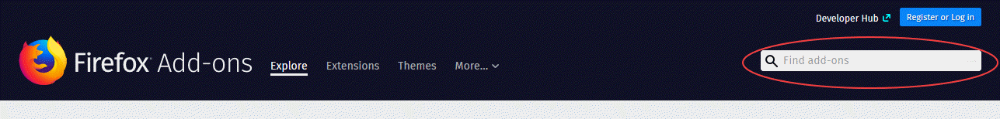
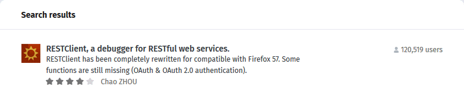
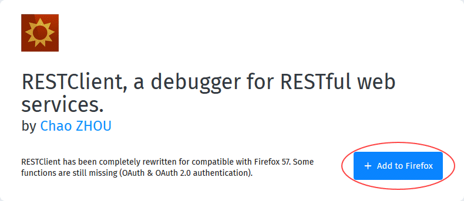
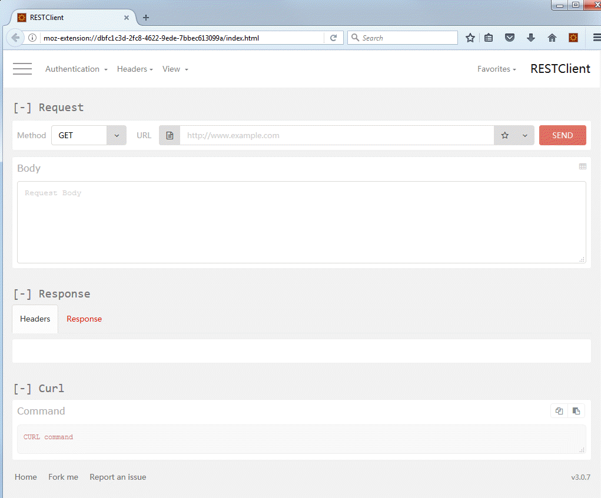

# How to install a REST client to access the vCloud API

## Overview

This guide covers the installation and basic usage of a Firefox plugin called REST Client. Using this plugin, you can access the vCloud API to work programmatically with your UKCloud for VMware environment.

## Installing RESTClient

To access the vCloud API, you can install a REST client within your internet browser.

> [!NOTE]
> This guide covers the installation of the RESTClient plugin under Mozilla Firefox. The installation and configuration of REST clients for other browsers is outside the scope of this guide.

To install the RESTClient plugin:

1. Browse to the following URL:

    <https://addons.mozilla.org/en-US/firefox/>

2. In the search box in the upper right-hand corner of the *Add-ons* page enter `RestClient` and press **Enter**.

    

3. In the search results, click **RESTClient, a debugger for RESTful web services**.

    

4. On the *RESTClient* page, click **Add to Firefox**.

    

5. This will start the downloading RESTClient in the background, after a short amount of time a window will be displayed (see below). When the download has completed click **Install**.

    

6. When the installation has successfully completed, you should see the icon for RESTClient towards the upper right‑hand corner of the Firefox window.

    

7. Click the **RESTClient** icon.

    

## Feedback

If you find an issue with this article, click **Improve this Doc** to suggest a change. If you have an idea for how we could improve any of our services, visit the [Ideas](https://community.ukcloud.com/ideas) section of the [UKCloud Community](https://community.ukcloud.com).
