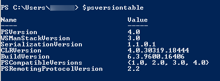

# How to interact with the vCloud REST API using PowerShell and Python

## Pre Work

### Useful Links

You can look up all of the different object types here:

http://pubs.vmware.com/vcd-55/index.jsp#doc/index.html

### Examples of all typed queries

http://pubs.vmware.com/vcloud-api-1-5/wwhelp/wwhimpl/js/html/wwhelp.htm#href=api_prog/GUID-43DFF30E-391F-42DC-87B3-5923ABCEB366.html

### PowerShell

With PowerShell, you will need v3 or higher. To check this, open PowerShell and enter `$psversiontable` at the prompt. You should see something like the following:

If `PSVersion` is less than 3.0, you'll need to upgrade. The v4 package is available here: https://www.microsoft.com/en-gb/download/details.aspx?id=40855

### Python

You'll need to install Python 2.7: https://www.python.org/ftp/python/2.7.10/python-2.7.10.msi

You'll then need to install the package: http://www.python-requests.org/en/latest/user/install/#install

### Getting your credentials

The first thing you will need to do is login to the portal and get your API credentials:

Select API from the menu on the top right, you will then get all of the credentials for each of the vCloud Orgs that you have access to. Note down the username field for the one you are going to interact with.

For more detailed instructions, see [*How to access vCloud Director through the vCloud API*](vmw-how-access-vcloud-api.md).

## Getting Started

### PowerShell

1. Copy and paste the following script into your PowerShell session:

       $Global:SkyscapeURL = "https://api.vcd.portal.skyscapecloud.com/api"

       $Global:Authorization = ""

       $Global:Accept = "application/*+xml;version=5.1"

       $Global:xvCloudAuthorization = ""

       Function New-vCloudLogin($Username,$Password)

       {

           $Pair = "$($Username):$($Password)"

           $Bytes = [System.Text.Encoding]::ASCII.GetBytes($Pair)

           $Base64 = [System.Convert]::ToBase64String($Bytes)

           $Global:Authorization = "Basic $base64"

           $headers = @{ Authorization = $Global:Authorization; Accept = $Global:Accept}

           $Res = Invoke-WebRequest -Method Post -Headers $headers -Uri "$($Global:SkyscapeURL)/sessions"

           $Global:xvCloudAuthorization = $res.headers["x-vcloud-authorization"].tostring()

       }

       Function Get-vCloudRequest($EndPoint)

       {

           $headers = @{"Accept" = $Global:Accept; "x-vcloud-authorization" = $Global:xvCloudAuthorization}

           [xml]$Response = Invoke-WebRequest -Method Get -Headers $headers -Uri "$($Global:SkyscapeURL)/$EndPoint"

           Return $Response

       }

    You will now have two new functions available to you; `New-vCloudLogin` and `Get-vCloudRequest`.

2. To log in enter:

       New-vCloudLogin –Username “myuser@org” –Password “yourportalpassword”

3. Use the username that you copied from the Portal earlier and your Portal password. This will login to vCloud and add your authorisation header to a global variable for use in the next function:

       $VMS = Get-vCloudRequest –EndPoint “query?type=vm”

4. This will get the first 25 VMs in your Org and store them in `$VMS`, which you can inspect. Just enter `$vms` and see what you get.

#### Other examples

`$VMS = Get-vCloudRequest –EndPoint "query?type=vm&pageSize=128"` Returns 128 VMs rather than 25

`$VMS = Get-vCloudRequest –EndPoint "query?type=vm&page=2"` Returns the second page of 25 VMs

`$VAPPS = Get-vCloudRequest –EndPoint "query?type=vApp"` Returns the first 25 vApps in an Org

`$VDC = Get-vCloudRequest –EndPoint "query?type=orgVdc"` Returns the first 25 VDCs in an Org

### Python

1. Save the following into a file, for example: `c:\vcloud_demo.py`:

       import base64

       import requests

       SkyscapeURL = "https://api.vcd.portal.skyscapecloud.com/api"

       Authorization = ""

       Accept = "application/*+xml;version=5.1"

       xvCloudAuthorization = ""

       def New_vCloudLogin(username,password):

           global Authorization

           global Accept

           global SkyscapeURL

           global xvCloudAuthorization

           Pair = "{username}:{password}".format(username=username,password=password)

           EncodedPair = base64.b64encode(Pair)

           Authorization = "Basic %s" % str(EncodedPair)

           apiheaders = {"Authorization" : Authorization, "Accept" : Accept}  

           res = requests.post(SkyscapeURL + '/sessions',headers=apiheaders, verify=False)

           xvCloudAuthorization = res.headers['x-vcloud-authorization']

       def Get_vCloudRequest(endpoint):

           global Authorization

           global Accept

           global SkyscapeURL

           global xvCloudAuthorization

           apiheaders = {"Accept" : Accept, "x-vcloud-authorization" : xvCloudAuthorization}  

           res = requests.get(SkyscapeURL + '/' + endpoint,headers=apiheaders, verify=False)

           return (res.content)

       # login to vcloud

       New_vCloudLogin("user@org","mypassword")

       # demo query, get all VM's and print them to screen

       data = Get_vCloudRequest("query?type=vm")

       print data

2. Now, click **Start** and enter `cmd`. This will bring up a command prompt.

3. You can run this script by entering:

       C:\python27\python.exe c:\vcloud_demo.py

    The above example will log you into vCloud and return an XML representation of the first 25 VMs in your VDC. You can adjust the script to use the same params as the examples in the Powershell script above.

## Feedback

If you find an issue with this article, click **Improve this Doc** to suggest a change. If you have an idea for how we could improve any of our services, visit [UKCloud Ideas](https://ideas.ukcloud.com). Alternatively, you can contact us at <products@ukcloud.com>.