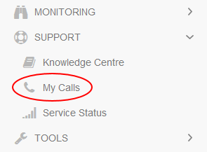

# How to bring your own Red Hat licensing

## Overview

UKCloud offers UKCloud for VMware with a variety of operating systems to suit your application requirements.

## Options

To make the provision of Red Hat based virtual machines (VMs) as simple and quick as possible, UKCloud offer the following options to all customers:

- UKCloud Red Hat licensing and usage billing - One of the options is for UKCloud to provide Red Hat licensing per hour based on your usage per VM. This will be retrospectively billed based on your usage per month in addition to the cost of the VM.

- Bring your own (BYO) Red hat licensing - For certain organisations that have an existing licensing contract with Red Hat, or want to license their Red Hat usage directly, UKCloud are able to offer the option of your organisation using your own licensing and therefore opting out of the automatic Red Hat licensing process offered by UKCloud.

## Process

If you want to take advantage of your own existing Red Hat licensing or purchase additional licences on your existing agreement for use with UKCloud provisioned VMs:

1. Log in to the [UKCloud Portal](https://portal.ukcloud.com/login).

    For more detailed instructions, see the [*Getting Started Guide for the UKCloud Portal*](../portal/ptl-gs.md)

2. In the Portal navigation panel, expand the **Support** option and select **My Calls**.

    

3. Click **Go to My Calls Portal**.

4. Click **New Service Request**.

5. Select **Generic Service Request**.

6. Fill in the Service Request form, making sure to provide the following information in the **Additional Details** field:

    - The date you want to use your own licencing from

    - Whether you want your own licencing to affect specific VMs, specific VDCs or all of your VMs under your organisation

7. When you're done, click **Review & Submit**.

## Validation

Once you've submitted the form, the support team will update our records and once the change has been confirmed with you, your own Red Hat licensing will be utilised and you will no longer be billed by UKCloud for Red Hat licence usage.

> [!NOTE]
> Red Hat may contact you to confirm that you have the correct number of licences in place to cover the number of Red Hat provisioned VMs supplied by UKCloud.

## Responsibilities

Once you've completed the form and the actions have been confirmed, your organisation will be responsible for ensuring that there are enough eligible licences to cover the Red Hat VMs on the UKCloud platform, and UKCloud will no longer be responsible for any Red Hat licensing commitments for the specified VMs under your organisation.

## Feedback

If you find a problem with this article, click **Improve this Doc** to make the change yourself or raise an [issue](https://github.com/UKCloud/documentation/issues) in GitHub. If you have an idea for how we could improve any of our services, send an email to <feedback@ukcloud.com>.
