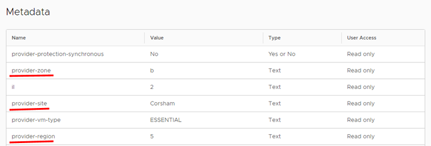
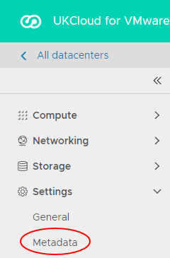
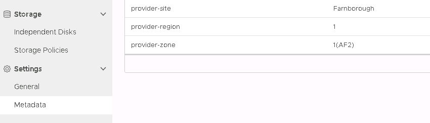

# How to locate your virtual data centre on the UKCloud platform

## Overview

Each virtual data centre (VDC) exists in a particular location within the UKCloud platform. UKCloud stores metadata against each VDC to indicate where within the platform the VDC resides. Using this metadata, you can locate your VDC by site, region and zone. For more information about the organisation of the UKCloud platform, see [*Understanding sites, regions and zones*](../other/other-ref-sites-regions-zones.md).

Knowing where your VDCs are located can be useful for:

- Determining how resilient your applications are

- Determining how Planned or Emergency Maintenance or an unplanned outage may affect your applications

- Providing additional information to help with support call resolution

This article describes how to find out where your VDC is within the UKCloud platform. You can use the VMware Cloud Director/vCloud Director Tenant Portal or the API.

The information provided by the VDC metadata is read-only. If you want to change the location of a VDC, raise a Support Request from the [My Calls](https://portal.skyscapecloud.com/support/ivanti) section of the UKCloud Portal.

> [!NOTE]
> If you want to find the location of a specific VM within a VDC, you can use VM location. For more information, see [*How to use VM location*](vmw-how-use-vm-location.md).

## Finding the location of a VDC

### [VMware Cloud Director 10.1](#tab/tabid-a)

1. In the VMware Cloud Director *Virtual Data Center* dashboard, select the VDC that you want to locate.

2. In the left navigation panel, under *Settings*, select **Metadata**.

    

3. The following fields indicate the location of your VDC:

    - **provider-site** - indicates the site in which your VDC is located: **Farnborough** or **Corsham**

    - **provider-region** - indicates the region in which your VDC is located, for example **1** or **5**.

    - **provider-zone** - indicates the zone in which your VDC is located, for example **1(AF2)** or **B**

    <!--  -->

4. When you're done, click **Cancel**.

### [vCloud Director 9.7](#tab/tabid-b)

1. In the vCloud Director *Virtual Datacenters* dashboard, select the VDC that you want to locate.

    For more detailed instructions on accessing vCloud Director, see the [*Getting Started Guide for UKCloud for VMware*](vmw-gs.md).

2. In the left navigation panel, select **Metadata**.

    

3. The following fields indicate the location of your VDC:

    - **provider-site** - indicates the site in which your VDC is located: **Farnborough** or **Corsham**

    - **provider-region** - indicates the region in which your VDC is located, for example **1** or **5**.

    - **provider-zone** - indicates the zone in which your VDC is located, for example **1(AF2)** or **B**

    

4. When you're done, click **Cancel**.

***

### A note about Synchronous Protection

If you set up your VDC to use Synchronous Protection, then the VDC is stretched across multiple sites. The metadata indicates this as follows:

- **provider-protection-synchronous** is **Yes**

- **provider-site** - indicates that your VDC is stretched across both sites: **Farnborough or Corsham**

- **provider-region** - indicates that your VDC is stretched across multiple regions, for example **1 or 2**

- **provider-zone** - indicates that your VDC is stretched across multiple zones, for example **1(AE1) or 2(AE2)**

## Finding the location of a VDC using the vCloud API

You can also find the location of your VDC by calling the vCloud API. For more information about the vCloud API, see the [vCloud Director API Guide](https://code.vmware.com/apis/553/vcloud-director).

For example, to retrieve all the metadata for a specified VDC, call the `GET /vcd/<id>/metadata` endpoint.

## Feedback

If you find a problem with this article, click **Improve this Doc** to make the change yourself or raise an [issue](https://github.com/UKCloud/documentation/issues) in GitHub. If you have an idea for how we could improve any of our services, send an email to <feedback@ukcloud.com>.
