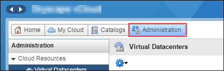
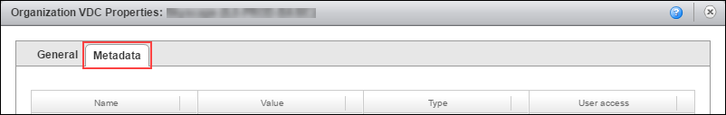
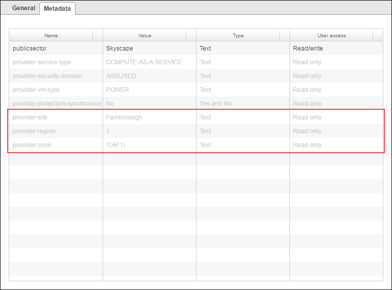

# How to locate your virtual data centre on the UKCloud platform

## Overview

Each virtual data centre (VDC) exists in a particular location within the UKCloud platform. UKCloud stores metadata against each VDC to indicate where within the platform the VDC resides. Using this metadata, you can locate your VDC by site, region and zone. For more information about the organisation of the UKCloud platform, see [*Understanding sites, regions and zones*](../other/other-ref-sites-regions-zones.md).

Knowing where your VDCs are located can be useful for:

- Determining how resilient your applications are

- Determining how scheduled or emergency maintenance or an unplanned outage may affect your applications

- Providing additional information to help with support call resolution

This guide describes how to use vCloud Director to find out where your VDC is within the UKCloud platform. You can use the vCloud Director UI or the API.

The information provided by the VDC metadata is read-only. If you want to change the location of a VDC, raise a Support Request from the [My Calls](https://portal.skyscapecloud.com/support/my_calls) section of the UKCloud Portal.

## Finding the location of a VDC via the Portal

> [!NOTE]
> You cannot view VDC metadata in the new vCloud Director 9.1 tenant portal. If your environment uses vCloud Director 9.1, you must first switch to the vCloud Director web console. For more information, see [*How to switch to the vCloud Director web console from the tenant portal*](vmw-how-switch-web-console.md).

1. In vCloud Director, click **Administration**.

    

2. Right-click the VDC and select **Properties**.

3. Click the **Metadata** tab.

    

4. The following fields indicate the location of your VDC:

    - **provider-site** - indicates the site in which your VDC is located: **Farnborough** or **Corsham**

    - **provider-region** - indicates the region in which your VDC is located, for example **1** or **5**.

    - **provider-zone** - indicates the zone in which your VDC is located, for example **1(AF1)** or **B**

    

    > [!NOTE]
    > If you set up your VDC to use synchronous protection, then the VDC is stretched across multiple sites. The metadata indicates this as follows:
    >
    > - **provider-protection-synchronous** is **Yes**
    > - **provider-site** - indicates that your VDC is stretched across both sites: **Farnborough or Corsham**
    > - **provider-region** - indicates that your VDC is stretched across multiple regions, for example **1 or 2**
    > - **provider-zone** - indicates that your VDC is stretched across multiple zones, for example **1(AE1) or 2(AE2)**

    You can use VM Location to locate individual VMs within the VDC. For more information, see [How to use VM Location in vCloud Director](https://portal.ukcloud.com/support/knowledge_centre/4e69cbb9-b56c-4af6-a775-88c9fc11eefa).

5. When you're done, click **Cancel**.

## Finding the location of a VDC via the vCloud Director API

You can also find the location of your VDC by calling the vCloud Director API. For more information about the vCloud Director API, see [vCloud Director API Guide](https://code.vmware.com/apis/287/vcloud).

For example, to retrieve all the metadata for a specified VDC, call the `GET /vcd/<id>/metadata` endpoint.

## Feedback

If you find an issue with this article, click **Improve this Doc** to suggest a change. If you have an idea for how we could improve any of our services, visit the [Ideas](https://community.ukcloud.com/ideas) section of the [UKCloud Community](https://community.ukcloud.com).
