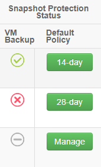

# How to manage Snapshot Protection for your VMs

## Overview

Protection technologies are tools used to enable you to design resilience into your cloud solutions. They protect data and provide you with the ability to recover from system outages - either caused by a disruption to the physical delivery of a service or as a result of corruption of your primary system.

The UKCloud platform offers a variety of protection options, including Snapshot Protection. Snapshot Protection automatically takes an image of your virtual machine (VM) every 24 hours and stores the image outside the core platform for either 14 or 28 days, depending on your chosen snapshot retention profile.

## How does Snapshot Protection work?

By default, VMs deployed on the UKCloud platform do not come with any protection services enabled. If you want Snapshot Protection for your VM, you must explicitly add it.

When you add Snapshot Protection to a VM, the VM is added to a daily automated backup. Backups are automatically taken for the VM once every 24 hours, sometime between the hours of 20:00 and 08:00. The status of a VM's backup is reported daily in the UKCloud Portal by 10:00, but typically within minutes of the close of the backup window.

If you encounter a problem with your VM, raise a Service Request via the [My Calls](https://portal.skyscapecloud.com/support/ivanti) section of the UKCloud Portal and we can use one of your VM backups to restore the whole VM image to a new VM in your VDC. You can then use this image to restore the VM or restore any required data to your original VM.

For more detailed information, see the [*Snapshot Protection Service Scope*](vmw-sco-snapshot-protection.md).

## Checking a VM's Snapshot Protection status

You can use the UKCloud Portal to see whether a VM uses Snapshot Protection, find out which snapshot retention policy is currently applied to a VM, or check the status of your VM's snapshots.

1. Log in to the UKCloud Portal.

    For more detailed steps, see the [*Getting Started Guide for the UKCloud Portal*](../portal/ptl-gs.md).

2. If necessary, switch to the account that the VM belongs to.

3. Click **My VMs**.

    

4. Select the compute service (vOrg) that the VM belongs to.

5. Select the **My VMs** tab.

    

6. From the **Currently viewing for VDC** list, select the VDC that the VM belongs to.

7. Click the **VMs** tab.

    

8. The icon in **VM Backup** column shows the status of each VM's most recent backup:

    Icon | Description
    -----|------------
     | Backup of the VM was successful
     | The VM has been excluded from backups
     | A backup has not yet been created for a VM that has recently been included in backups
     | Backup of the VM was unsuccessful
     | The VM has been excluded from backups but has not yet reached the end of the previous retention period (when the end retention period is reached, the icon will change to the grey minus sign)

    > [!TIP]
    > You can hover over the icon to see a description of the backup status.

9. The button in the **Default Policy** column shows the Snapshot Protection option currently applied to the VM:

    - **14‑day** - VM uses Snapshot Protection, with backups retained for 14 days

    - **28-day** - VM uses Snapshot Protection, with backups retained for 28 days

    - **Manage** - VM is currently excluded from Snapshot Protection

    - **Processing** - A change in status to Snapshot Protection is currently being processed for the VM

    - **Failed** - A change in the status of Snapshot Protection for the VM failed; contact the UKCloud support team to resolve this issue.

    

10. To find out more detail about the most recent backup of a VM, or to view information about previous backups, click the **VM Name**.

11. In the VMs *Info* page, the following fields provide information about the most recent backup of the VM:

    - **Additional information** - additional information about the backup, for example if the backup was removed from the daily automated backup, if the retention period was changed, or further details of any failures.

    - **Last backup** - the status of the most recent backup

    - **Retention length** - how long the backup will be kept for: 14 days or 28 days

    - **Backup status** - when the most recent backup was attempted

12. The *Snapshot Protection Backups* section of the page provides information about previous backups. This covers the entire retention policy period (14 or 28 days). Information includes:

    - **Status** - the status of the backup

    - **Slot** - the backup slot during which the backup was taken

    - **Start** - the date and time when the backup started

    - **End** - the date and time when the backup ended

    - **Snapshot Removal Start** - the date and time when the snapshot consolidation process started (that is, writing back any changes to the VM that occurred during the time it was locked for backup)

    - **Snapshot Removal End** - the date and time when the snapshot consolidation process ended

13. The *Snapshot Protection Policy History* section of the page lists any recent changes to the snapshot retention policy for the VM.

    - **Status** - The status of the policy change

    - **Date Requested** - The date and time when the policy change was requested

    - **User** - The user who requested the change

    - **Protection Period** - The new protection period introduced by the policy change

    - **Reason for Change** - The reason for the policy change

    - **Action** - The type of policy change request

14. Click **Manage my Backups** to raise a Service Request related to your backups via the [My Calls](https://portal.skyscapecloud.com/support/ivanti) section of the UKCloud Portal, for example, to restore a backup.

    

15. To view all the VM information in a single table, click the *Actions* tab and select **Export VMs**. You can save this page to view offline and analyse further.

    

## Managing Snapshot Protection for a VM

By default, VMs deployed on the UKCloud platform do not come with any protection services enabled. You can use the UKCloud Portal to add Snapshot Protection to your VM. You can also use the Portal to change the snapshot retention policy for your backups and to remove Snapshot Protection from your VM.

1. Access the **My VMs** tab for your compute service.

    For detailed steps for how to do this, see the first few steps in [Checking a VM's snapshot status](#checking-a-vms-snapshot-protection-status).

2. From the **Currently viewing for VDC** list, select the VDC that the VM belongs to.

3. Click the **VMs** tab.

4. In the **Default Policy** column, click the green button.

    The label on the button will depend on the currently applied policy:

    - **Manage** if there is currently no snapshot retention policy applied to the VM

    - **14-day** if the VM's snapshot retention policy is currently 14 days

    - **28-day** if the VM's snapshot retention policy is currently 28 days

    

5. In the *Snapshot Protection Policy* dialog box, from the **New Protection Policy** list, select the snapshot retention policy that you want to apply to the VM:

    - **14-day** to apply a 14-day snapshot retention policy to the VM

    - **28-day** to apply a 28-day snapshot retention policy to the VM

    - **No Backup** to turn Snapshot Protection off for the VM

    

    > [!NOTE]
    > If you remove Snapshot Protection from a VM, you should consider alternatives to ensure the integrity of your data in the case of disruption. In addition to Snapshot Protection, UKCloud offers Journaling Protection options, or you may want to implement your own protection solution, possibly utilising our Cloud Storage service.

6. In the **Reason For Change** field, provide a reason for the change to the existing snapshot retention policy.

7. Click **Submit**.

    The button in the **Snapshot Protection** column changes to an amber **Processing** button. When the changes have been applied, the button changes back to green with a label indicating the VM's snapshot retention policy (**14-day** or **28-day**) or **Manage** if you have turned off Snapshot Protection.

    The amount of time it takes for your changes to take place depends on how many requests are in the queue. If there are any problems with the request, the button in the **Snapshot Protection** column changes to a red **Failed** button; in this situation, contact UKCloud Support for further assistance.

    Backup status information is updated daily on the UKCloud Portal by 10:00, but typically within minutes of the close of the backup window.

    > [!NOTE]
    > If you remove a VM from backups, the status icon for the VM will display as a red cross until the end of the previously selected retention period. When the end of the retention period is reached, the status icon will change to the grey minus sign.

## Managing Snapshot Protection for a VDC

You can specify a snapshot retention policy to apply to all the VMs in a VDC. You can apply the policy to all new VMs or to all new and existing VMs.

1. Access the **My VMs** tab for your compute service.

    For detailed steps for how to do this, see the first few steps in [Checking a VM's snapshot status](#checking-a-vms-snapshot-protection-status).

2. From the **Currently viewing for VDC** list, select the VDC that you want to apply Snapshot Protection to.

3. Select the **Snapshot Protection** tab.

4. Next to **Default VM Snapshot Protection**, click the green button.

    The label on the button will depend on the currently applied policy:

    - **Manage** if there is currently no default snapshot retention policy applied to the VDC

    - **14-day** if the default snapshot retention policy is currently 14 days

    - **28-day** if the default snapshot retention policy is currently 28 days

    

5. In the *Snapshot Protection Policy* dialog box, from the **New Protection Policy** list, select the snapshot retention policy that you want to apply to the VMs in this VDC:

    - **14-day** if you want to apply a 14-day snapshot retention policy to the VDC

    - **28-day** if you want to apply a 28-day snapshot retention policy to the VDC

    - **No Backup** if you do not want to apply a default snapshot retention policy to the VDC

    

6. In the **Reason For change** field, provide a reason for the change to the existing snapshot retention policy.

7. If you want to apply the chosen snapshot retention policy to existing VMs in the VDC as well as new VMs, select the **Apply new policy to all existing VMs?** check box.

    > [!NOTE]
    > If you select this check box, all existing VMs will switch to the new policy when you click Submit. You will not be able to rollback this change.

8. Click **Submit**.

    The label of the **Default VM Snapshot Protection** button changes to indicate the new snapshot retention policy (**14-day** or **28-day**) or to **Manage** if you have turned off Snapshot Protection.

    Any new VMs created within the VDC will now use the specified snapshot retention policy, although you can override this for individual VMs if required by following the steps in [Managing snapshot protection for a VM](#managing-snapshot-protection-for-a-vm).

    If you selected **Apply to all existing VMs**, the button changes to an amber **Processing** button. When the changes have been applied, the button changes back to green with a label indicating the VDC's snapshot retention policy (**14-day** or **28-day**) or **Manage** if you have turned off Snapshot Protection. If the VDC contains a lot of VMs, the process of updating the policy for all existing VMs may take several minutes to complete.

    Backup status information is updated daily on the UKCloud Portal by 10:00, but typically within minutes of the close of the backup window.

    > [!NOTE]
    > When you exit the *Snapshot Protection Policy* dialog box, the **Currently viewing for VDC** list on the *My VMs* tab resets to the first VDC listed under the compute service. You'll need to reselect your VDC from the list before continuing.

9. The *Default Snapshot Protection Policy History* section of the page lists any recent changes to the snapshot protection policy for the VDC.

10. The *Recent VM* *Snapshot Protection Policy Actions* section of the page lists any recent changes to the snapshot protection policy for VMs in the VDC.

## Monitoring the status of Snapshot Protection

You can monitor the status of Snapshot Protection across an entire compute service to get a general overview of how your VDCs and VMs are protected.

1. Log in to the UKCloud Portal.

    For more detailed instructions, see the [*Getting Started Guide for UKCloud Portal*](../portal/ptl-gs.md).

2. If necessary, switch to the account that the compute service belongs to.

3. In the navigation panel, expand **Reports** and click **Backup Summary**.

    

4. Click the link for the compute service for which you want to view Snapshot Protection information.

5. The *Snapshot Protection Summary* page provides the following information for the selected compute service:

    - **Success Rate (Last 24 Hours)** - The percentage of successful VM backups in the previous night's backups

    - **Success Rate (Within Retention Period)** - The overall percentage success rate of all backups across the compute service

    - **Number of VMs Protected** - The total number of VMs successfully protected in the previous night's backups

    - **Number of VMs Not Protected** - The total number of VMs with Snapshot Protection that were not successfully protected in the previous night's backups

    - **VM Snapshot Protection Failures** - A list of the VMs that encountered a Snapshot Protection failure in previous night's backups

    

## Next steps

For more information about working with your VMs, see the [*Getting Started Guide for UKCloud for VMware*](vmw-gs.md).

## Feedback

If you find an issue with this article, click **Improve this Doc** to suggest a change. If you have an idea for how we could improve any of our services, visit the [Ideas](https://community.ukcloud.com/ideas) section of the [UKCloud Community](https://community.ukcloud.com).
