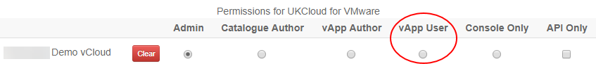

# How to securely manage permissions for a specific vApp

## Overview

This guide shows you how to extend permissions to users for specific vApps, while ensuring that those users cannot access other vApps or settings within vCloud Director.

## Prerequisites

You must be able to log in to the UKCloud Portal as an administrator to perform the steps in this guide. If you do not have the appropriate permissions, contact your administrator.

For each user to whom you want to grant permissions on the vApp, you need the vCloud Director user ID. Users can obtain their user ID as follows:

1. Log into the Portal as the appropriate user.

2. Click the drop down list in the top right of the Portal pane and click **API**.

    

3. For the vOrg to which the vApp belongs, make a note of the **Username**.

    

## Setting vCloud Director permissions in the UKCloud Portal

1. Log in to the UKCloud Portal as an administrator.

2. Select the account to which the vApp belongs.

3. In the left-hand menu, click **Contacts** and then **All Contacts**.

    

4. Edit the users to whom you want to grant permissions and ensure that, on the **Permissions** tab, only the **vApp User** option is selected for the vOrg to which the vApp belongs.

    

    You can also create new users if required.

## Managing permissions for a vApp

To manage permissions for a specific vApp:

1. In vCloud Director, select the VDC where your vApp is located.

2. In the card for the vApp, click **Details**.

    

3. In the *Sharing* section, select **Share with specific users or groups**.

    

4. For each user to whom you want to grant permissions:

    - Highlight the user or users from the list and go to the right panel to select Access Level.

    - Select the appropriate permission level from the **Access Level** list: **Read Only** or **Full Control**.

    

5. When you're done setting permissions for all users, click **Save**.

## Feedback

If you find an issue with this article, click **Improve this Doc** to suggest a change. If you have an idea for how we could improve any of our services, visit the [Ideas](https://community.ukcloud.com/ideas) section of the [UKCloud Community](https://community.ukcloud.com).
