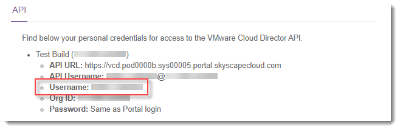
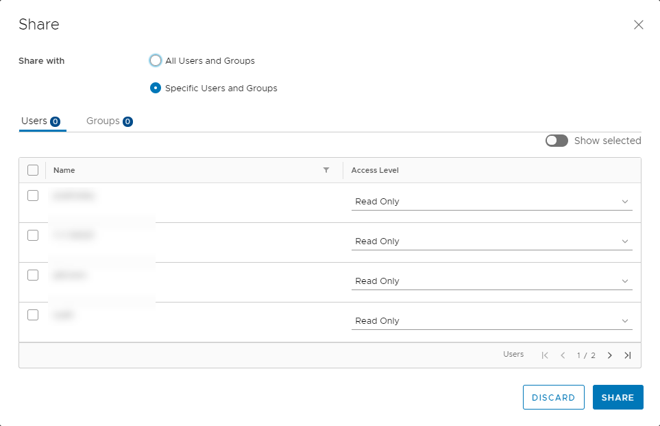

#### UKCloud Limited (“UKC”) and Virtual Infrastructure Group Limited (“VIG”) (together “the Companies”) – in Compulsory Liquidation

On 25 October 2022, the Companies were placed into Liquidation with the Official Receiver appointed as Liquidator and J Robinson and A M Hudson simultaneously appointed as Special Managers to manage the liquidation process on behalf of the Official Receiver.

Further information regarding the Liquidations can be found here: <https://www.gov.uk/government/news/virtual-infrastructure-group-limited-and-ukcloud-limited-information-for-creditors-and-interested-parties>

Contact details: 
For any general queries relating to the Liquidations please email <ukcloud@uk.ey.com> 
For customer related queries please email <ukcloudcustomers@uk.ey.com> 
For supplier related queries please email <ukcloudsuppliers@uk.ey.com>

# How to securely manage permissions for a specific vApp

## Overview

This article shows you how to extend permissions to users for specific vApps, while ensuring that those users cannot access other vApps or settings.

## Prerequisites

You must be able to log in to the UKCloud Portal as an administrator to perform the steps in this guide. If you do not have the appropriate permissions, contact your administrator.

For each user to whom you want to grant permissions on the vApp, you need the VMware Cloud Director user ID. Users can obtain their user ID as follows:

1. Log into the Portal as the appropriate user.

2. Click the drop down list in the top right of the Portal pane and click **API**.

    

3. For the compute service to which the vApp belongs, make a note of the **Username**.

    

## Setting VMware Cloud Director permissions in the UKCloud Portal

1. [*Log in to the UKCloud Portal*](../portal/ptl-gs.md#logging-in-to-the-ukcloud-portal) as an administrator.

2. If necessary, select the account to which the vApp belongs.

3. In the navigation panel, expand the **Contacts** option and select **All Contacts**.

    

4. Edit the users to whom you want to grant permissions and ensure that, in the *Permissions for UKCloud for VMware* section of the **Permissions** tab, only the **vApp User** option is selected for the compute service to which the vApp belongs.

    

    You can also create new users if required.

## Managing permissions for a vApp

To manage permissions for a specific vApp:

1. In the VMware Cloud Director *Virtual Data Center* dashboard, select the VDC that contains the vApp.

2. In the left navigation panel, select **vApps**.

    

3. In the card for the vApp, click **Details**.

4. Select **Sharing** then **Edit**.

5. In the *Share* dialog box, from the **Share with** radio buttons, select **Specific Users and Groups**.

   

6. For each user to whom you want to grant permissions:

    - Select the check box for the user.

    - From the **Access Level** list, select the appropriate permission level:

      - **Read Only** - View the VMs in the vApp but make no changes

      - **Read/Write** - View and make changes to the VMs in the vApp; create new VMs

      - **Full Control** - View, edit and create VMs; change permissions of other users

    

7. When you're done setting permissions for all users, click **Share**.

## Feedback

If you find a problem with this article, click **Improve this Doc** to make the change yourself or raise an [issue](https://github.com/UKCloud/documentation/issues) in GitHub. If you have an idea for how we could improve any of our services, send an email to <feedback@ukcloud.com>.
