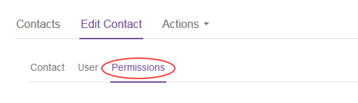

# How to manage permissions for vCloud Director

## Configuring permissions

To configure permissions for a portal user:

1. Log in to the UKCloud Portal as an administrator.

    For more detailed instructions, see the [*Getting Started Guide for the UKCloud Portal*](../portal/ptl-gs.md)

2. In the Portal navigation panel, expand the **Contacts** option and select **All Contacts**.

    

3. On the *Contacts* page, use the **Search** field to find the user to whom you want to assign or revoke vCloud Director permissions and then click the **Edit** button.

    

4. On the *Edit contact* page, select the **Permissions** tab.

    

5. In the *Permissions for UKCloud for VMware* section, you'll see a list of virtual data centres (VDCs) and the associated permissions available for the portal user.

    Select the permission level you want to assign to the user, then scroll to the bottom of the page and click **Save**.

## User types and privileges

The first table shows the user types (operations); the second table shows the exact privileges each user type has.

Operation | Allows the user administrative access to the given vCloud Director organisation with:
----------|--------------------------------------------------------------------------------------
Console Only (CO) | Permissions for Console access only
vApp User (VU) | Permissions for a vApp User
vApp Author (VA) | Permissions for a vApp Author
Catalogue Author (CA) |  Permissions for a Catalogue Author
Admin (ADM) | All permissions

Group | Privilege | CO | VU | VA | CA | ADM
------|-----------|----|----|----|----|-----
Catalog | Add a vApp from My Cloud | &nbsp; | &nbsp; | &check; | &check; | &check;
&nbsp; | Change Owner | &nbsp; | &nbsp; | &nbsp; | &nbsp; | &check;
&nbsp; | Create/Delete a new Catalog | &nbsp; | &nbsp; | &nbsp; | &check; | &check;
&nbsp; | Edit Catalog Properties | &nbsp; | &nbsp; | &nbsp; | &check; | &check;
&nbsp; | Publish a Catalog | &nbsp; | &nbsp; | &nbsp; | &check; | &check;
&nbsp; | Share a Catalog | &nbsp; | &nbsp; | &nbsp; | &check; | &check;
&nbsp; | View Private and Shared Catalogs | &nbsp; | &nbsp; | &check; | &check; | &check;
&nbsp; | View Published Catalogs | &nbsp; | &nbsp; | &nbsp; | &nbsp; | &check;
Catalog Item | Add to My Cloud | &nbsp; | &check; | &check; | &check; | &check;
&nbsp; | Copy/Move a vApp Template/Media | &nbsp; | &nbsp; | &check; | &check; | &check;
&nbsp; | Create/Upload a vApp Template/Media | &nbsp; | &nbsp; | &nbsp; | &check; | &check;
&nbsp; | Enable vApp Template Download | &nbsp; | &nbsp; | &nbsp; | &check; | &check;
&nbsp; | Edit vApp Template / Media Properties | &nbsp; | &nbsp; | &nbsp; | &check; | &check;
&nbsp; | View vApp Templates/Media | &nbsp; | &check; | &check; |&check; | &check;
Disk | Change Owner | &nbsp; | &nbsp; | &check; | &check; | &check;
&nbsp; | Create a Disk | &nbsp; | &nbsp; | &check; | &check; | &check;
&nbsp; | Delete a Disk | &nbsp; | &nbsp; | &check; | &check; | &check;
&nbsp; | Edit Disk Properties | &nbsp; | &nbsp; | &check; | &check; | &check;
&nbsp; | View Disk Properties | &nbsp; | &check; | &check; | &check; | &check;
vApp | Access to VM Console | &check; | &check; | &check; | &check; | &check;
&nbsp; | Change Owner | &nbsp; | &nbsp; | &nbsp; | &nbsp; | &check;
&nbsp; | Copy a vApp | &nbsp; | &check; | &check; | &check; | &check;
&nbsp; | Create/Reconfigure a vApp | &nbsp; | &nbsp; | &check; | &check; | &check;
&nbsp; | Create/Revert/Remove a Snapshot | &nbsp; | &check; | &check; | &check; | &check;
&nbsp; | Delete a vApp | &nbsp; | &check; | &check; | &check; | &check;
&nbsp; | Edit vApp Properties | &nbsp; | &check; | &check; | &check; | &check;
&nbsp; | Edit VM CPU | &nbsp; | &nbsp; | &check; | &check; | &check;
&nbsp; | Edit VM Hard Disk | &nbsp; | &nbsp; | &check; | &check; | &check;
&nbsp; | Edit VM Memory | &nbsp; | &nbsp; | &check; | &check; | &check;
&nbsp; | Edit VM Network | &nbsp; | &check; | &check; | &check; | &check;
&nbsp; | Edit VM Properties | &nbsp; | &check; | &check; | &check; | &check;
&nbsp; | Manage VM Password Settings | &check; | &check; | &check; | &check; | &check;
&nbsp; | Share a vApp | &nbsp; | &nbsp; | &check; | &check; | &check;
&nbsp; | Start/Stop/Suspend/Reset a vApp | &nbsp; | &check; | &check; | &check; | &check;

## Feedback

If you find an issue with this article, click **Improve this Doc** to suggest a change. If you have an idea for how we could improve any of our services, visit the [Ideas](https://community.ukcloud.com/ideas) section of the [UKCloud Community](https://community.ukcloud.com).
