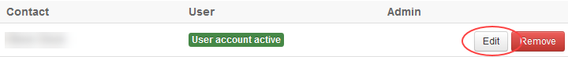

# How to manage VMware Cloud Director/vCloud Director permissions in the UKCloud Portal

## Overview

In the UKCloud Portal, you can control the access that a Portal user has to the different virtual data centres (VDCs) in your organisation.

### Intended audience

To complete the steps in this guide you must be a Portal administrator.

## Configuring permissions

To configure permissions for a Portal user:

1. Log in to the UKCloud Portal as an administrator.

    For more detailed instructions, see the [*Getting Started Guide for the UKCloud Portal*](../portal/ptl-gs.md)

2. In the Portal navigation panel, expand the **Contacts** option and select **All Contacts**.

    

3. On the *Contacts* page, use the **Search** field to find the user to whom you want to assign or revoke permissions and then click the **Edit** button.

    

4. On the *Edit contact* page, select the **Permissions** tab.

    

5. In the *Permissions for UKCloud for VMware* section, you'll see a list of VDCs and the associated user roles available for the Portal user.

    Select the role you want to assign to the user, then scroll to the bottom of the page and click **Save**.

## User roles and access rights

For a list of the access rights each of the listed user roles has, see the [Rights in Predefined Global Tenant Roles]( 
https://docs.vmware.com/en/VMware-Cloud-Director/10.0/com.vmware.vcloud.tenantportal.doc/GUID-AE42A8F6-868C-4FC0-B224-87CA0F3D6350.html#GUID-AE42A8F6-868C-4FC0-B224-87CA0F3D6350) VMware article.

### API Only role

UKCloud have created an **API Only** role that restricts users with VMware Cloud Director/vCloud Director permissions to accessing VMware Cloud Director/vCloud Director solely via the API, with no GUI access.

> [!NOTE]
> The **API Only** role must be selected in addition to one of the VMware Cloud Director/vCloud Director roles (Admin, Catalogue Author, vApp Author, vApp User or Console Only); you should not select the API Only role on its own.

## Feedback

If you find a problem with this article, click **Improve this Doc** to make the change yourself or raise an [issue](https://github.com/UKCloud/documentation/issues) in GitHub. If you have an idea for how we could improve any of our services, send an email to <feedback@ukcloud.com>.
