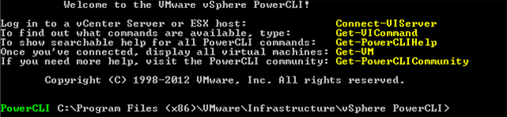
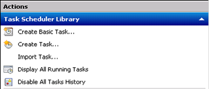
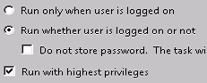
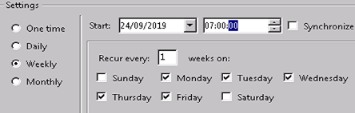
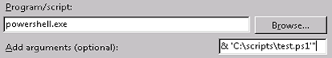

# How to manipulate power states with PowerCLI

## Overview

PowerCLI is a command line interface tool developed by VMware and built upon Microsoft PowerShell. The tool is designed to enable manipulation, automation, management and control over vSphere and vCloud Director assets.

PowerCLI can help you realise some of the fundamental benefits of cloud computing, such as on-demand self-service. Controlling virtual machine power states programmatically, to turn off compute elements when they are no longer required, can help you save up to 70% on your compute costs by taking advantage of hourly billing. For example, you could power off an internal room-booking system when staff are at home during evenings and weekends.

This article describes the basics of how to use PowerCLI to power VMs and vApps on and off via a script, and then automate the script so that it can run unattended.

## Before you begin

PowerCLI is a module for Powershell. As Powershell is a Microsoft tool, it is advised that you install it on a Windows-based environment. The latest version of PowerCLI, with all required subcomponents, is available from the VMware website at https://www.vmware.com/support/developer/PowerCLI/.

If you're not running Windows in your environment, contact UKCloud support or a UKCloud Cloud Architect for specific advice on open source alternatives that are available.

UKCloud recommends installing PowerCLI onto a reference management machine, separate from the controlled environment. This management machine should not be powered off, and could be a standalone virtual server within UKCloud, or any other Windows machine with HTTP access to the UKCloud API URL.

You may also find a good script editor useful. There are several available for free, such as PowerShell ISE, Visual Studio Code and Notepad++.

## Connecting to the UKCloud cloud platform

Your PowerCLI script needs to connect to vCloud Director using a privileged account, so we recommend that you create a user in the UKCloud Portal with only **API Only** access. This ensures that the account cannot be used to access the GUI, limiting the risk associated with an administrative account. Also, as an **API Only** account cannot utilise additional security features, such as Google 2-Step Verification, it is advisable to restrict the account so that it can log in only from specific IP addresses. You can configure these permissions under the **Contacts** section of the UKCloud Portal (for more information, see [*How to manage permissions for vCloud Director*](vmw-how-manage-vcd-permissions.md)).

You usually log in to the portal using an email address and password. For **API Only** access a unique user ID is generated for each UKCloud account you want to log into. You need to specify these unique identifiers when running the scripts to connect to the UKCloud environment.

You can find API credentials and URL details on the UKCloud Portal when you have logged in:

1. In the top right corner of the page, click your username and then select **API**.

    

2. The *API* page provides a view of your personal credentials for accessing the vCloud API.

    

    The example in this article uses the Assured OFFICIAL, internet connected security domain. The **API URL**, **Username** and **Password** are unique to each security domain and you should check via the Portal before connecting. The **API URL** for PowerCLI requires you to omit the `https://` from the start, so for the above example the actual endpoint you would use is:

    `api.vcd.portal.skyscapecloud.com`

To connect to the UKCloud platform with PowerCLI:

1. On the reference server with PowerCLI installed, open PowerCLI:

    

2. Enter the following command:

    ```none
    Connect-CIServer -server "<API URL>" -Org "<ORGNAME>" -Username "<USERNAME>" -Password "<PASSWORD>"
    ```

    Make sure to change the inputs (in \<angled brackets>) to your unique account details.

3. When you've successfully connected, you can use PowerCLI commands to manipulate objects within your connected VDC organisation.

For more information on PowerCLI, there's a wide range of documentation from VMware, or generally available from a standard web search. We recommend that you start with the VMware blog pages: <https://blogs.vmware.com/PowerCLI>.

## Using PowerCLI to control object power states

1. To retrieve the vApp that you want to control the power state of, use the `Get-CIVApp` cmdlet and assign the results to a variable, for example:

    `$vApps = $Get-CIVapp`

2. This returns all of the vApps and put them into a variable. You'll want to specify which vApp you want to change the power state of by filtering for the right name, for example:

    `$MyVApp = Get-CIVapp | Where {$_.Name -match “My vApp”}`

    This returns any vApp in your Organisation where the name contains the string `My vApp`.

3. To control the power state, use the `Start-CIVApp` and `Stop-CIVAppGuest` cmdlets.

    > [!IMPORTANT]
    > You should use the `-RunAsync` parameter as this will hand the task over to vCloud. If you don't use this, the task can fail if it takes too long or for any number of other issues that won’t happen if vCloud is handling the task.

    Here is how this looks:

    ```none
    $MyVApp | Start-CIVApp -RunASync
    $MyVApp | Stop-CIVAppGuest -RunASync
    ```

4. You may also want to create a check so that the script turns the vApp on or off depending on it's current power state. You can do this by checking the current status and starting or stopping the vApp accordingly:

    ```none
    If ($MyVApp.Status -match “On”){
        $MyVApp | Stop-CIVAppGuest -RunASync
    }else{$MyVApp | Start-CIVApp}
    ```

5. You may want put some measures in place to force a shutdown using `Stop-CIVapp`. For example, in the event that the vApp fails to power down after five minutes, you could have the following:

    ```none
    If ($MyVApp.Status -match “On”){
        $MyVApp | Stop-CIVAppGuest -RunASync
        Start-Sleep -Seconds 300
        If ($MyVApp.Status -NotMatch “PoweredOff”){
            $MyVApp | StopCIVapp -RunAsync
        }
    }else{$MyVApp | Start-CIVApp}
    ```

## Scheduling the script

Now that you've written a script to control the power state as you intend, you'll want some method of running it at a time you have determined. To do this, you'll want to use the Windows machine you created earlier. You'll be able to use Windows Task Scheduler to facilitate this. Here, we'll go through a simple task to schedule the startup of the `My vApp` vApp at 7am every weekday.

1. Open up *Task Scheduler* by going to: **Start > Administrative Tools > Task Scheduler**.

2. In *Task Scheduler*, select **Create Task** on the right:

    

3. In the *Create Task* dialog box, enter a **Name** for your task.

4. Under *Security options*, select the radio button for **Run whether user is logged on or not** and select **Run with highest privileges**.

    

5. To add a trigger to tell Task Scheduler when to run the task, select the **Triggers** tab, then select **New** at the bottom.

6. To make the task run on weekdays at 7am, in the *New Trigger* dialog box, select **Weekly** on the left, enter the **Start** time, then select just the week days:

    

7. Click **OK** when you're done.

8. To add an action to tell Task Scheduler what it needs to run at those times, select the **Actions** tab, then select **New**.

9. In the *New Action* dialog box, in the **Program/script** field, enter `powershell.exe`.

10. In the **Add arguments** field, enter the file path to your script, using the following format (including quotation marks):

    `"& 'C:\<Your script folder>\<Script name>.ps1'"`

    

11. Click **OK** to add the action, then click **OK** again.

12. You'll be prompted to enter some credentials. Enter the administrator credentials of the Windows box you're using to run the script.

## Next steps

As previously mentioned, this article helps you learn how to start to manipulate power states within your cloud environment. You should use this as the first building block to get your solution realising the benefits of elastic on-demand compute with hourly billing. Why pay for a service you are only using for 60% of the time when you can achieve dramatic cost savings with a simple script?

Not all VMs and vApps are candidates for being powered down. For example, the work involved in getting a large database consistent and up and running may outweigh the cost benefits of automating the power state.

There are lots of ways you could enhance this, such as writing out to a log file to provide a more auditable trace for management, adding email alerting or tie-ins with other third party services (such as Nagios, SCCM, and so on).

If you've created something that you think others in the UKCloud community could also benefit from, then let us know so we can share it via our Knowledge Centre or GitHub repository.

## Feedback

If you find a problem with this article, click **Improve this Doc** to make the change yourself or raise an [issue](https://github.com/UKCloud/documentation/issues) in GitHub. If you have an idea for how we could improve any of our services, send an email to <feedback@ukcloud.com>.
