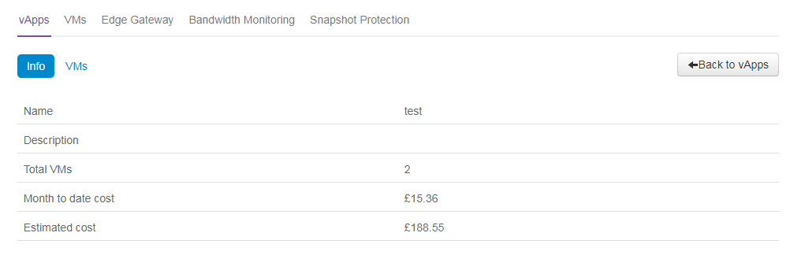

# How to view your VMs in the UKCloud Portal

## Overview

The My VMs page in the UKCloud Portal enables you to see, at a glance, the services currently operational within your environment. My VMs doesn't just cover virtual machines (VMs); it also covers deployed vApps, edge gateway settings and bandwidth monitoring.

If your system administrator has enabled billing for your account, you can also look at near real-time costs; both current month-to-date and an estimated monthly cost. You can see costs on a per-VM and per-vApp
basis.

## Accessing the My VMs page

To go to the My VMs page:

1. Log in to the UKCloud Portal.

    For more detailed instructions, see the [*Getting Started Guide for the UKCloud Portal*](vmw-gs.md).

2. In the Portal navigation panel, expand **VMware Cloud** and then select the compute service with which you want to work.

    

3. Click the **My VMs** tab.

    

4. From the **Currently viewing for VDC** list, select the virtual data centre (VDC) you want to work with to see its settings and, if billing is enabled, estimated and actual costs.

    

## Viewing information about vApps

The **vApps** tab shows a list of the vApps within the selected VDC. The information displayed includes the number of VMs within the vApp and the cost associated with the vApp, which can be shown in either month-to-date or estimated monthly cost.

1. Select the **vApps** tab.

2. Click a vApp name to view additional information about that vApp in the **Info** tab.

    

3. Select the **VMs** tab to see a list of the VMs within the selected vApp and their properties.

    

4. One useful property that you can see is the backup status.

    In the example above, there is no backup policy for these VMs so the backup icon is greyed out. If backups are successful there will be a green icon, if backups have failed there will be a red icon.

5. Click a VM name to see additional information about it, including backup logs.

    If you need to manage your backups for a VM, click the **Manage** button. For more information, see [*How to manage Snapshot Protection for your VMs*](vmw-how-manage-snapshot-protection.md).

6. Click **Back to vApps** to return to the main *My VMs* page.

## Viewing information about VMs

The **VMs** tab displays a list of all VMs within your environment.

1. Select the **VMs** tab.

2. Click a VM to view its additional properties in the **Info** tab.

    

3. Click **Back to VMs** to return to the main *My VMs* page.

## Viewing information about edge gateways

The **Edge Gateways** tab shows properties associates with the edge gateways that are deployed in your VDCs.

1. Select the **Edge Gateway** tab.

2. From the **Select Edge** list, select the edge gateway you want to work with.

    - The **Config** tab shows basic configuration information for the edge

    - The **Firewall** tab shows you information about the firewall rules configured for the edge.

    - The **NAT** tab shows you information about the NAT rules configured for the edge.

    - The **VPN** tab displays any VPNs that have been created against the selected edge

    - The **Events** tab displays any events associated with the edge.

## Viewing bandwidth monitoring information

The **Bandwidth Monitoring** tab displays bandwidth statistics for the edge gateways within your VDCs.

> [!NOTE]
> Bandwidth Monitoring is not available on the Elevated OFFICIAL security platform.

1. Select the **Bandwidth Monitoring** tab.

2. From the **Select Edge** list, select the edge gateway you want to work with.

3. Select the appropriate tab to view different bandwidth statistics.

## Viewing snapshot protection information

The **Snapshot Protection** tab enables you to specify a snapshot retention policy to apply to all the VMs in a VDC. You can apply the policy to all new VMs or to all new and existing
VMs.

For more information about snapshot protection, see [*How to manage Snapshot Protection for your VMs*](vmw-how-manage-snapshot-protection.md).

## Feedback

If you have any comments on this document or any other aspect of your UKCloud experience, send them to <products@ukcloud.com>.