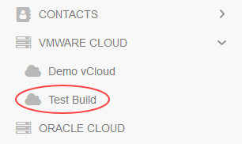
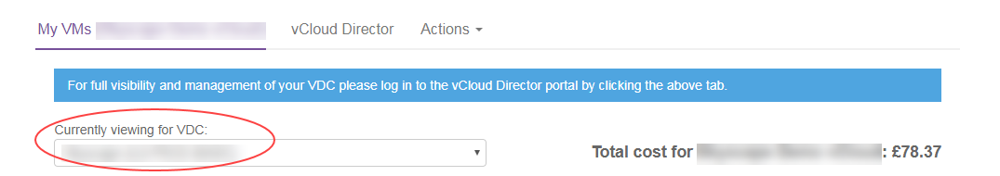
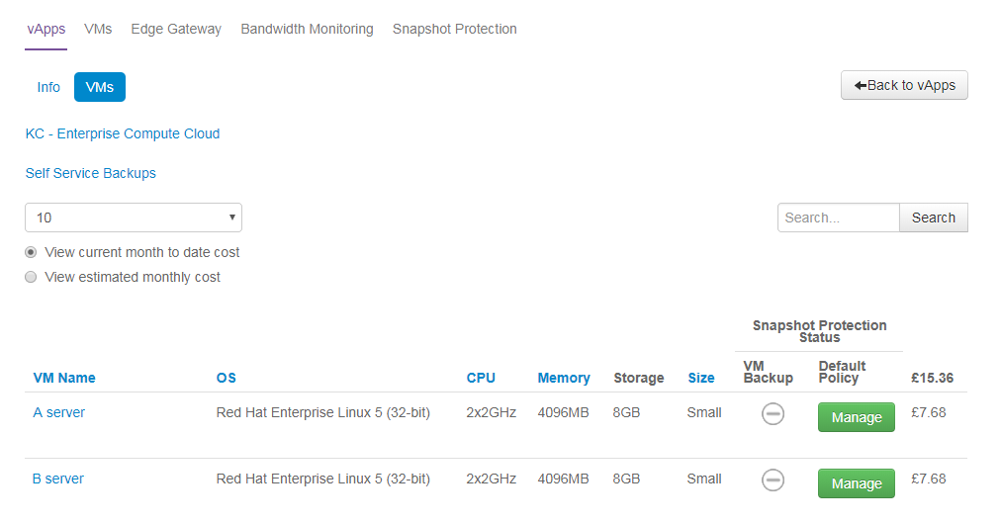
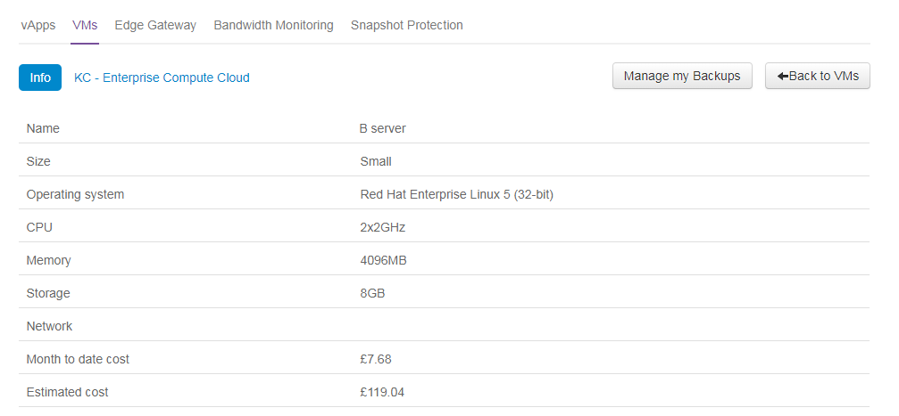

#### UKCloud Limited (“UKC”) and Virtual Infrastructure Group Limited (“VIG”) (together “the Companies”) – in Compulsory Liquidation

On 25 October 2022, the Companies were placed into Liquidation with the Official Receiver appointed as Liquidator and J Robinson and A M Hudson simultaneously appointed as Special Managers to manage the liquidation process on behalf of the Official Receiver.

Further information regarding the Liquidations can be found here: <https://www.gov.uk/government/news/virtual-infrastructure-group-limited-and-ukcloud-limited-information-for-creditors-and-interested-parties>

Contact details: 
For any general queries relating to the Liquidations please email <ukcloud@uk.ey.com> 
For customer related queries please email <ukcloudcustomers@uk.ey.com> 
For supplier related queries please email <ukcloudsuppliers@uk.ey.com>

# How to view your VMs in the UKCloud Portal

## Overview

The My VMs page in the UKCloud Portal enables you to see, at a glance, the services currently operational within your environment, including virtual machines (VMs) and vApps.

## Accessing the My VMs page

To go to the My VMs page:

1. [*Log in to the UKCloud Portal*](vmw-gs.md#logging-in-to-the-ukcloud-portal).

2. If necessary, switch to the account that you want to work in.

3. In the Portal navigation panel, expand **VMware Cloud** and then select the compute service with which you want to work.

   

4. Select the **My VMs** tab.

   

5. From the **Currently viewing for VDC** list, select the virtual data centre (VDC) you want to work with to see its settings.

   

## Viewing information about vApps

The **vApps** tab shows a list of the vApps within the selected VDC. The information displayed includes the number of VMs within the vApp.

1. On the *My VMs* page, select the **vApps** tab.

2. Click a vApp name to view additional information about that vApp in the **Info** tab.

   

3. Select the **VMs** tab to see a list of the VMs within the selected vApp and their properties.

   

4. One useful property that you can see is the backup status.

   

   In the example above, there is no backup policy for this VM so the backup icon is greyed out. If backups are successful there will be a green icon, if backups have failed there will be a red icon.

   If you need to manage your backups for a VM, click the **Manage** button. For more information, see [*How to manage Snapshot Protection for your VMs*](vmw-how-manage-snapshot-protection.md).

5. Click a VM name to see additional information about it, including backup logs.

## Viewing information about VMs

The **VMs** tab displays a list of all VMs within the selected VDC.

1. On the *My VMs* tab, select the **VMs** tab.

2. Click a VM to view its additional properties, including backup logs.

   

## Viewing Snapshot Protection information

The **Snapshot Protection** tab enables you to specify a snapshot retention policy to apply to all the VMs in a VDC. You can apply the policy to all new VMs or to all new and existing
VMs.

For more information about Snapshot Protection, see [*How to manage Snapshot Protection for your VMs*](vmw-how-manage-snapshot-protection.md).

## Feedback

If you find a problem with this article, click **Improve this Doc** to make the change yourself or raise an [issue](https://github.com/UKCloud/documentation/issues) in GitHub. If you have an idea for how we could improve any of our services, send an email to <feedback@ukcloud.com>.
