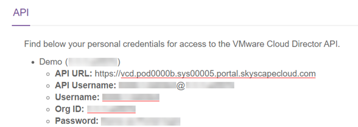

# How to export edge gateway configuration data using PowerShell

## Overview

If you want to export your edge gateway configuration data (firewall rules, NAT rules, load balancer virtual servers and DHCP pools), for example, for backup or disaster recovery purposes, you can use PowerShell.

## Exporting Edge Gateway configuration data

1. Install PowerCLI from VMware:

   <https://code.vmware.com/web/tool/12.0.0/vmware-powercli>

2. Copy the following function and paste it into a `.psm1` file:

   ```none
   function Get-EdgeConfig ($EdgeGateway)
   {
       $Edgeview = $EdgeGateway | get-ciview
       
       $webclient = New-Object system.net.webclient
       
       $webclient.Headers.Add("x-vcloud-authorization",$EdgeView.Client.SessionKey)
       
       $webclient.Headers.Add("accept","application/*+xml;version=34.0")
       
       $edgeview.id -match "(?<=urn:vcloud:gateway:).*"
       
       $edgeID = $Matches[0]
       
       $requrl = "https://" + $global:DefaultCIServers.name + "/network/edges/" + $edgeID
       
       [xml]$EGWConfXML = $webclient.DownloadString($requrl)
       
       $Holder = "" | Select Firewall,NAT,LoadBalancer,DHCP
       
       $Holder.Firewall =
       $EGWConfXML.edge.features.firewall.firewallrules.firewallrule
       
       $Holder.NAT =
       $EGWConfXML.edge.features.nat.natrules.natrule
       
       $Holder.LoadBalancer = 
       $EGWConfXML.edge.features.LoadBalancer
       
       $Holder.DHCP = 
       $EGWConfXML.edge.features.DHCP
       
       Return $Holder
   }
   ```

3. Enter the following command to import the function:

   `Import-Module [PATH TO PSM1 FILE]`
    
4. Connect to VMware Cloud Director using the following commands, swapping the `<user-name>` and `<org-id>` with your credentials and the `<api-url>` with your region details (which is the API URL without the `http://` part):
   
   ```none
   $credential = Get-Credential -Message "Enter your Cloud Director password?" -UserName <user-name>
   
   $vcd = Connect-CIServer -Server <api-url> -Org <org-id> -Credential $credential
   ```

   > [!TIP]
   > You can find your credentials and region information in the UKCloud Portal by clicking your username in the top right hand corner and selecting API. For more information, see [*Finding your Cloud Director API credentials*](vmw-how-access-vcloud-api.md#finding-your-cloud-director-api-credentials).
   >
   > Make sure to use the **Username** rather than the **API Username**.
   > 
   > 
    
5. Find your edge gateways by entering the following command:

   `$Gateways = Search-Cloud -QueryType EdgeGateway`

6. Inspect the `$Gateways` variable and identify the edge for which you want to export configuration data.

7. Retrieve the configuration data for your chosen edge.

   For example, to retrieve configuration data for the first edge in the `$Gateways` variable, enter the following command:

   `$Config = Get-EdgeConfig -EdgeGateway $Gateways[0]`

8. Inspect the `$Config` variable. It will have the following properties:

   ```none
   $Config.Firewall = All the firewall rules
   $Config.NAT = All the NAT rules
   $Config.LoadBalancer = All load balancer rules
   $Config.DHCP = All DHCP pools
   ```

   You can drill down further into the object's properties to retrieve more details. For example, using `$Config.firewall[0].source`, you can examine the source of the first retrieved firewall rule.

9. Data such as source addresses is presented as objects in objects, so if you want to export the data to a CSV, we recommend first using code like that shown below to extract these values and present them at the top level.

   ```none
   function Get-FirewallDetails ($config)
   {
       foreach ($fwrule in $config.firewall){
           $protocol = $fwrule.application.service.protocol
           $fwrule.SetAttribute("protocol",$protocol)
           $port = $fwrule.application.service.port
           $fwrule.SetAttribute("port",$port)
           $srcport = $fwrule.application.service.sourcePort
           $fwrule.SetAttribute("sourcePort",$srcport)
           $destex = $fwrule.destination.exclude
           $fwrule.SetAttribute("destExclude",$destex)
           $destip = $fwrule.destination.ipAddress
           $fwrule.SetAttribute("destIP",$destip)
           $srcex = $fwrule.source.exclude
           $fwrule.SetAttribute("srcExclude",$srcex)
           $srcip = $fwrule.source.ipAddress
           $fwrule.SetAttribute("srcIP",$srcip)
       }
   }
   
   function Get-NatDetails ($config)
   {
       foreach ($natrule in $config.nat){
           $Originalip = $natrule.GatewayNatRule.OriginalIP
           $Translatedip = $natrule.GatewayNatRule.TranslatedIP
           $appliedon = $natrule.GatewayNatRule.interface.name
           $OriginalPort = $natrule.GatewayNatRule.originalport
           $TranslatedPort = $natrule.GatewayNatRule.TranslatedPort
           $Protocol = $natrule.GatewayNatRule.Protocol
           $natrule.SetAttribute("OriginalIP", $Originalip)
           $natrule.SetAttribute("TranslatedIP", $Translatedip)
           $natrule.SetAttribute("AppliedOn", $appliedon)
           $natrule.SetAttribute("OriginalPort", $OriginalPort)
           $natrule.SetAttribute("TranslatedPort", $TranslatedPort)
           $natrule.SetAttribute("Protocol", $Protocol)
       }
   }
   ```

   You can then run `Get-FirewallDetails $Config` to make the results more export-friendly.

10. To export this data to a CSV file, enter a command such as:

    ```none
    $Config.Firewall | Export-csv -path c:\users\myaccount\desktop\firewallrules.csv

    $Config.Nat | Export-csv -path c:\users\myaccount\desktop\natrules.csv -notypeinformation
    ```
    
## Feedback

If you find a problem with this article, click **Improve this Doc** to make the change yourself or raise an [issue](https://github.com/UKCloud/documentation/issues) in GitHub. If you have an idea for how we could improve any of our services, send an email to <feedback@ukcloud.com>.
