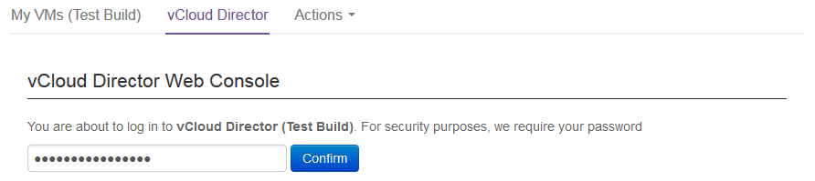
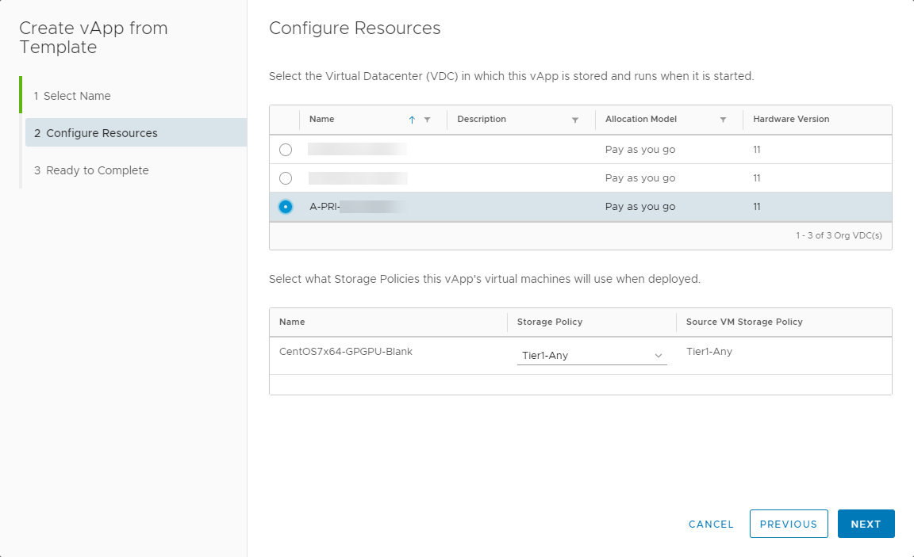

# How to set up Cloud GPU Compute for UKCloud for VMware

## Overview

Cloud GPU enables you to supplement your on-platform compute resources with GPU capabilities.

This service enables you to use UKCloud's main infrastructure platforms to meet the specialist requirements of some advanced applications, with the benefits of a cloud environment. It supports the following types of
workloads:

- **Compute workloads.** GPUs have become prevalent in a world that needs a lot of data processing, fast. The parallel nature of GPU cores lends itself perfectly to supporting initiatives such as deep or machine learning and large-scale mathematical modelling.

- **Visualisation workloads.** Describes the traditional use cases for GPU processing. These include simulation, powering desktop applications with graphics content (such as computer aided design), video encoding, rendering or streaming.

This article provides an introduction for how to use Cloud GPU for compute workloads and describes the tasks you need to perform to get the service up and running.

### Intended audience

To complete the steps in this article you must have access to the UKCloud Portal and vCloud Director.

## Cloud GPU overview

We offer two GPU variants for use with our cloud platform:

Use case | Compute | Visualisation
---------|---------|--------------
Likely card | NVIDIA&reg; Tesla&reg; P100 | NVIDIA M60 Series Card with GRID&trade;
Overview | NVIDIA Tesla P100 GPU accelerators are the most advanced ever built. Designed to accelerate the compute-intensive elements of applications, they are ideal if you're looking to deliver deep learning, analytics or HPC solutions. | NVIDIA GRID is designed to share virtual GPUs (vGPUs) across multiple virtual desktop and applications instances. This enables you to deliver graphically intensive applications such as design software and video streaming.
Precision | Double precision | Single precision
Delivery model | vGPU | vGPU

With Cloud GPU, you can:

- **Process large data sets.** The significantly improved computational power provided by Cloud GPU means that you can gain insight into your data by using the massively parallelised capabilities to process large data sets. This enables:

  - Parallel processing of data in a fraction of the time of using just CPU

  - Machine learning, deep learning, artificial intelligence

  - Mathematical modelling and data sequencing

  - Healthcare modelling

  - Predictive threat analysis

- **Bring any application to the cloud.** Applications that have previously struggled to transition to the cloud because of GPU requirements can now be moved, improving manageability of your data and applications, while increasing collaborative opportunities.

- **Centralise your applications.** Cloud GPU enables you to centralise your applications to improve access to them. By doing so, users can access the tools they need from anywhere, anytime on commodity devices.

- **Visualise data in real-time.** Improved visualisation capabilities provided by Cloud GPU enables you to visualise data in real-time to render virtualised environments when you need them. This helps you to:

  - Design using Computer Aided Design applications in a centralised environment, enabling ease of collaboration

  - Create and run simulations

  - Render and analyse high resolution images and video

## Before you begin

When using our Cloud GPU service for compute workloads, you should consider the following:

- Your Cloud GPU virtual machine (VM) must be in a PRIORITY virtual data centre (VDC).

- You should create your Cloud GPU VM using the appropriate UKCloud template from the GPGPU public catalog.

- Your deployed Cloud GPU VM should be using hardware version 11. The shell VM in the Cloud GPU VM template uses hardware version 11.

- Snapshot Protection is not available for your VM, so you must implement your own backup solution.

- Currently, there is no high availability or disaster recovery option; your VM cannot be migrated to a different host in the event of host failure. In the event of a host failure, you must wait for the host to be returned to service.

## Creating your virtual machine

Before you request your Cloud GPU service, you must create a VM for the service using the UKCloud GPU-enabled template.

1. Log in to the UKCloud Portal.

    For more detailed instructions, see the [*Getting Started Guide for the UKCloud Portal*](../portal/ptl-gs.md).

2. If necessary, switch to the appropriate account.

3. Click **My VMs**.

    

4. Click the compute service (vOrg) that contains the VDC in which you want to create the VM.

    > [!IMPORTANT]
    > You must create your VM in a PRIORITY VDC. If you don't already have a VDC for this type of workload, you can create one using the steps in the [*Getting Started Guide for UKCloud for VMware*](../vmware/vmw-gs.md#building-a-virtual-data-centre).

5. On the *vCloud Director* tab, enter your password and click **Confirm**.

    

6. In vCloud Director, click the menu icon and select **Libraries**.

    

7. In the left navigation panel, click **vApp Templates**.

    

8. Click the triple-dot icon next to the **GPGPU** template and select **Create vApp**.

    

    > [!NOTE]
    > The GPGPU template provides a shell VM with no disks attached, hence no operating system installed. You'll need add the necessary disks so that you can install your preferred operating system on the VM.

9. On the *Select Name* page of the *Create vApp from Template* dialog box, give the vApp a **Name** and **Description**, select the appropriate **Runtime lease** and **Storage lease** then click **Next**.

    

10. On the *Configure Resources* page, from the list of VDCs, select the VDC in which you want to create the VM and click **Next**.

    > [!NOTE]
    > You must create your VM in a PRIORITY VDC.

11. From the **Storage Policy** list, for optimal performance, select Tier 1 storage and click **Next**.

    

12. On the *Configure Networking* page, from the **Networks** list, select the network that you want to attach your VM to and click **Next**.

    

13. On the *Customize Hardware* page, add an **LSI Logic SAS (SCSI)** hard disk of a size appropriate for the operating system that you plan to install on your VM and then click **Next**.

    

14. On the *Ready to Complete* page, review your settings and then click **Finish** to start the deployment.

    This creates a vApp with a shell VM.

15. After the VM has been deployed, right-click it and select **Power On**, then use the popout console to go through the setup procedure.

16. When your VM is ready, install your preferred operating system.

17. When you're finished, right-click the vApp that contains your VM and select **Power Off**.

    > [!IMPORTANT]
    > It is essential that you power off the vApp so that UKCloud can migrate the VM to a GPU‑enabled server.

## Provisioning your Cloud GPU service

When your VM is ready, use [My Calls](https://portal.skyscapecloud.com/support/ivanti) in the UKCloud Portal to raise a service request for the Cloud GPU service. Provide the following details in the ticket so that UKCloud can complete the setup of your service:

- VDC name

- vApp name

- VM name

UKCloud will confirm that you've set up your VM correctly and that it meets all the necessary prerequisites. If the VM meets all requirements, UKCloud will migrate the VM to a GPU‑enabled host and attach the GPU card to your VM.

## Installing NVIDIA drivers

When UKCloud has provisioned your Cloud GPU server, you can install the appropriate NVIDIA drivers.

To install NVIDIA drivers:

1. Power on your VM.

2. In the card for the VM, select **Actions** then **Insert Media**.

    

3. In the *Insert CD* dialog box, in the search field, enter vGPU and click the **Refresh** icon.

    

4. Select the vGPU driver ISO and click **Insert**.

5. Check the console of VM to ensure that the ISO is mounted.

6. Run the appropriate executable (Windows) or binary (Linux).

    **On Windows:**

    - From Explorer, double click the driver installer file (NVIDIA*.*.exe).

    - Select **Custom (Advanced)**.

    - Select **Perform a clean installation**.

        

    - Click **Next**.

    - Restart and connect to the VM.

    **On Linux:**

    - Update the system:

        ``` none
        # yum update
        ```

    - Install gcc with Kernel Modules:

        ``` none
        # yum install kernel-devel gcc
        ```

    - Make the driver package executable:

        ``` none
        # chmod +x NVIDIA-Linux-x86\_64-384.73-grid.run
        ```

    - Run the driver installer:

        ``` none
        # ./NVIDIA-Linux-x86_64-384.73-grid.run
        ```

    - Accept the defaults.

        > [!NOTE]
        > If you don't have a GUI installed, you can ignore the messages relating to X.

    - Confirm that the driver is installed and the card is detected:

        ``` none
        # nvidia-smi
        Thu Oct 5 14:57:43 2017
        +------------------------------------------------------------------------------+
        | NVIDIA-SMI 384.73                 Driver Version: 384.73                     |
        |------------------------------------------------------------------------------|
        | GPU  Name        Persistence-M| Bus-Id        Disp.A |  Volatile Uncorr. ECC |
        | Fan  Temp  Perf  Pwr:Usage/Cap|         Memory-Usage |   GPU-Util Compute M. |
        |===============================+======================+=======================|
        |   0  GRID P100-16Q       On   | 00000000:02:01.0 Off |                   N/A |
        | N/A   N/A    P0    N/A /  N/A |   1040MiB / 16383MiB |        0%     Default |
        |-------------------------------+----------------------------------------------|
        |------------------------------------------------------------------------------|
        | Processes:                                                       GPU Memory  |
        |  GPU       PID    Type    Process name                           Usage       |
        |==============================================================================|
        | No running processes found                                                   |
        +------------------------------------------------------------------------------+
        ```

## Licensing your VM for Cloud GPU

To enable full functionality of the NVIDIA GPU card, your VM must obtain a valid licence from the NVIDIA GRID License Server. To do this, you must configure your edge gateway to allow traffic to and from the license server.

#### Configuring the edge gateway

To enable access to the NVIDIA GRID License Server from your network, you must create the following firewall rule on your edge gateway:

- **Source/Source Port:** as appropriate for your source network

- **Destination:** `51:179.197.53`

- **Destination Port:** `7070`

- **Protocol:** `TCP`

- **Action:** `Allow`


For more detailed instructions for creating firewall rules, see [*How to create firewall rules*](../vmware/vmw-how-create-firewall-rules.md).

#### Retrieving a licence (Windows)

To license GRID Virtual GPU on Windows:

1. Right-click on the desktop and select **Nvidia Control Panel**.

2. In the *NVIDIA Control Panel*, under **Licensing**, select **Manage License**.

    

3. In the **License Server** field, enter `gpuls.ukcloud.com`.

4. Leave the **Port Number** field empty to default to port `7070`, which is the default port number used by the NVIDIA GRID License Server.

5. Click **Apply**.

6. The server will attempt to connect to the license server and pull a licence from the available pool.

    

7. Once configured, licensing settings persist across reboots.

### Retrieving a licence (Linux)

To license GRID Virtual GPU on Linux

1. Copy the template grid licensing config file:

    ``` none
    # cp /etc/nvidia/gridd.conf.template /etc/nvidia/gridd.conf
    ```

2. Edit the file and set the following values:

    - `ServerAddress=gpuls.ukcloud.com`

    - `ServerPort=7070`

    - `FeatureType=1`

3. Save your changes.

4. Restart the GRID service:

    ``` none
    # service nvidia-gridd restart
    ```

5. Check the log messages to confirm the licence is enabled (this may take a minute or two):

    ``` none
    #tail -f /var/log/messages

    Oct 5 15:04:45 localhost systemd: Starting NVIDIA Grid Daemon...
    Oct 5 15:04:45 localhost nvidia-gridd: Started (16224)
    Oct 5 15:04:45 localhost systemd: Started NVIDIA Grid Daemon.
    Oct 5 15:05:16 localhost nvidia-gridd: Service provider detection complete.
    Oct 5 15:05:17 localhost nvidia-gridd: License acquired successfully. Server URL : http://51.179.209.134:7070/request
    Oct 5 15:05:17 localhost nvidia-gridd: Your system is licensed for GRID vGPU.
    ```

6. Alternatively, if you have the GUI installed, you can set up the details for the license server in the NVIDIA Settings dialog box.

    - Open the settings tools from your desktop or from the command line:

        ```none
        # nvidia-settings
        ```

    - Select Manage License and input the following server details:

      - **License Server:** `gpuls.ukcloud.com`

      - **Port Number:** `7070`

## Next steps

In this article, you've learned how to set up your environment to enable the provisioning of your Cloud GPU service and you can now start creating your GPU‑powered applications.

For information about NVIDIA virtual GPU software specific to your OS, see:

<https://docs.nvidia.com/grid/latest/index.html>

## Feedback

If you find an issue with this article, click **Improve this Doc** to suggest a change. If you have an idea for how we could improve any of our services, visit the [Ideas](https://community.ukcloud.com/ideas) section of the [UKCloud Community](https://community.ukcloud.com).
