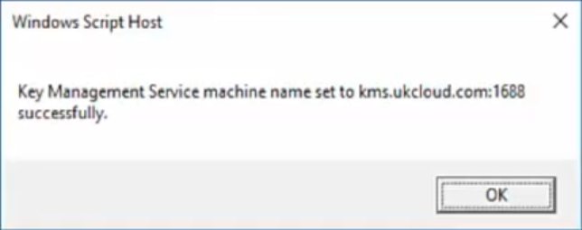
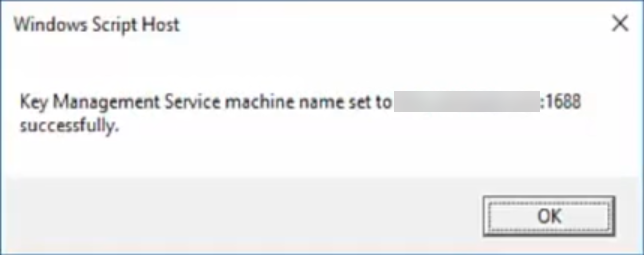

# How to license Windows VMs using the UKCloud Key Management Server

## Overview

You need to register the Windows virtual machines (VMs) that you create with the UKCloud Key Management Server (KMS). You need to set up a connection with the KMS to enable registration.

## Setting up a connection with the UKCloud KMS

Before product activation, make sure your VMs can communicate with the UKCloud KMS that exists outside your cloud organisation.

To allow this communication, you need to create a source network address translation (SNAT) and firewall rule on your edge gateway:

# [Using vCloud Director 8.20](#tab/tabid-1)

1. In vCloud Director, click the **Administration** tab.

    

    For more detailed instructions, see the [*Getting Started Guide for UKCloud for VMware*](vmw-gs.md)

2. Double-click the virtual data centre (VDC) that you want to work with, or right-click the VDC and select **Open**.

3. Select the **Edge Gateways** tab.

    

4. Right-click the edge gateway and select **Edge Gateway Services**.

5. Select the **NAT** tab and create a new SNAT rule.

6. Make sure that the **Applied On** field is set to reflect your network.

7. For the **Original (Internal) source IP/range**, enter the IP address, CIDR or range of addresses you want to SNAT out.

8. For the translated address, enter the external IP address of your edge gateway or one of your external IP address assignments.

    For more information about creating SNAT rules, see [*How to create NAT rules*](vmw-how-create-nat-rules.md).

9. Select the **Firewall** tab and make sure that an outbound rule exists on your firewall.

    Contact UKCloud Support for details of the **Destination IP** and **Destination Port**.

    For more information about creating firewall rules, see [*How to create firewall rules*](vmw-how-create-firewall-rules.md).

# [Using vCloud Director 9.1](#tab/tabid-2)

1. In vCloud Director, select the VDC for which server activation is required.

2. In the left navigation panel, click **Edges**.

    

3. Select the edge that you want to configure and click the **Configure Services** button.

    

4. In the *Edge Gateway* dialog box, select the **NAT** tab and create a new SNAT rule.

5. Make sure that the **Applied On** field is set to reflect your network firewall tenant (NFT).

6. In the **Original Source IP/Range** field, enter the IP address, CIDR or range of addresses you want to SNAT out.

7. For the translated address, enter the external IP address of your edge gateway or one of your external IP address assignments.

    For more information about creating SNAT rules, see [*How to create NAT rules*](vmw-how-create-nat-rules.md).

8. Select the **Firewall** tab and make sure that an outbound rule exists on your firewall.

    Contact UKCloud Support for details of the **Destination IP** and **Destination Port**.

    For more information about creating firewall rules, see [*How to create firewall rules*](vmw-how-create-firewall-rules.md).

***

## Activating your Windows licence

1. Open a console to the VM you want to license and activate.

2. Launch a command line with administrator rights.

3. Enter:

        C:\ > slmgr /skms  kms.ukcloud.com:1688

4. You\'ll see the following pop-up box:

    

5. If an error message appears indicating that the KMS server can't be contacted, it means either that the edge gateway hasn't been configured correctly or that DNS can't be retrieved. Try again by issuing the same command but using the IP address of the activation server:

        C:\ > slmgr /skms  <external IP address>:1688

    

6. Click **OK**, then from the same command line window, enter:

        C:\ >slmgr /ato

    

## Related videos

- [How to license Windows VMs using the UKCloud Key Management Server](https://vimeo.com/308877124)

## Feedback

If you find an issue with this article, click **Improve this Doc** to suggest a change. If you have an idea for how we could improve any of our services, visit [UKCloud Ideas](https://ideas.ukcloud.com). Alternatively, you can contact us at <products@ukcloud.com>.