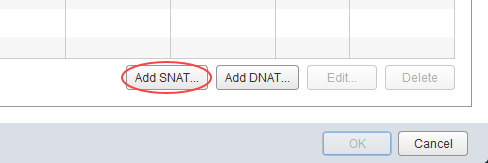

# How to license Windows VMs using the UKCloud Key Management Server

## Overview

You need to register the Windows virtual machines (VMs) that you create with the UKCloud Key Management Server (KMS). You need to set up a connection with the KMS to enable registration.

## Setting up a connection with the UKCloud KMS

Before product activation, make sure your VMs can communicate with the UKCloud KMS that exists outside your cloud organisation.

To allow this communication, you need to create a source network address translation (SNAT) and firewall rule on your edge gateway:

1. In vCloud Director, click the **Administration** tab.

    

    For more detailed instructions, see the [*Getting Started Guide for UKCloud for VMware*](vmw-gs.md)

2. Double-click the virtual data centre (VDC) that you want to work with, or right-click the VDC and select **Open**.

3. Select the **Edge Gateways** tab.

    

4. Right-click the edge gateway and select **Edge Gateway Services**.

5. Select the **NAT** tab and click **Add SNAT**

    

6. Make sure that the **Applied On** field is set to reflect your network.

7. For the **Original (Internal) source IP/range**, enter the IP address, CIDR or range of addresses you want to SNAT out.

8. For the translated address, enter the external IP address of your edge gateway or one of your external IP address assignments.

9. Select the **Firewall** tab and make sure that an outbound rule exists on your firewall.

    - **For Assured:** Set the **Destination IP** to `37.26.89.8` and the **Destination Port** to `any` or `1688`
    - **For Elevated:** Set the **Destination IP** to `172.26.x.x` (contact support for IP) and the **Destination Port** to `any` or `1688`

## Activating your Windows licence

1. Open a console to the VM you want to license and activate.

2. Launch a command line with administrator rights.

3. Enter:

        C:\ > slmgr /skms  kms.ukcloud.com:1688

4. You\'ll see the following pop-up box:

    

5. If an error message appears indicating that the KMS server can't be contacted, it means either that the edge gateway hasn't been configured correctly or that DNS can't be retrieved. Try again by issuing the same command but using the IP address of the activation server:

        C:\ > slmgr /skms  <external IP address>:1688

    

6. Click **OK**, then from the same command line window, enter:

        C:\ >slmgr /ato

    

## Feedback

If you have any comments on this document or any other aspect of your UKCloud experience, send them to <products@ukcloud.com>.