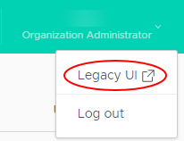

# How to switch to the vCloud Director Legacy UI

## Overview

For some tasks, you cannot use the Tenant UI; to perform these tasks, you must first switch to the Legacy UI.

Tasks that you cannot perform in the Tenant UI include:

- Uploading ISO and FLP media as a URL

- Viewing vApp template description, including OS password and patch dates

- Changing VDC default storage policy

## Switching to the Legacy UI

1. In the top-right corner of the vCloud Director Tenant UI, click your user name, then select **Legacy UI**.

    

2. To return to the Tenant UI, click **Try the new portal** at the top of the page.

    

## Feedback

If you find an issue with this article, click **Improve this Doc** to suggest a change. If you have an idea for how we could improve any of our services, visit the [Ideas](https://community.ukcloud.com/ideas) section of the [UKCloud Community](https://community.ukcloud.com).
